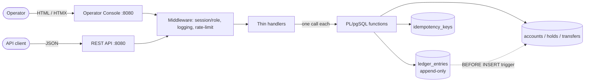
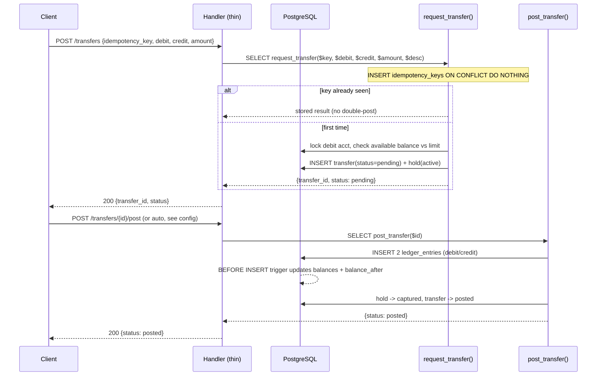

# bank0 — Overview & Design

> A core-banking backend proof of concept.
> Status: **implemented** · Stack: Go 1.26 · PostgreSQL 18 · Templ + HTMX

---

## 1. What this is (and isn't)

bank0 is a **proof of concept for the engine at the heart of a bank**: the part
that holds account balances and moves money between them without ever losing a
cent, double-spending, or double-posting on a retry.

**In scope**
- Customers, accounts, and a single currency (EUR), stored as integer minor units.
- A **double-entry ledger** as the single source of truth for money.
- A **transfer state machine** with authorization holds (pending → posted /
  failed / reversed).
- **Database-enforced idempotency** for every money movement.
- An **operator console** (admin UI) for support/ops staff
  ([`05-admin-ui.md`](05-admin-ui.md)).
- A **customer client API** ([`06-client-api.md`](06-client-api.md)) and a
  **PWA** over it ([`07-client-web-app.md`](07-client-web-app.md)).

**Out of scope (PoC simplifications, called out where they matter)**
- Multi-currency and FX (single currency keeps double-entry trivially balanced).
- Real payment rails (SEPA/SWIFT/card networks) — we *model* their lifecycle, we
  don't connect to them.
- Interest accrual, statements/PDF generation, KYC/AML workflows.
- Customer MFA / step-up and onboarding/KYC (designed, not built — see
  [`06-client-api.md`](06-client-api.md) §6).

These can each be layered on later without reshaping the core; see the "future
extension" notes in [`02-data-model.md`](02-data-model.md) and
[`03-ledger-lifecycle-idempotency.md`](03-ledger-lifecycle-idempotency.md).

---

## 2. Design principles

These four principles are the reason every later decision is the way it is. When
in doubt, re-derive from these.

### P1 — The ledger is the source of truth; balance is a cache

A single append-only table, `ledger_entries`, records every movement of value as
a signed posting. `accounts.balance_minor` is a **maintained cache** of
`SUM(ledger_entries.signed_amount)` for that account. It exists for fast reads,
not for truth.

> **Invariant (reconciliation):** for every account,
> `balance_minor == SUM(signed_amount of posted ledger_entries)`.
> A `reconcile()` function asserts this on demand and on the admin dashboard.

The cache cannot drift, because **the only thing in the entire system that may
change a balance is inserting a ledger entry** (enforced by trigger — see P2).
There is no `UPDATE accounts SET balance = ...` anywhere in application code.

### P2 — State transitions live in the database

Every money movement is a PL/pgSQL function with explicit row locks
(`FOR UPDATE`). The functions own all validation (sufficient funds, limits,
account status, currency match) and all writes (transfer row, ledger entries,
holds, balance cache, audit). Triggers enforce structural invariants
(immutability, single-default-account, `updated_at`, balance-follows-ledger).

This is deliberate: it makes correctness a property of the **schema**, not of
each caller. A second API, a cron job, or a `psql` session all get the same
guarantees.

### P3 — Idempotency is enforced by the database

Money moves carry a client **idempotency key**. A dedicated table makes the first
call do the work and every replay return the *original* result — at the database
level, inside the same transaction that does the posting. The API layer never has
to reason about "did this already happen?". Natural-key uniqueness
(username, IBAN, one-default-account) is enforced by unique / partial-unique
indexes. See [`03-...md`](03-ledger-lifecycle-idempotency.md).

### P4 — Append-only and auditable

`ledger_entries` is immutable: a trigger rejects `UPDATE` and `DELETE`.
Mistakes are corrected by appending **reversing entries**, never by editing
history. Every admin action is attributed to a named operator and recorded.
The audit trail is the ledger itself plus an `admin_actions` log — there is no
separate, divergeable "audit copy" of transactions (a key simplification over
tf-backend, which kept both `transactions` and `transaction_audit_log`).

### P5 — The API backend carries no business logic

> "Ensure no business confusion on the API backend."

Handlers parse the request, call exactly one DB function, and map the result (or
a typed DB error) to an HTTP status. No balance math, no state checks, no
"is this allowed?" in Go. If you find business logic creeping into a handler,
it belongs in a DB function.

---

## 3. Architecture at a glance

The handler-to-function mapping is intentionally 1:1 for mutations. See
[`03-...md`](03-ledger-lifecycle-idempotency.md) §"API surface".

---

## 4. Request lifecycle (a money move)

Two-phase by default (request → post) because you chose the full lifecycle; a
synchronous convenience that requests-and-posts in one transaction is also
provided for the common "settle immediately" case. Details in
[`03-...md`](03-ledger-lifecycle-idempotency.md).

---

## 5. Documentation map

| Read this when you want to… | Doc |
|---|---|
| Understand scope and *why* the design is shaped this way | this file |
| Know the tables, columns, constraints, indexes, ERD | [`02-data-model.md`](02-data-model.md) |
| Understand the transfer state machine, the DB functions, idempotency, triggers | [`03-ledger-lifecycle-idempotency.md`](03-ledger-lifecycle-idempotency.md) |
| Deploy: topology, Cloudflare edge, Helm/Gateway option, migrations | [`04-deployment.md`](04-deployment.md) |
| Build or critique the operator console (admin UI) | [`05-admin-ui.md`](05-admin-ui.md) |
| Use the customer client API: endpoints, JWT + refresh auth, ownership, MFA plan | [`06-client-api.md`](06-client-api.md) |
| Build/run the customer PWA (Cloudflare Workers) | [`07-client-web-app.md`](07-client-web-app.md) |

---

## 6. Open questions for the next pass

Resolved (2026-06-05):

1. **Auto-post vs deferred settlement.** ✅ **Auto-post** — `POST /transfers` and the
   console "send" settle in the same request; the pending queue remains for deferred
   and maker-checker cases.
3. **Hold expiry cadence.** ✅ **In-process Go ticker**, guarded by a Postgres
   advisory lock so it's safe across N replicas (runs on portal pods). A
   `bank0 maintenance` subcommand exists for a CronJob alternative. See
   [`04-deployment.md`](04-deployment.md).
4. **Maker-checker threshold.** ✅ **€10,000** — lives in the DB as
   `bank_settings.maker_checker_threshold_minor` (operator-editable from the console
   Settings panel), not in app config.

Still deferred:

2. **Overdraft.** Customer accounts currently `CHECK (balance_minor >= 0)`. Do any
   account types allow negative balances (credit lines)? (Default: no.)

Resolved since:

5. **Customer-facing surface.** ✅ **Built** — client API
   ([`06-client-api.md`](06-client-api.md), ownership/IDOR closed, JWT + refresh)
   and a Cloudflare-hosted PWA ([`07-client-web-app.md`](07-client-web-app.md)).
