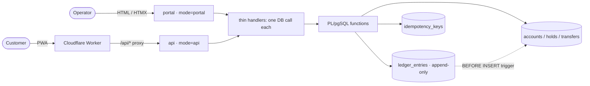
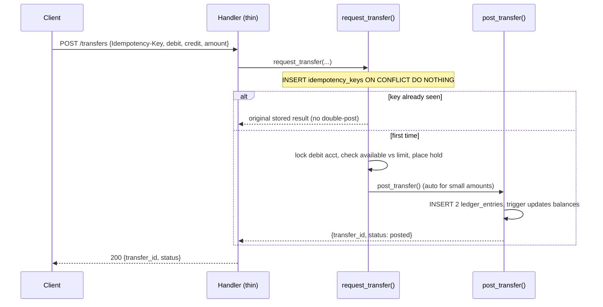

# bank0 — Overview

bank0 is a **core-banking backend**: the engine at the heart of a bank — the part
that holds account balances and moves money between them without ever losing a
cent, double-spending, or double-posting on a retry. Correctness is a property of
the **database**; the Go services on top are thin transport.

Single currency (EUR), amounts as integer minor units. It **models** the payment
lifecycle (authorization holds, settlement, reversal) rather than connecting to
real rails (SEPA/SWIFT/cards); interest, statements, and KYC are out of scope
and can be layered on without reshaping the core. A per-payment AML name-screening
gate does ship (watchlist match parks a payment `under_review` for operator
review — see [03](03-ledger-lifecycle-idempotency.md) / [05](05-admin-ui.md)).

---

## The four invariants

Everything below follows from four rules. When a design question comes up, re-derive
the answer from these.

1. **The ledger is the source of truth; balance is a cache.** `ledger_entries` is an
   append-only record of every signed posting. `accounts.balance_minor` is a
   trigger-maintained cache of `SUM(ledger_entries)` — for fast reads, not for truth.
   The *only* thing that may change a balance is inserting a ledger entry, so the
   cache can't drift: `reconcile()` asserts `balance_minor == SUM(entries)` on demand
   and on the operator dashboard.
2. **Money/auth logic lives in the database.** Every money movement and every
   auth/session transition is a PL/pgSQL function with explicit row locks. It owns all
   validation (funds, limits, account status) and all writes (transfer, ledger, holds,
   balance cache, audit). Triggers enforce the structural invariants. Correctness is a
   property of the schema, so a second client, a cron job, or a `psql` session all get
   the same guarantees.
3. **Idempotency is enforced by the database.** Money moves carry an `Idempotency-Key`;
   a dedicated table makes the first call do the work and every replay return the
   *original* result, inside the same transaction that posts. The API never has to
   reason about "did this already happen?".
4. **Append-only and auditable.** `ledger_entries` is immutable (a trigger rejects
   UPDATE/DELETE); corrections are new **reversing entries**. Every operator action is
   attributed and recorded in `admin_actions`. The ledger *is* the audit trail.

The API layer carries **no** business logic: handlers parse the request, call **one**
DB function, and map the result (or a typed DB error) to an HTTP status.

---

## Architecture — three surfaces, one ledger

Two surfaces are the **same Go binary** in different `server.mode`s (separated *in the
app*, not just at the edge — an `api` pod doesn't even register the admin routes); the
third is a Cloudflare Worker. All three read and write the one Postgres ledger.

| Host | Surface | Tech | Auth |
|------|---------|------|------|
| `portal.bank0.hnimn.art` | admin API + operator console | Go `mode=portal` (Templ/HTMX) | DB cookie session, staff roles |
| `api.bank0.hnimn.art` | customer JSON API | Go `mode=api`, behind Cloudflare | JWT bearer + rotating refresh tokens, ownership-scoped |
| `bank0.hnimn.art` | customer PWA | Cloudflare Worker (Preact/Vite) | proxies `/api/*` to the client API |



`server.mode=all` serves both Go surfaces in one container for local development.
The schema is a 16-file domain baseline under `db/migrations/`: `00001_foundation`
(extensions, `uuidv7()`, enum types), `00002_iban`, `00003_users`,
`00004_auth_tokens`, `00005_onboarding`, `00006_mfa`, `00007_accounts`,
`00008_transfers`, `00009_maker_checker`, `00010_maintenance`,
`00011_beneficiaries`, `00012_guided_scenarios`, `00013_disputes`, `00014_events`,
`00015_fraud`, `00016_system_seed`.

---

## Using bank0

### Run it locally

```bash
docker compose -f deploy/docker-compose.dev.yml up --build -d   # Postgres + migrate + admin (mode=portal :8080) + client (mode=api :8090)
task seed                                                       # load the dev seed (db/seed.sql); migrate ran above
open http://localhost:8080/        # operator console (Templ + HTMX)
open http://localhost:8090/docs    # client API reference (Scalar)
```

Seeded logins (dev passwords): staff `admin`/`admin`, `operator1`/`operator`,
`auditor1`/`auditor`; customers `alice`/`password` … (30 named + generated, no console
access). The default seed (`db/seed.sql`, idempotent) loads 98 customers / 242
accounts (valid NL IBANs) / 741 transfers, including pending/canceled/reversed for the
full lifecycle and a randomized 10-user / 30-account guided-transfer "mule" pool.
`task seed:demo` loads a much larger randomized set.

### Scenario — a customer moves money (client API → PWA)

The PWA is same-origin with the API (the Worker proxies `/api/*`), so tokens never
cross a third origin.

1. `POST /auth/login` → an access JWT (15-min) + a refresh token. The PWA silently
   rotates via `POST /auth/refresh`.
2. `GET /me`, `GET /users/{id}/accounts`, `GET /accounts/{id}/ledger` — all
   ownership-scoped to the token subject (anything else is `404`).
3. `GET /beneficiaries/resolve?iban=…` confirms a payee (masked owner name), then
   `POST /beneficiaries` saves it.
4. `POST /transfers` with an `Idempotency-Key` moves the money. A small amount posts
   immediately; replays return the original result.



Above the maker-checker threshold (`bank_settings`, €10k by default) the transfer
parks as **pending** for a second operator instead of posting. Guided-transfer mode
(`GET /transfers/suggestion`) returns a short menu of candidate payees for the
APP-scam demo — see [`06-client-api.md`](06-client-api.md).

### Scenario — an operator runs the bank (console)

From `portal.*`, a staff member (cookie session, role-gated) provisions and supervises:

1. **Provision**: create a customer (`POST /users`), open an account
   (`POST /accounts`, generated NL IBAN), fund it (`POST /accounts/{id}/deposit`).
2. **Move money**: credit/withdraw; anything above the threshold routes to the
   **maker-checker Approvals** queue (the maker can't self-approve).
3. **Supervise**: search users/accounts/transfers, walk a transfer's lifecycle
   (post/cancel/reverse — reversals clawback-check the recipient), resolve disputes,
   and watch `reconcile()` (run continuously on the maintenance tick) confirm the books
   balance. See [`05-admin-ui.md`](05-admin-ui.md).

### Deploy it

Two supported paths, same image: a **self-managed** Kubernetes/Helm + Gateway API
setup ([`04-deployment.md`](04-deployment.md)) and a **serverless** Supabase + Cloud
Run + Cloudflare path ([`08-deployment-cloud-run-supabase.md`](08-deployment-cloud-run-supabase.md)).
Migrations run as a pre-upgrade job; readiness pings the DB; `/metrics` exposes
Prometheus RED + pool gauges.

---

## Documentation map

| To… | Read |
|---|---|
| Know the tables, columns, constraints, indexes | [`02-data-model.md`](02-data-model.md) |
| Understand the transfer state machine, DB functions, idempotency, triggers | [`03-ledger-lifecycle-idempotency.md`](03-ledger-lifecycle-idempotency.md) |
| Deploy (self-managed Helm / Gateway) | [`04-deployment.md`](04-deployment.md) |
| Use the operator console | [`05-admin-ui.md`](05-admin-ui.md) |
| Use the customer client API (auth, ownership, endpoints) | [`06-client-api.md`](06-client-api.md) |
| Build/run the customer PWA | [`07-client-web-app.md`](07-client-web-app.md) |
| Deploy (serverless Supabase + Cloud Run) | [`08-deployment-cloud-run-supabase.md`](08-deployment-cloud-run-supabase.md) |
| Integrate the fraudbank clients | [`09-fraudbank-integration.md`](09-fraudbank-integration.md) |
| Review the security model | [`10-security-review.md`](10-security-review.md) |
| Understand IBAN validation/generation | [`11-iban-verification.md`](11-iban-verification.md) |
| Understand the closed-core → real-rail seam (rail-readiness) | [`12-rail-readiness.md`](12-rail-readiness.md) |

The open backlog + product roadmap live in [`specs/`](specs/) (start at
[`specs/spec-p3-roadmap.md`](specs/spec-p3-roadmap.md)). The as-built behaviour of every
shipped feature is documented in the reference docs above (`02`–`11`).
