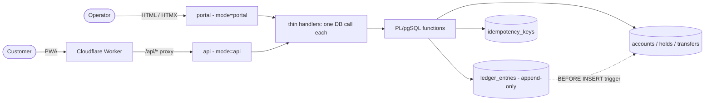
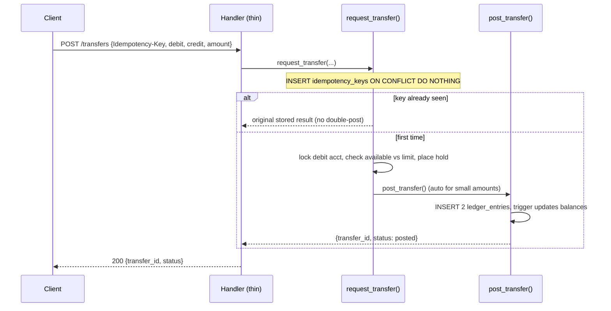

# bank0 - Overview

**TL;DR.** bank0 is the engine at the heart of a bank: it holds account balances
and moves money between them. Four invariants shape every design decision - the
ledger is the truth and the balance is a cache, the logic lives in Postgres,
idempotency is enforced by the database, and nothing is ever edited or deleted.
Three surfaces share one ledger. If you are about to ask "where should this code
go?", the answer is almost always "in a PL/pgSQL function".

This document explains *why* bank0 is shaped the way it is. To run it, read the
[README](../README.md). To change it, read
[`08-development.md`](08-development.md).

Single currency (EUR). Every amount is an integer in **minor units** - the
smallest unit of the currency, so EUR 12.34 is carried as `1234`. Money never
touches a float or a decimal type anywhere in the system. bank0 models
the payment lifecycle - authorization holds, settlement, reversal - rather than
connecting to real rails like SEPA, SWIFT or card networks. Interest, statements
and full KYC are out of scope and can be layered on without reshaping the core.
Per-payment AML name screening does ship: a watchlist match parks a payment for
operator review.

Prerequisites: SQL, transactions and indexes. Banking vocabulary is introduced
where it is first needed.

---

## The four invariants

Everything below follows from four rules. When a design question comes up,
re-derive the answer from these rather than from precedent.

**1. The ledger is the source of truth; the balance is a cache.** Double-entry
bookkeeping means every movement of money is recorded twice - once as a debit on
one account, once as an equal credit on another - so the books always balance by
construction. `ledger_entries` is that append-only record of signed postings.
`accounts.balance_minor` is a trigger-maintained sum of those entries, kept for
fast reads, never for truth. The only thing that may change a balance is
inserting a ledger entry, so the cache cannot drift, and `reconcile()` asserts
`balance_minor == SUM(entries)` on demand and on every maintenance tick.

**2. Money and auth logic lives in the database.** Every money movement and every
auth transition is a PL/pgSQL function with explicit row locks. It owns the
validation - available funds, per-account limits, account status - and every
write it implies: the transfer row, the ledger entries, the hold, the balance
cache, the audit record. Triggers enforce the structural invariants underneath.
Correctness is a property of the schema, so it survives a second client, a cron
job, or somebody in `psql`.

**3. Idempotency is enforced by the database.** Money moves carry an
`Idempotency-Key`. A dedicated table makes the first call do the work and every
replay return the *original* result, inside the same transaction that posts. The
API never has to reason about whether something already happened.

**4. Append-only and auditable.** `ledger_entries` is immutable - a trigger
rejects `UPDATE` and `DELETE`. A correction is a new pair of reversing entries,
not an edit. Every operator action is attributed and recorded in
`admin_actions`. The ledger is the audit trail.

The consequence for the Go layer: handlers carry no business logic. They parse
the request, call one DB function, and map the result or a typed SQLSTATE to an
HTTP status. `mapDBError` is the single place where a SQLSTATE becomes a status
code.

---

## Three surfaces, one ledger

Two surfaces are the same Go binary in different `server.mode`s, separated in
the application rather than only at the edge - an `api` pod does not even
register the admin routes. The third is a Cloudflare Worker. All three read and
write one Postgres ledger.

| Host | Surface | Tech | Auth |
|---|---|---|---|
| `portal.bank0.hnimn.art` | admin API + operator console | Go `mode=portal`, Templ and HTMX | DB cookie session, staff roles |
| `api.bank0.hnimn.art` | customer JSON API | Go `mode=api`, behind Cloudflare | JWT bearer + rotating refresh tokens, ownership-scoped |
| `bank0.hnimn.art` | customer PWA | Cloudflare Worker, Preact and Vite | proxies `/api/*` to the client API |

```mermaid
graph LR
    Op([Operator]) -->|HTML / HTMX| Portal[portal - mode=portal]
    Cust([Customer]) -->|PWA| CFW[Cloudflare Worker]
    CFW -->|/api/* proxy| API[api - mode=api]
    Portal --> MW[thin handlers: one DB call each]
    API --> MW
    MW --> FN[PL/pgSQL functions]
    FN --> L[(ledger_entries - append-only)]
    FN --> A[(accounts / holds / transfers)]
    L -. BEFORE INSERT trigger .-> A
    FN --> IK[(idempotency_keys)]
```

Diagram: operators reach the portal surface directly and customers reach the API
surface through the Worker proxy; both surfaces funnel into thin handlers, which
call PL/pgSQL functions, which write the append-only ledger, the account and
transfer tables, and the idempotency keys. A trigger on ledger inserts maintains
the account balance cache.

The schema starts from a 17-file domain baseline under `db/migrations/`, frozen
at the `v1.0.0` tag, with every later change as a new numbered migration on top
(so the directory holds more than 17 files). The baseline is:
`00001_foundation` (extensions, `uuidv7()`, enum types), `00002_iban`,
`00003_users`, `00004_auth_tokens`, `00005_onboarding`, `00006_mfa`,
`00007_accounts`, `00008_transfers`, `00009_maker_checker`, `00010_maintenance`,
`00011_beneficiaries`, `00012_guided_scenarios`, `00013_disputes`,
`00014_events`, `00015_fraud`, `00016_system_seed`, `00017_iban_minting`.

---

## What a money move actually does

A customer sends money from the PWA. The PWA is same-origin with the API,
because the Worker proxies `/api/*`, so tokens never cross a third origin.

1. `POST /auth/login` returns a 15-minute access token and a refresh token; the
   PWA rotates silently at `POST /auth/refresh`.
2. `GET /me`, `GET /users/{id}/accounts` and `GET /accounts/{id}/ledger` are all
   scoped to the token subject. Another customer's account is a 404, not a 403 -
   the API does not confirm that it exists.
3. `GET /beneficiaries/resolve?iban=...` runs confirmation of payee and returns a
   masked owner name plus the server's match verdict; `POST /beneficiaries` saves
   the payee.
4. `POST /transfers` with an `Idempotency-Key` moves the money.

```mermaid
sequenceDiagram
    participant C as Client
    participant H as Handler (thin)
    participant FN as request_transfer()
    participant TR as post_transfer()
    C->>H: POST /transfers {Idempotency-Key, debit, credit, amount}
    H->>FN: request_transfer(...)
    Note over FN: INSERT idempotency_keys ON CONFLICT DO NOTHING
    alt key already seen
        FN-->>H: original stored result (no double-post)
    else first time
        FN->>FN: lock debit acct, check available vs limit, place hold
        FN->>TR: post_transfer() (auto for small amounts)
        TR->>TR: INSERT 2 ledger_entries, trigger updates balances
        TR-->>H: {transfer_id, status: posted}
    end
    H-->>C: 200 {transfer_id, status}
```

Diagram: the handler makes one call to `request_transfer`, which claims the
idempotency key first. A replay returns the stored result without posting again;
a first-time request locks the debit account, checks funds against the limit,
places a hold, and posts two ledger entries whose trigger updates both balances.

Both functions live in
[`00008_transfers.sql`](../db/migrations/00008_transfers.sql), with the rest of
the transfer lifecycle.

A *hold* is a reservation: the funds are unavailable to spend but no ledger entry
exists yet, so the money has not moved. Above the maker-checker threshold
(`bank_settings`, EUR 10,000 by default) the transfer parks as `pending` for a
second operator to approve - the person who created it cannot approve their own.
The fraud gate can park it two other ways: `held` for a customer cooling-off, or
`under_review` for operator AML screening.

---

## What an operator does

Staff work from `portal.*` with a cookie session and a role.

1. **Provision.** Create a customer, open an account with a generated NL IBAN,
   fund it.
2. **Move money.** Credit or withdraw. Anything above the maker-checker threshold
   routes to the Approvals queue instead of posting.
3. **Supervise.** Search users, accounts and transfers; walk a transfer's
   lifecycle (post, cancel, reverse - a reversal checks the recipient can still
   fund the clawback); resolve disputes; release or refuse screening holds; watch
   `reconcile()` confirm the books balance on every tick.

See [`05-admin-ui.md`](05-admin-ui.md).

---

## Documentation map

| To ... | Read |
|---|---|
| Run it, deploy it, see what it is | [`../README.md`](../README.md) |
| Work on the code: generate, test, add a migration or an endpoint | [`08-development.md`](08-development.md) |
| Know the tables, columns, constraints and indexes | [`02-data-model.md`](02-data-model.md) |
| Understand the transfer state machine, the DB functions, idempotency, triggers | [`03-ledger-lifecycle-idempotency.md`](03-ledger-lifecycle-idempotency.md) |
| Deploy with Helm and Gateway API | [`04-deployment.md`](04-deployment.md) |
| Use the operator console | [`05-admin-ui.md`](05-admin-ui.md) |
| Call the customer API: auth, ownership, endpoints, errors | [`06-client-api.md`](06-client-api.md) |
| Build or run the customer PWA | [`07-client-web-app.md`](07-client-web-app.md) |
| Integrate an external client | [`09-fraudbank-integration.md`](09-fraudbank-integration.md) |
| Review the security model | [`10-security-review.md`](10-security-review.md) |
| Understand IBAN validation and generation | [`11-iban-verification.md`](11-iban-verification.md) |
| Understand the closed-core to real-rail seam | [`12-rail-readiness.md`](12-rail-readiness.md) |

The open backlog and product roadmap live in
the [issue tracker](https://github.com/minhtt159/bank0/issues). The one planning
document that survives is
[`specs/spec-p3-roadmap.md`](specs/spec-p3-roadmap.md), which is design thinking
for product domains nobody has committed to building. Anything already built is
described in the reference documents above, never in a spec.
