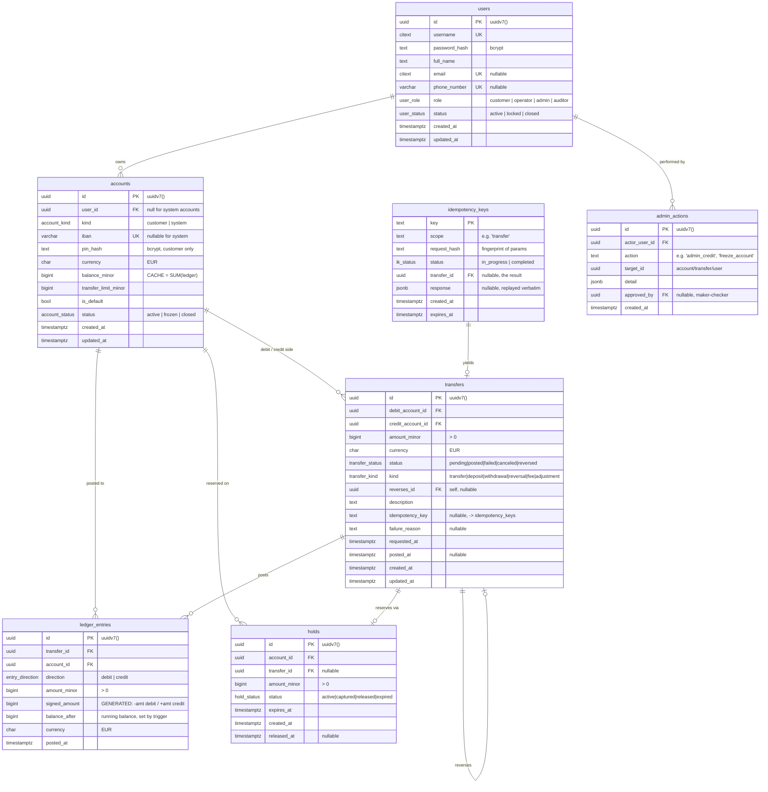

# bank0 — Data Model

> Consolidated ERD and schema rationale.
> Money is **BIGINT minor units**, single currency **EUR**. PKs are **UUIDv7**
> (`uuidv7()` native in PostgreSQL 18).

---

## 1. What changed vs tf-backend (the consolidation)

tf-backend stored money in three overlapping places that could drift:

| tf-backend | Problem | bank0 |
|---|---|---|
| `accounts.balance` (mutable, written directly) | could be set by `update_account_info`, bypassing the ledger | `accounts.balance_minor` is a **cache**, writable only by the ledger trigger |
| `transactions` (2 rows/transfer) | the real ledger, but not authoritative | **`ledger_entries`** — append-only, authoritative |
| `transaction_audit_log` (1 row/transfer, denormalized) | a *second copy* that could diverge | **removed.** Replaced by the `transfers` row + a read-only enriched view |

Net: **one** ledger, **one** operation table (`transfers`), plus supporting
tables for holds and idempotency. The `enriched_ledger` view supplies the
human-readable joins the old `enriched_transaction_audit_log` view did.

---

## 2. Entity-relationship diagram



---

## 3. Tables in detail

> The DDL below is a **design sketch** to communicate intent. The canonical
> definitions live in `db/migrations/` once implementation starts. Enum names and
> column names here are the contract.

### 3.1 `users`

```sql
CREATE TYPE user_role   AS ENUM ('customer', 'operator', 'admin', 'auditor');
CREATE TYPE user_status AS ENUM ('active', 'locked', 'closed');

CREATE TABLE users (
    id            UUID PRIMARY KEY DEFAULT uuidv7(),
    username      CITEXT NOT NULL UNIQUE,            -- case-insensitive
    password_hash TEXT   NOT NULL,                   -- bcrypt via pgcrypto
    full_name     TEXT   NOT NULL,
    email         CITEXT UNIQUE,                     -- NULL allowed; NULLs don't collide
    phone_number  VARCHAR(16) UNIQUE,
    role          user_role   NOT NULL DEFAULT 'customer',
    status        user_status NOT NULL DEFAULT 'active',
    created_at    TIMESTAMPTZ NOT NULL DEFAULT now(),
    updated_at    TIMESTAMPTZ NOT NULL DEFAULT now(),
    CHECK (email IS NULL OR email ~* '^[^@\s]+@[^@\s]+\.[^@\s]{2,}$')
);
```

Changes from tf-backend: `password` → `password_hash` (bcrypt, never plaintext);
added `role` (drives the operator console) and `status` (lock/close without
deleting — banks don't hard-delete people); `CITEXT` so `Alice` == `alice` for
login and email. Optional `email`/`phone` are genuinely `NULL` (not `''`), so the
unique constraints behave (the NULL-vs-empty fix from tf-backend's migration 8 is
correct by construction here).

### 3.2 `accounts`

```sql
CREATE TYPE account_kind   AS ENUM ('customer', 'system');
CREATE TYPE account_status AS ENUM ('active', 'frozen', 'closed');

CREATE TABLE accounts (
    id                  UUID PRIMARY KEY DEFAULT uuidv7(),
    user_id             UUID REFERENCES users(id) ON DELETE RESTRICT,  -- NULL for system
    kind                account_kind   NOT NULL DEFAULT 'customer',
    system_code         TEXT UNIQUE,                  -- e.g. EXTERNAL_CLEARING (system only)
    iban                VARCHAR(34) UNIQUE,           -- NULL for system accounts
    pin_hash            TEXT,                         -- bcrypt; customer only
    currency            CHAR(3) NOT NULL DEFAULT 'EUR',
    balance_minor       BIGINT  NOT NULL DEFAULT 0,   -- CACHE, trigger-maintained
    transfer_limit_minor BIGINT NOT NULL DEFAULT 50000,  -- €500.00
    is_default          BOOLEAN NOT NULL DEFAULT FALSE,
    status              account_status NOT NULL DEFAULT 'active',
    created_at          TIMESTAMPTZ NOT NULL DEFAULT now(),
    updated_at          TIMESTAMPTZ NOT NULL DEFAULT now(),

    CHECK (transfer_limit_minor >= 0),
    CHECK (currency = 'EUR'),                          -- single currency, for now
    -- customers can't go negative; system accounts (the bank's GL) can:
    CHECK (kind = 'system' OR balance_minor >= 0),
    -- system: code + no owner/iban; customer: owner + iban + no code
    CHECK (
        (kind = 'system'   AND system_code IS NOT NULL AND user_id IS NULL AND iban IS NULL)
     OR (kind = 'customer' AND system_code IS NULL     AND user_id IS NOT NULL AND iban IS NOT NULL)
    )
);

-- exactly one default account per user (the partial-unique-index pattern):
CREATE UNIQUE INDEX uq_accounts_one_default
    ON accounts (user_id) WHERE is_default;
```

Key points:
- **`balance_minor` is a cache.** No application code writes it; only the ledger
  trigger does (§4). The `>= 0` check is *belt-and-suspenders* — funds are
  actually guarded by the `available` check in `request_transfer`, but the
  constraint guarantees the database can never persist a negative customer
  balance even if a function is buggy.
- **System accounts** (`kind='system'`) are the bank's general-ledger accounts:
  `external_clearing` (the boundary where money enters/leaves the bank),
  `cash`, `fees`. They have no `user_id`/`iban` and **may** go negative — that's
  how a deposit works without minting money (§4 in `03-...md`).
- **One default account** is enforced by a partial unique index, not a trigger —
  cheaper, race-free, and declarative (replaces tf-backend's
  `enforce_single_default_account` trigger + `FOR UPDATE` dance).

### 3.3 `transfers` — the operation/intent

```sql
CREATE TYPE transfer_status AS ENUM
    ('pending', 'posted', 'failed', 'canceled', 'reversed');
CREATE TYPE transfer_kind   AS ENUM
    ('transfer', 'deposit', 'withdrawal', 'reversal', 'fee', 'adjustment');

CREATE TABLE transfers (
    id                UUID PRIMARY KEY DEFAULT uuidv7(),
    debit_account_id  UUID NOT NULL REFERENCES accounts(id) ON DELETE RESTRICT,
    credit_account_id UUID NOT NULL REFERENCES accounts(id) ON DELETE RESTRICT,
    amount_minor      BIGINT  NOT NULL,
    currency          CHAR(3) NOT NULL DEFAULT 'EUR',
    status            transfer_status NOT NULL DEFAULT 'pending',
    kind              transfer_kind   NOT NULL DEFAULT 'transfer',
    reverses_id       UUID REFERENCES transfers(id),     -- set on reversals
    description       TEXT NOT NULL DEFAULT '',
    idempotency_key   TEXT,                              -- -> idempotency_keys.key
    failure_reason    TEXT,
    requested_at      TIMESTAMPTZ NOT NULL DEFAULT now(),
    posted_at         TIMESTAMPTZ,
    created_at        TIMESTAMPTZ NOT NULL DEFAULT now(),
    updated_at        TIMESTAMPTZ NOT NULL DEFAULT now(),

    CHECK (amount_minor > 0),
    CHECK (debit_account_id <> credit_account_id),
    -- posted_at is set once a transfer hits the ledger; a reversed transfer was
    -- posted, so it keeps its posted_at:
    CHECK ((posted_at IS NOT NULL) = (status IN ('posted','reversed'))),
    CHECK ((kind = 'reversal')  = (reverses_id IS NOT NULL)) -- reverses_id iff reversal
);
```

`transfers` is the **intent**: one row per requested money movement, carrying its
lifecycle state. It is *not* the ledger — the ledger entries are written only when
a transfer reaches `posted`. A normal customer transfer has
`debit_account_id`/`credit_account_id` both being customer accounts; a deposit has
`debit_account_id = external_clearing` (system) and `credit_account_id =`
customer; a withdrawal is the reverse.

### 3.4 `ledger_entries` — the append-only source of truth

```sql
CREATE TYPE entry_direction AS ENUM ('debit', 'credit');

CREATE TABLE ledger_entries (
    id            UUID PRIMARY KEY DEFAULT uuidv7(),
    transfer_id   UUID NOT NULL REFERENCES transfers(id) ON DELETE RESTRICT,
    account_id    UUID NOT NULL REFERENCES accounts(id)  ON DELETE RESTRICT,
    direction     entry_direction NOT NULL,
    amount_minor  BIGINT NOT NULL,
    -- signed convention: debit reduces the account, credit increases it
    signed_amount BIGINT GENERATED ALWAYS AS
                  (CASE direction WHEN 'debit' THEN -amount_minor
                                  ELSE amount_minor END) STORED,
    balance_after BIGINT NOT NULL,         -- running balance, set by trigger
    currency      CHAR(3) NOT NULL DEFAULT 'EUR',
    posted_at     TIMESTAMPTZ NOT NULL DEFAULT now(),

    CHECK (amount_minor > 0)
);

CREATE INDEX idx_ledger_account_posted ON ledger_entries (account_id, posted_at DESC, id DESC);
CREATE INDEX idx_ledger_transfer       ON ledger_entries (transfer_id);
```

- **Append-only**: a trigger (§4) raises an exception on any `UPDATE` or `DELETE`.
- **`signed_amount`** is a stored generated column so balance sums and
  reconciliation are trivial and index-friendly.
- **`balance_after`** gives every entry a running balance → instant account
  statements without window functions at read time.
- The `(account_id, posted_at DESC, id DESC)` index drives statement pagination;
  `id` (UUIDv7, time-ordered) is the stable tiebreaker within the same millisecond.

### 3.5 `holds` — authorization reservations

```sql
CREATE TYPE hold_status AS ENUM ('active', 'captured', 'released', 'expired');

CREATE TABLE holds (
    id           UUID PRIMARY KEY DEFAULT uuidv7(),
    account_id   UUID NOT NULL REFERENCES accounts(id) ON DELETE RESTRICT,
    transfer_id  UUID REFERENCES transfers(id),
    amount_minor BIGINT NOT NULL,
    status       hold_status NOT NULL DEFAULT 'active',
    expires_at   TIMESTAMPTZ NOT NULL,
    created_at   TIMESTAMPTZ NOT NULL DEFAULT now(),
    released_at  TIMESTAMPTZ,
    CHECK (amount_minor > 0)
);

-- only one active hold per pending transfer
CREATE UNIQUE INDEX uq_holds_active_transfer
    ON holds (transfer_id) WHERE status = 'active';
CREATE INDEX idx_holds_active_account
    ON holds (account_id) WHERE status = 'active';
CREATE INDEX idx_holds_expiry
    ON holds (expires_at) WHERE status = 'active';
```

A hold reserves funds on the debit account **without** moving the ledger balance.
The defining concept of the lifecycle you chose:

> **`available_minor = balance_minor − SUM(holds.amount_minor WHERE status='active')`**

Posting a transfer converts its hold `active → captured` and writes the ledger
entries; canceling/failing/expiring converts it `active → released/expired` and
returns the funds to `available`.

### 3.6 `idempotency_keys`

```sql
CREATE TYPE ik_status AS ENUM ('in_progress', 'completed');

CREATE TABLE idempotency_keys (
    key          TEXT PRIMARY KEY,
    scope        TEXT NOT NULL,                  -- 'transfer', 'reversal', ...
    request_hash TEXT NOT NULL,                  -- SHA-256 of normalized params
    status       ik_status NOT NULL DEFAULT 'in_progress',
    transfer_id  UUID REFERENCES transfers(id),
    response     JSONB,
    created_at   TIMESTAMPTZ NOT NULL DEFAULT now(),
    expires_at   TIMESTAMPTZ NOT NULL DEFAULT now() + INTERVAL '7 days'
);
```

How it guarantees no double-post and "no business confusion on the API" is the
subject of [`03-...md`](03-ledger-lifecycle-idempotency.md) §3. In short: the DB
function does `INSERT ... ON CONFLICT (key) DO NOTHING`; a conflict means "seen
before" → return the stored result; a conflict with a *different* `request_hash`
→ raise (the client reused a key for a different request — a bug we surface
loudly rather than silently mis-handling).

### 3.7 `admin_actions` — operator audit

```sql
CREATE TABLE admin_actions (
    id            UUID PRIMARY KEY DEFAULT uuidv7(),
    actor_user_id UUID NOT NULL REFERENCES users(id),
    action        TEXT NOT NULL,            -- 'admin_credit','freeze_account',...
    target_id     UUID,                     -- account / transfer / user affected
    detail        JSONB NOT NULL DEFAULT '{}',
    approved_by   UUID REFERENCES users(id),-- maker-checker second approver
    created_at    TIMESTAMPTZ NOT NULL DEFAULT now()
);
```

Note this logs the *act of an operator deciding something*. The financial effect
is still the ledger. Together they answer both "what moved?" (ledger) and "who
authorized it and why?" (admin_actions).

---

## 4. Invariants (the correctness contract)

These are the guarantees the schema + functions + triggers uphold. Each maps to a
check the `reconcile()` function and the admin dashboard run.

| # | Invariant | Enforced by |
|---|-----------|-------------|
| I1 | `accounts.balance_minor == SUM(signed_amount)` of that account's entries | balance-follows-ledger trigger; verified by `reconcile()` |
| I2 | Every transfer's entries net to zero: `SUM(signed_amount WHERE transfer_id=t) == 0` | `post_transfer` always writes balanced pairs; `reconcile()` |
| I3 | **Global**: `SUM(signed_amount)` over all posted entries == 0 (no money created/destroyed) | follows from I2; `reconcile()` asserts directly |
| I4 | `available_minor >= 0` for customer accounts | `request_transfer` checks before creating a hold; `CHECK` on balance |
| I5 | `ledger_entries` is append-only | immutability trigger (rejects UPDATE/DELETE) |
| I6 | At most one `is_default` account per user | partial unique index |
| I7 | At most one `active` hold per pending transfer | partial unique index |
| I8 | A transfer is `posted` ⟺ it has `posted_at` and ≥2 ledger entries | CHECK + `post_transfer` |
| I9 | Replaying an idempotency key never creates a second transfer | `idempotency_keys` PK + ON CONFLICT logic |

> I3 is the single most reassuring line on the dashboard: if the bank's books
> sum to zero, no cent has leaked. System (GL) accounts hold the counter-balancing
> negatives that make customer positives possible.

---

## 5. Indexes (beyond PKs and the unique constraints above)

| Index | Purpose |
|-------|---------|
| `ledger_entries (account_id, posted_at DESC, id DESC)` | account statement pagination |
| `ledger_entries (transfer_id)` | fetch both legs of a transfer |
| `holds (account_id) WHERE status='active'` | fast `available` computation |
| `holds (expires_at) WHERE status='active'` | `expire_holds()` batch scan |
| `transfers (status) WHERE status='pending'` | operator "pending queue" |
| `transfers (debit_account_id, created_at DESC)` / `(credit_account_id, created_at DESC)` | per-account transfer history (the tf-backend `UNION ALL` pattern still applies) |
| `idempotency_keys (expires_at)` | TTL cleanup job |
| `users (lower(username))`, `accounts (lower(iban))` | search (the search-feature TODO), or `pg_trgm` GIN later |

---

## 6. Naming & conventions

- **Money**: every monetary column ends in `_minor` and is `BIGINT` (minor units,
  i.e. euro cents). Formatting to `€10.50` happens only in the presentation layer.
- **Time**: always `TIMESTAMPTZ`, default `now()`. `updated_at` maintained by a
  `BEFORE UPDATE` trigger on every mutable table.
- **IDs**: `UUID` PKs, `DEFAULT uuidv7()` (time-ordered → index-friendly inserts;
  this is the UUIDv7-migration TODO, native in PG18 so no helper function needed).
- **Enums**: PostgreSQL `ENUM` types, named `<noun>_<attr>` (e.g. `transfer_status`).
- **No hard deletes** of financial data: `ON DELETE RESTRICT` on every FK into
  `accounts`/`transfers`/`ledger_entries`. People/accounts are *closed*, not deleted.

---

## 7. Future extensions (non-breaking)

- **Multi-currency**: add `currency` per ledger entry (already present), drop the
  `currency = 'EUR'` checks, introduce an FX `transfer_kind` that posts 4 legs via
  an `fx_clearing` system account + an `exchange_rates` table. The double-entry
  core does not change.
- **Overdraft / credit lines**: relax the customer `balance >= 0` check for
  flagged accounts; `available` already centralizes the funds check.
- **Statements**: `balance_after` is already materialized — a statement is a date
  range over `ledger_entries`.
- **Interest**: a scheduled job that posts `fee`/`adjustment` transfers against a
  system interest account.
