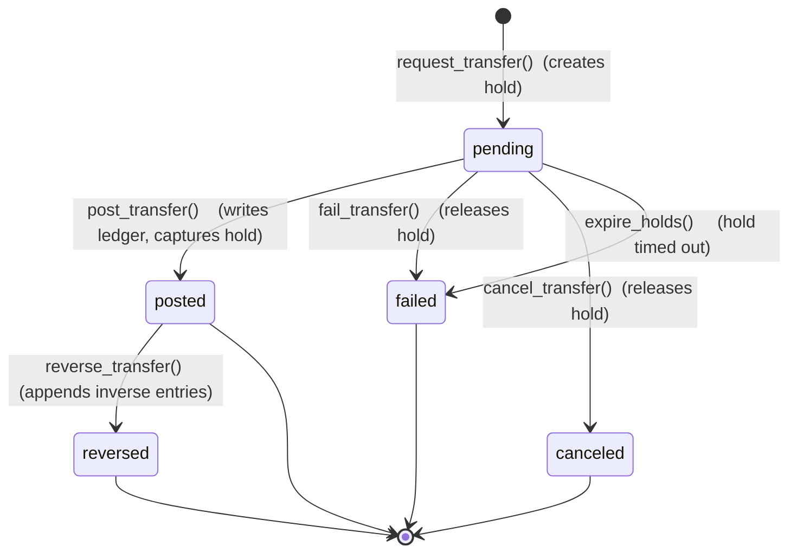
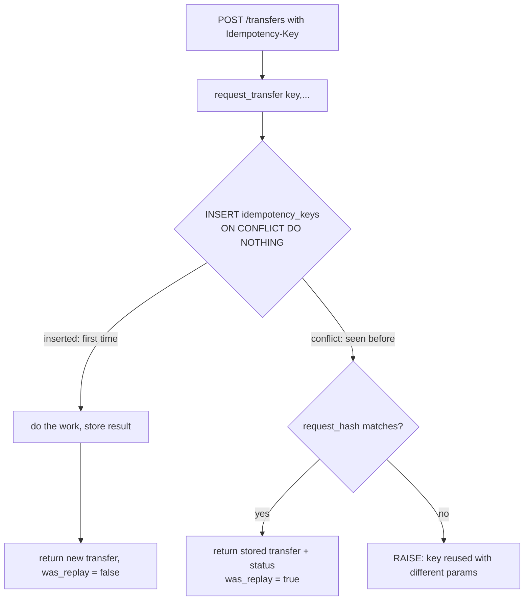

# bank0 — Ledger, Lifecycle & Idempotency

> The engine. This is where "state transitions live in the database" and
> "idempotency is enforced by the database" become concrete.
> Read [`02-data-model.md`](02-data-model.md) first.

---

## 1. The transfer state machine



| State | Meaning | Balance effect | Available effect |
|-------|---------|----------------|------------------|
| `pending` | requested, funds reserved | none (no ledger yet) | debit account ↓ by amount (hold) |
| `posted` | settled, ledger written | debit ↓, credit ↑ | hold released, balance already reflects it |
| `failed` | rejected / expired | none | hold released |
| `canceled` | withdrawn before posting | none | hold released |
| `reversed` | settled then corrected | inverse entries applied | n/a |

**Terminal states** (`posted` can still be `reversed`): `failed`, `canceled`,
`reversed`. There is no edit and no delete — only forward transitions and
reversing entries. This is what makes the history trustworthy (P4).

> **Why two phases?** You chose the full lifecycle, so reserve (`pending`+hold)
> and settle (`posted`+ledger) are distinct. This models real authorization:
> a hold reserves `available` funds immediately, while the actual ledger posting
> can happen now (synchronous) or later (deferred settlement). The PoC default is
> to post immediately after request (see §5 `transfer()` convenience), but the
> states remain first-class so the deferred path exists.

---

## 2. The DB functions (the only way money moves)

Each function is the **single entry point** for one transition. Handlers call
exactly one of these and translate its result. Signatures are the contract;
bodies below are abbreviated to the load-bearing logic.

### 2.1 `request_transfer` — create a pending transfer + hold (idempotent)

```sql
-- returns (transfer_id, status, was_replay)
CREATE FUNCTION request_transfer(
    p_idempotency_key TEXT,
    p_debit_account   UUID,
    p_credit_account  UUID,
    p_amount_minor    BIGINT,
    p_description     TEXT DEFAULT '',
    p_kind            transfer_kind DEFAULT 'transfer',
    p_hold_ttl        INTERVAL DEFAULT INTERVAL '15 minutes'
) RETURNS TABLE (transfer_id UUID, status transfer_status, was_replay BOOLEAN)
LANGUAGE plpgsql AS $$
DECLARE
    v_hash    TEXT := encode(digest(
        p_debit_account::text || p_credit_account::text ||
        p_amount_minor::text  || p_kind::text, 'sha256'), 'hex');
    v_existing idempotency_keys%ROWTYPE;
    v_debit    accounts%ROWTYPE;
    v_credit   accounts%ROWTYPE;
    v_available BIGINT;
    v_transfer_id UUID;
BEGIN
    -- (a) Idempotency gate: first writer wins.
    INSERT INTO idempotency_keys (key, scope, request_hash, status)
    VALUES (p_idempotency_key, 'transfer', v_hash, 'in_progress')
    ON CONFLICT (key) DO NOTHING;

    IF NOT FOUND THEN
        -- key already exists -> this is a replay (or a concurrent duplicate)
        SELECT * INTO v_existing FROM idempotency_keys WHERE key = p_idempotency_key;
        IF v_existing.request_hash <> v_hash THEN
            RAISE EXCEPTION 'idempotency key % reused with different parameters',
                p_idempotency_key USING ERRCODE = 'check_violation';
        END IF;
        -- same request: return the original outcome, do NOT post again
        RETURN QUERY
            SELECT v_existing.transfer_id, t.status, TRUE
            FROM transfers t WHERE t.id = v_existing.transfer_id;
        RETURN;
    END IF;

    -- (b) Validate. Lock the debit account to serialize the funds check.
    SELECT * INTO v_debit  FROM accounts WHERE id = p_debit_account  FOR UPDATE;
    IF NOT FOUND THEN RAISE EXCEPTION 'debit account not found'; END IF;
    SELECT * INTO v_credit FROM accounts WHERE id = p_credit_account FOR UPDATE;
    IF NOT FOUND THEN RAISE EXCEPTION 'credit account not found'; END IF;

    IF v_debit.status <> 'active'  THEN RAISE EXCEPTION 'debit account % not active',  p_debit_account;  END IF;
    IF v_credit.status <> 'active' THEN RAISE EXCEPTION 'credit account % not active', p_credit_account; END IF;
    IF v_debit.currency <> v_credit.currency THEN RAISE EXCEPTION 'currency mismatch'; END IF;
    IF p_amount_minor <= 0 THEN RAISE EXCEPTION 'amount must be positive'; END IF;
    IF v_debit.kind = 'customer' AND p_amount_minor > v_debit.transfer_limit_minor THEN
        RAISE EXCEPTION 'amount exceeds transfer limit';
    END IF;

    -- available = balance - active holds  (system accounts may go negative)
    SELECT v_debit.balance_minor - COALESCE(SUM(amount_minor),0) INTO v_available
    FROM holds WHERE account_id = p_debit_account AND status = 'active';
    IF v_debit.kind = 'customer' AND v_available < p_amount_minor THEN
        RAISE EXCEPTION 'insufficient available funds: have %, need %', v_available, p_amount_minor;
    END IF;

    -- (c) Create the pending transfer + the hold.
    INSERT INTO transfers (debit_account_id, credit_account_id, amount_minor,
                           currency, status, kind, description, idempotency_key)
    VALUES (p_debit_account, p_credit_account, p_amount_minor,
            v_debit.currency, 'pending', p_kind, p_description, p_idempotency_key)
    RETURNING id INTO v_transfer_id;

    INSERT INTO holds (account_id, transfer_id, amount_minor, status, expires_at)
    VALUES (p_debit_account, v_transfer_id, p_amount_minor, 'active', now() + p_hold_ttl);

    -- (d) Record the result against the idempotency key.
    UPDATE idempotency_keys
       SET status = 'completed', transfer_id = v_transfer_id,
           response = jsonb_build_object('transfer_id', v_transfer_id, 'status', 'pending')
     WHERE key = p_idempotency_key;

    RETURN QUERY SELECT v_transfer_id, 'pending'::transfer_status, FALSE;
END;
$$;
```

The locking + `INSERT ... ON CONFLICT` makes this safe under concurrent
duplicate submissions: only one transaction creates the row; the other sees the
key and replays. No double-spend, no double-post.

### 2.2 `post_transfer` — pending → posted (idempotent)

```sql
CREATE FUNCTION post_transfer(p_transfer_id UUID)
RETURNS transfer_status LANGUAGE plpgsql AS $$
DECLARE v_t transfers%ROWTYPE;
BEGIN
    SELECT * INTO v_t FROM transfers WHERE id = p_transfer_id FOR UPDATE;
    IF NOT FOUND THEN RAISE EXCEPTION 'transfer not found'; END IF;

    -- Idempotent: posting an already-posted transfer is a no-op.
    IF v_t.status = 'posted' THEN RETURN 'posted'; END IF;
    IF v_t.status <> 'pending' THEN
        RAISE EXCEPTION 'cannot post transfer in state %', v_t.status;
    END IF;

    -- Write BOTH legs. The AFTER INSERT trigger updates balances + balance_after.
    INSERT INTO ledger_entries (transfer_id, account_id, direction, amount_minor, currency)
    VALUES (p_transfer_id, v_t.debit_account_id,  'debit',  v_t.amount_minor, v_t.currency),
           (p_transfer_id, v_t.credit_account_id, 'credit', v_t.amount_minor, v_t.currency);

    -- Capture the hold and mark posted.
    UPDATE holds SET status='captured', released_at=now()
     WHERE transfer_id = p_transfer_id AND status='active';
    UPDATE transfers SET status='posted', posted_at=now() WHERE id = p_transfer_id;

    RETURN 'posted';
END;
$$;
```

Note what's **not** here: no `UPDATE accounts SET balance`. Inserting the two
ledger rows is the *only* thing that moves balance, via the trigger in §4. That's
the design's spine.

### 2.3 `cancel_transfer` / `fail_transfer` — pending → canceled/failed

```sql
CREATE FUNCTION cancel_transfer(p_transfer_id UUID, p_reason TEXT DEFAULT '')
RETURNS transfer_status LANGUAGE plpgsql AS $$
DECLARE v_status transfer_status;
BEGIN
    SELECT status INTO v_status FROM transfers WHERE id = p_transfer_id FOR UPDATE;
    IF v_status = 'canceled' THEN RETURN 'canceled'; END IF;     -- idempotent
    IF v_status <> 'pending' THEN RAISE EXCEPTION 'cannot cancel state %', v_status; END IF;

    UPDATE holds SET status='released', released_at=now()
      WHERE transfer_id=p_transfer_id AND status='active';
    UPDATE transfers SET status='canceled', failure_reason=p_reason WHERE id=p_transfer_id;
    RETURN 'canceled';
END;
$$;
-- fail_transfer is identical with status 'failed' (used by expiry / system rejection).
```

### 2.4 `reverse_transfer` — posted → reversed (idempotent, appends inverse)

```sql
CREATE FUNCTION reverse_transfer(
    p_transfer_id     UUID,
    p_idempotency_key TEXT,
    p_reason          TEXT
) RETURNS UUID LANGUAGE plpgsql AS $$
DECLARE v_orig transfers%ROWTYPE; v_rev_id UUID; v_existing idempotency_keys%ROWTYPE;
BEGIN
    -- idempotency gate (same pattern as request_transfer)
    INSERT INTO idempotency_keys (key, scope, request_hash, status)
    VALUES (p_idempotency_key, 'reversal',
            encode(digest(p_transfer_id::text,'sha256'),'hex'), 'in_progress')
    ON CONFLICT (key) DO NOTHING;
    IF NOT FOUND THEN
        SELECT * INTO v_existing FROM idempotency_keys WHERE key=p_idempotency_key;
        RETURN v_existing.transfer_id;                   -- replay -> same reversal
    END IF;

    SELECT * INTO v_orig FROM transfers WHERE id=p_transfer_id FOR UPDATE;
    IF v_orig.status = 'reversed' THEN RAISE EXCEPTION 'already reversed'; END IF;
    IF v_orig.status <> 'posted'  THEN RAISE EXCEPTION 'can only reverse a posted transfer'; END IF;

    -- New transfer with debit/credit swapped, kind='reversal'.
    INSERT INTO transfers (debit_account_id, credit_account_id, amount_minor, currency,
                           status, kind, reverses_id, description, idempotency_key, posted_at)
    VALUES (v_orig.credit_account_id, v_orig.debit_account_id, v_orig.amount_minor,
            v_orig.currency, 'posted', 'reversal', p_transfer_id, p_reason,
            p_idempotency_key, now())
    RETURNING id INTO v_rev_id;

    -- Inverse ledger entries (trigger updates balances). Original entries untouched.
    INSERT INTO ledger_entries (transfer_id, account_id, direction, amount_minor, currency)
    VALUES (v_rev_id, v_orig.credit_account_id, 'debit',  v_orig.amount_minor, v_orig.currency),
           (v_rev_id, v_orig.debit_account_id,  'credit', v_orig.amount_minor, v_orig.currency);

    UPDATE transfers SET status='reversed' WHERE id=p_transfer_id;
    UPDATE idempotency_keys SET status='completed', transfer_id=v_rev_id WHERE key=p_idempotency_key;
    RETURN v_rev_id;
END;
$$;
```

The original transfer and its entries are never touched — the correction is new
history. Reconciliation invariants I1–I3 still hold after a reversal.

### 2.5 `deposit` / `withdraw` — money crossing the bank boundary

A deposit doesn't mint money; it's a transfer **from the `external_clearing`
system account to the customer**. Thin wrappers over `request_transfer` +
`post_transfer`:

```sql
-- deposit: external_clearing -> customer   (system account goes more negative)
-- withdraw: customer -> external_clearing  (system account goes more positive)
CREATE FUNCTION deposit(p_idempotency_key TEXT, p_account UUID, p_amount BIGINT,
                        p_description TEXT DEFAULT 'Deposit')
RETURNS UUID LANGUAGE plpgsql AS $$
DECLARE v_ext UUID; v_id UUID;
BEGIN
    SELECT id INTO v_ext FROM accounts WHERE kind='system' AND iban IS NULL
       AND id = '<external_clearing account id>';   -- resolved by code/seed
    SELECT transfer_id INTO v_id FROM request_transfer(
        p_idempotency_key, v_ext, p_account, p_amount, p_description, 'deposit');
    PERFORM post_transfer(v_id);
    RETURN v_id;
END;
$$;
```

This is the principled replacement for tf-backend's `admin_credit_account` /
direct-balance-write TODO: an admin credit is just a `deposit`, fully on the
ledger, fully reconcilable, and the `external_clearing` balance tells you exactly
how much money has entered the bank.

### 2.6 `expire_holds` — batch sweep (scheduler-driven)

```sql
CREATE FUNCTION expire_holds() RETURNS INT LANGUAGE plpgsql AS $$
DECLARE v_n INT;
BEGIN
    WITH expired AS (
        UPDATE holds SET status='expired', released_at=now()
        WHERE status='active' AND expires_at < now()
        RETURNING transfer_id
    )
    UPDATE transfers SET status='failed', failure_reason='hold expired'
    WHERE id IN (SELECT transfer_id FROM expired) AND status='pending';
    GET DIAGNOSTICS v_n = ROW_COUNT;
    RETURN v_n;
END;
$$;
```

Run by an in-process Go ticker for the PoC (could be `pg_cron` in production).

### 2.7 `reconcile` — assert the invariants

```sql
-- returns one row per failing invariant; empty result = books are correct
CREATE FUNCTION reconcile() RETURNS TABLE (check_name TEXT, detail TEXT)
LANGUAGE sql AS $$
    -- I1: balance cache matches ledger
    SELECT 'balance_drift', format('account %s: cache=%s ledger=%s', a.id, a.balance_minor, l.s)
    FROM accounts a
    JOIN (SELECT account_id, COALESCE(SUM(signed_amount),0) s FROM ledger_entries GROUP BY account_id) l
      ON l.account_id = a.id
    WHERE a.balance_minor <> l.s
    UNION ALL
    -- I2: each transfer's legs net to zero
    SELECT 'transfer_unbalanced', format('transfer %s sums to %s', transfer_id, SUM(signed_amount))
    FROM ledger_entries GROUP BY transfer_id HAVING SUM(signed_amount) <> 0
    UNION ALL
    -- I3: global zero-sum
    SELECT 'global_nonzero', format('global ledger sums to %s', SUM(signed_amount))
    FROM ledger_entries HAVING SUM(signed_amount) <> 0;
$$;
```

---

## 3. Idempotency — the contract with the API

> Your preference: idempotency at the DB level so there is **no business
> confusion on the API backend**. Here is exactly what the API can assume.

**The rule the API relies on:** *calling a money-moving function twice with the
same idempotency key has the same effect as calling it once, and returns the same
result.*



What this buys each layer:

- **API handler**: never checks "did this happen already?" It passes the
  `Idempotency-Key` header straight through and returns whatever the function
  returns. A `was_replay=true` still returns `200` with the original body.
- **Client**: can retry safely on timeout/5xx with the same key; it will get the
  original transfer, never a duplicate.
- **Operator**: a double-click on "Post" or "Credit" can't create two movements.

Three classes of idempotency in bank0, matching your "both" choice:

| Class | Mechanism | Example |
|-------|-----------|---------|
| Money moves | `idempotency_keys` table + `ON CONFLICT` + result replay | transfers, deposits, withdrawals, reversals |
| Natural uniqueness | `UNIQUE` constraint | `users.username`, `accounts.iban`, `users.email` |
| State uniqueness | partial unique index | one `is_default` account/user; one `active` hold/transfer |
| State-transition no-ops | status guard returns current state | `post_transfer` on an already-`posted` row |

**Key format & TTL**: clients supply an opaque string (UUID recommended); the
header is `Idempotency-Key`. Keys expire after 7 days (`idempotency_keys.expires_at`),
swept by the same ticker as `expire_holds`.

**Concurrency note**: the `in_progress` status handles the rare case where two
identical requests race before the first finishes — the second sees the key, and
either replays the (now `completed`) result or, if still `in_progress`, the API
returns `409 Conflict / retry` (the safe answer: "your request is being
processed").

---

## 4. Triggers (structural invariants)

| Trigger | Table | Timing | Job |
|---------|-------|--------|-----|
| `trg_ledger_apply_balance` | `ledger_entries` | `BEFORE INSERT` (FOR EACH ROW) | the **only** balance writer: computes the signed delta, sets `NEW.balance_after`, and `UPDATE accounts SET balance_minor = …` (flagged via `set_config('bank0.in_ledger','on',true)`) |
| `trg_accounts_guard_balance` | `accounts` | `BEFORE UPDATE` | **tamper guard**: rejects any `balance_minor` change unless `bank0.in_ledger='on'` — so a stray `UPDATE accounts SET balance_minor` (admin slip, buggy fn, manual psql) is *blocked*, not merely detected later |
| `trg_ledger_immutable` | `ledger_entries` | `BEFORE UPDATE OR DELETE` | `RAISE EXCEPTION 'ledger_entries is append-only'` |
| `trg_set_updated_at` | `users`, `accounts`, `transfers` | `BEFORE UPDATE` | `NEW.updated_at = now()` |

> The balance trigger runs `BEFORE INSERT` (not `AFTER`) because it must stamp
> `NEW.balance_after`; it computes the signed delta directly from
> `direction`/`amount_minor` since the generated `signed_amount` column isn't
> populated yet in a BEFORE trigger. The tamper guard + the `in_ledger` flag
> together make the cache provably un-forgeable: validated in
> `db/smoke_test.sql` (a direct balance UPDATE raises `restrict_violation`).

> **Balance-after detail.** `balance_after` needs the post-update balance, so the
> cleanest implementation is a `BEFORE INSERT` trigger that reads the current
> `accounts.balance_minor` under the row lock already held by `post_transfer`,
> computes `balance_after = balance_minor + signed_amount`, sets it on `NEW`, and
> applies the `UPDATE accounts`. Documented as one logical "balance-follows-ledger"
> step; may be split across BEFORE/AFTER in the migration.

The immutability trigger is what lets the rest of the system *trust* the ledger:
nothing — not a buggy function, not a stray `psql` `UPDATE`, not the admin UI —
can rewrite financial history. Corrections go through `reverse_transfer`.

---

## 5. API surface (thin handlers, 1:1 with functions)

| Method | Path | DB function | Notes |
|--------|------|-------------|-------|
| POST | `/transfers` | `request_transfer` (+ `post_transfer` if auto-post) | requires `Idempotency-Key` header |
| POST | `/transfers/{id}/post` | `post_transfer` | for deferred settlement |
| POST | `/transfers/{id}/cancel` | `cancel_transfer` | pending only |
| POST | `/transfers/{id}/reverse` | `reverse_transfer` | posted only; requires key + reason; admin |
| POST | `/accounts/{id}/deposit` | `deposit` | admin; via external_clearing |
| POST | `/accounts/{id}/withdraw` | `withdraw` | admin; via external_clearing |
| GET | `/accounts/{id}` | — | balance + available (balance − active holds) |
| GET | `/accounts/{id}/ledger` | — | statement; cursor on `(posted_at, id)` |
| GET | `/transfers/{id}` | — | transfer + its legs |

**The `transfer()` convenience** (auto-post path): one function that runs
`request_transfer` then `post_transfer` in a single transaction, for the common
"settle now" case. Still idempotent (the key guards the whole thing), still
two-phase underneath.

### Error mapping (the only "logic" the API has)

DB functions `RAISE EXCEPTION` with SQLSTATE codes; the handler maps them:

| DB signal | HTTP | Body |
|-----------|------|------|
| `insufficient available funds` | 422 | `{"error":"insufficient_funds"}` |
| `... not active` / `... not found` | 409 / 404 | typed error |
| `idempotency key reused with different parameters` (`check_violation`) | 422 | `{"error":"idempotency_key_conflict"}` |
| `unique_violation` (23505) | 409 | `{"error":"already_exists"}` |
| `cannot post transfer in state X` | 409 | `{"error":"invalid_state"}` |
| anything else | 500 | `{"error":"internal"}` (logged with request id) |

This table *is* the API's business knowledge. Everything else lives in the
database.

---

## 6. Worked example: Alice pays Bob €10.50, then it's reversed

```
1. request_transfer(key='r1', debit=Alice, credit=Bob, amount=1050)
   -> transfers: (id=T1, status=pending)
   -> holds:     (T1, Alice, 1050, active)
   -> Alice available -= 1050 ; balances unchanged

2. post_transfer(T1)
   -> ledger_entries: (T1, Alice, debit, 1050)  signed=-1050
                      (T1, Bob,   credit,1050)  signed=+1050
   -> trigger: Alice.balance -=1050, Bob.balance +=1050, balance_after set
   -> holds: T1 -> captured ; transfers: T1 -> posted

3. (oops) reverse_transfer(T1, key='rev1', reason='wrong recipient')
   -> transfers: (id=T2, kind=reversal, reverses_id=T1, status=posted)
   -> ledger_entries: (T2, Bob,   debit, 1050) signed=-1050
                      (T2, Alice, credit,1050) signed=+1050
   -> trigger: Bob.balance -=1050, Alice.balance +=1050
   -> transfers: T1 -> reversed

reconcile() -> 0 rows. I1, I2 (T1 legs sum 0, T2 legs sum 0), I3 (global 0) all hold.
History: T1 posted + T2 reversal — nothing edited, full story preserved.
```
