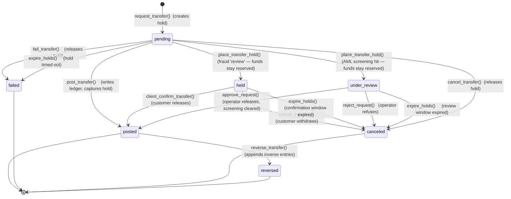
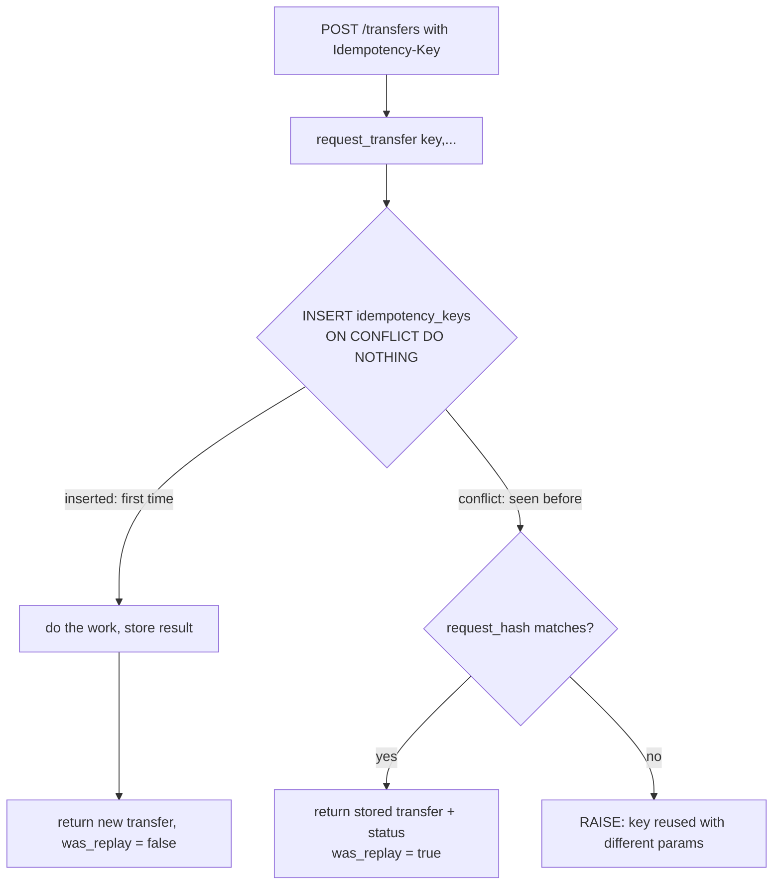

# bank0 — Ledger, Lifecycle & Idempotency

> The engine. This is where "state transitions live in the database" and
> "idempotency is enforced by the database" become concrete.
> Read [`02-data-model.md`](02-data-model.md) first.

---

## 1. The transfer state machine



| State | `status_iso` | Meaning | Balance effect | Available effect |
|-------|--------------|---------|----------------|------------------|
| `pending` | `PDNG` | requested, funds reserved | none (no ledger yet) | debit account ↓ by amount (hold) |
| `held` | `PDNG` | parked for a **customer** confirmation / cooling-off (Rec 22 `review` decision) | none (no ledger yet) | hold stays active (funds still reserved) |
| `under_review` | `PDNG` | parked for **operator** screening/AML review (Rec 25 watchlist hit) | none (no ledger yet) | hold stays active (funds still reserved) |
| `posted` | `ACSC` | settled, ledger written | debit ↓, credit ↑ | hold released, balance already reflects it |
| `failed` | `RJCT` | rejected / expired | none | hold released |
| `canceled` | `CANC` | withdrawn before posting | none | hold released |
| `reversed` | `ACSC` | settled then corrected | inverse entries applied | n/a |

The **`status_iso`** column is the ISO-20022-aligned parallel status (Rec 20) —
a **computed** projection of `status` onto the Berlin Group
ExternalPaymentTransactionStatus code list (`iso_status()`, [`00008`](../db/migrations/00008_transfers.sql)),
never stored, exposed additively alongside the flat `status`. It exists so the
contract speaks rail before a rail exists; the mapping rationale (why `posted →
ACSC`, why a `reversed` original *stays* `ACSC`, why `RCVD` is unused) lives in
[`12-rail-readiness.md`](12-rail-readiness.md) §4.

**Two parked states between `pending` and `posted`** (Recs 22/25): `held` and
`under_review` both sit on money that hasn't reached the ledger yet — the
authorization hold stays `active` (funds reserved), only its `expires_at` is
stretched to cover the (longer) window (`transfers.hold_reason` / `hold_expires_at`
carry the why + the deadline, on a **business-day** clock via `add_business_days`;
both are kept after release for audit). Release is one-way to `posted`
(`client_confirm_transfer` for `held`, `approve_request` for `under_review`) — a
parked transfer is **never auto-released**; if its window lapses the sweep
auto-cancels it (§2.6).

**Terminal states** (`posted` can still be `reversed`): `failed`, `canceled`,
`reversed`. There is no edit and no delete — only forward transitions and
reversing entries. That is what makes the history trustworthy.

> **Why two phases?** Reserve (`pending`+hold) and settle (`posted`+ledger) are
> distinct, modelling real authorization: a hold reserves `available` funds
> immediately, while the actual ledger posting can happen now (synchronous) or
> later (deferred settlement). The default is to post immediately after request
> (see §5 `transfer()` convenience), but the states remain first-class so the
> deferred path exists.

---

## 2. The DB functions (the only way money moves)

Each function is the **single entry point** for one transition. Handlers call
exactly one of these and translate its result. Signatures are the contract;
bodies below are abbreviated to the load-bearing logic.

### 2.1 `request_transfer` — create a pending transfer + hold (idempotent)

```sql
-- returns (transfer_id, status, was_replay)
CREATE FUNCTION request_transfer(
    p_idempotency_key TEXT,
    p_debit_account   UUID,
    p_credit_account  UUID,
    p_amount_minor    BIGINT,
    p_description     TEXT DEFAULT '',
    p_kind            transfer_kind DEFAULT 'transfer',
    p_hold_ttl        INTERVAL DEFAULT INTERVAL '15 minutes'
) RETURNS TABLE (transfer_id UUID, status transfer_status, was_replay BOOLEAN)
LANGUAGE plpgsql AS $$
DECLARE
    v_hash    TEXT := encode(digest(
        p_debit_account::text || p_credit_account::text ||
        p_amount_minor::text  || p_kind::text, 'sha256'), 'hex');
    v_existing idempotency_keys%ROWTYPE;
    v_debit    accounts%ROWTYPE;
    v_credit   accounts%ROWTYPE;
    v_available BIGINT;
    v_transfer_id UUID;
BEGIN
    -- (a) Idempotency gate: first writer wins.
    INSERT INTO idempotency_keys (key, scope, request_hash, status)
    VALUES (p_idempotency_key, 'transfer', v_hash, 'in_progress')
    ON CONFLICT (key) DO NOTHING;

    IF NOT FOUND THEN
        -- key already exists -> this is a replay (or a concurrent duplicate)
        SELECT * INTO v_existing FROM idempotency_keys WHERE key = p_idempotency_key;
        IF v_existing.request_hash <> v_hash THEN
            RAISE EXCEPTION 'idempotency key % reused with different parameters',
                p_idempotency_key USING ERRCODE = 'check_violation';
        END IF;
        -- same request: return the original outcome, do NOT post again
        RETURN QUERY
            SELECT v_existing.transfer_id, t.status, TRUE
            FROM transfers t WHERE t.id = v_existing.transfer_id;
        RETURN;
    END IF;

    -- (b) Validate. Lock the debit account to serialize the funds check.
    SELECT * INTO v_debit  FROM accounts WHERE id = p_debit_account  FOR UPDATE;
    IF NOT FOUND THEN RAISE EXCEPTION 'debit account not found'; END IF;
    SELECT * INTO v_credit FROM accounts WHERE id = p_credit_account FOR UPDATE;
    IF NOT FOUND THEN RAISE EXCEPTION 'credit account not found'; END IF;

    IF v_debit.status <> 'active'  THEN RAISE EXCEPTION 'debit account % not active',  p_debit_account;  END IF;
    IF v_credit.status <> 'active' THEN RAISE EXCEPTION 'credit account % not active', p_credit_account; END IF;
    IF v_debit.currency <> v_credit.currency THEN RAISE EXCEPTION 'currency mismatch'; END IF;
    IF p_amount_minor <= 0 THEN RAISE EXCEPTION 'amount must be positive'; END IF;
    IF v_debit.kind = 'customer' AND p_amount_minor > v_debit.transfer_limit_minor THEN
        RAISE EXCEPTION 'amount exceeds transfer limit';
    END IF;

    -- available = balance - active holds  (system accounts may go negative)
    SELECT v_debit.balance_minor - COALESCE(SUM(amount_minor),0) INTO v_available
    FROM holds WHERE account_id = p_debit_account AND status = 'active';
    IF v_debit.kind = 'customer' AND v_available < p_amount_minor THEN
        RAISE EXCEPTION 'insufficient available funds: have %, need %', v_available, p_amount_minor;
    END IF;

    -- (c) Create the pending transfer + the hold.
    INSERT INTO transfers (debit_account_id, credit_account_id, amount_minor,
                           currency, status, kind, description, idempotency_key)
    VALUES (p_debit_account, p_credit_account, p_amount_minor,
            v_debit.currency, 'pending', p_kind, p_description, p_idempotency_key)
    RETURNING id INTO v_transfer_id;

    INSERT INTO holds (account_id, transfer_id, amount_minor, status, expires_at)
    VALUES (p_debit_account, v_transfer_id, p_amount_minor, 'active', now() + p_hold_ttl);

    -- (d) Record the result against the idempotency key.
    UPDATE idempotency_keys
       SET status = 'completed', transfer_id = v_transfer_id,
           response = jsonb_build_object('transfer_id', v_transfer_id, 'status', 'pending')
     WHERE key = p_idempotency_key;

    RETURN QUERY SELECT v_transfer_id, 'pending'::transfer_status, FALSE;
END;
$$;
```

The locking + `INSERT ... ON CONFLICT` makes this safe under concurrent
duplicate submissions: only one transaction creates the row; the other sees the
key and replays. No double-spend, no double-post.

### 2.2 `post_transfer` — pending → posted (idempotent)

```sql
CREATE FUNCTION post_transfer(
    p_transfer_id UUID,
    -- which source states this call may post FROM. Defaults to {pending} so the
    -- plain 1-arg admin/sqlc call can NEVER release a parked transfer; the release
    -- paths pass it explicitly (client_confirm_transfer → {held};
    -- approve_request/screening → {under_review}).
    p_allow_from  transfer_status[] DEFAULT ARRAY['pending']::transfer_status[]
) RETURNS transfer_status LANGUAGE plpgsql AS $$
DECLARE v_t transfers%ROWTYPE;
BEGIN
    SELECT * INTO v_t FROM transfers WHERE id = p_transfer_id FOR UPDATE;
    IF NOT FOUND THEN RAISE EXCEPTION 'transfer not found'; END IF;

    -- Idempotent: posting an already-posted transfer is a no-op.
    IF v_t.status = 'posted' THEN RETURN 'posted'; END IF;
    IF NOT (v_t.status = ANY(p_allow_from)) THEN
        RAISE EXCEPTION 'cannot post transfer in state %', v_t.status;
    END IF;

    -- Write BOTH legs. The BEFORE INSERT trigger updates balances + balance_after.
    INSERT INTO ledger_entries (transfer_id, account_id, direction, amount_minor, currency)
    VALUES (p_transfer_id, v_t.debit_account_id,  'debit',  v_t.amount_minor, v_t.currency),
           (p_transfer_id, v_t.credit_account_id, 'credit', v_t.amount_minor, v_t.currency);

    -- Capture the hold and mark posted.
    UPDATE holds SET status='captured', released_at=now()
     WHERE transfer_id = p_transfer_id AND status='active';
    UPDATE transfers SET status='posted', posted_at=now() WHERE id = p_transfer_id;

    RETURN 'posted';
END;
$$;
```

Note what's **not** here: no `UPDATE accounts SET balance`. Inserting the two
ledger rows is the *only* thing that moves balance, via the trigger in §4. That's
the design's spine.

> **`p_allow_from` is a safety fence, not a feature knob.** A raw admin/sqlc
> `post_transfer(id)` posts only from `pending`; releasing a `held` or
> `under_review` transfer requires the *release* function to opt that source state
> in. So a stray direct post can never spring a payment past its fraud/AML gate —
> the only doors into `posted` from a parked state are `client_confirm_transfer`
> (§2.3b) and `approve_request` (§2.8).

### 2.3 `cancel_transfer` / `fail_transfer` — pending/held/under_review → canceled/failed

```sql
CREATE FUNCTION cancel_transfer(p_transfer_id UUID, p_reason TEXT DEFAULT '')
RETURNS transfer_status LANGUAGE plpgsql AS $$
DECLARE v_status transfer_status;
BEGIN
    SELECT status INTO v_status FROM transfers WHERE id = p_transfer_id FOR UPDATE;
    IF v_status = 'canceled' THEN RETURN 'canceled'; END IF;     -- idempotent
    -- pending, held (customer withdraws) and under_review (operator refuses / sweep
    -- lapses) are all cancellable; every other state raises.
    IF v_status NOT IN ('pending', 'held', 'under_review') THEN
        RAISE EXCEPTION 'cannot cancel state %', v_status;
    END IF;

    UPDATE holds SET status='released', released_at=now()
      WHERE transfer_id=p_transfer_id AND status='active';
    UPDATE transfers SET status='canceled', failure_reason=p_reason WHERE id=p_transfer_id;
    RETURN 'canceled';
END;
$$;
-- fail_transfer is identical with status 'failed' (used by expiry / system rejection).
```

Cancelling a parked transfer releases its (stretched) hold just like a `pending`
one. The *customer* path (`client_cancel_transfer`) refuses `under_review` — AML
screening is operator territory (§2.3b); the operator refuses it via
`reject_request` (§2.8), which calls straight into `cancel_transfer`.

### 2.3a `place_transfer_hold` — pending → held / under_review (park, don't post)

The single entry point that **parks** a transfer without touching the ledger. Both
gates (§2.8) funnel through it: the fraud `review` decision → `held`, an AML
watchlist hit → `under_review`.

```sql
CREATE FUNCTION place_transfer_hold(
    p_transfer_id   UUID,
    p_new_status    transfer_status,   -- 'held' | 'under_review'
    p_reason        TEXT,
    p_business_days INT,               -- 1..4 (the window length; cf. FCA FG24/6)
    p_actor         UUID,
    p_detail        JSONB DEFAULT '{}'
) RETURNS transfer_status LANGUAGE plpgsql AS $$
DECLARE v_t transfers%ROWTYPE; v_expires TIMESTAMPTZ;
BEGIN
    -- park only from pending; guards on state/status/window elided.
    SELECT * INTO v_t FROM transfers WHERE id = p_transfer_id FOR UPDATE;

    v_expires := add_business_days(now(), p_business_days);
    UPDATE transfers
       SET status = p_new_status, hold_reason = p_reason, hold_expires_at = v_expires
     WHERE id = p_transfer_id;
    -- Keep the funds reserved: STRETCH the active hold to the window's end. No
    -- active↔non-active edge is crossed, so the held_minor cache stays correct.
    UPDATE holds SET expires_at = v_expires
     WHERE transfer_id = p_transfer_id AND status = 'active';

    -- Audit + queue: under_review files a 'screening_hold' into the maker-checker
    -- queue; held files an audit-only 'risk_hold'. Actor = the initiating customer.
    INSERT INTO admin_actions (actor_user_id, action, target_id, detail)
    VALUES (p_actor,
            CASE WHEN p_new_status = 'under_review' THEN 'screening_hold' ELSE 'risk_hold' END,
            p_transfer_id, p_detail || jsonb_build_object('reason', p_reason, ...));

    -- Tell the payer their money was parked (idempotent per transfer, §3).
    PERFORM emit_event(<payer>, 'transfer.held', ...);
    RETURN p_new_status;
END;
$$;
```

The load-bearing subtlety is the hold **stretch**: because the row never leaves
`status='active'`, the `held_minor` cache the ledger trigger maintains is untouched,
and reconcile invariant I4 (held-cache == Σ active holds) still holds while a
transfer is parked. The one-way `CHECK (hold_expires_at IS NOT NULL OR status NOT
IN ('held','under_review'))` guarantees a parked row always carries a deadline for
the sweep to act on.

### 2.3b `client_confirm_transfer` — held → posted (customer release, idempotent)

The customer releases their **own** `held` transfer (the Rec 22 cooling-off).
Ownership is enforced exactly like the post/cancel lifecycle: a foreign or unknown
transfer surfaces as *not found* (→ 404, hiding existence).

```sql
CREATE FUNCTION client_confirm_transfer(p_caller_subject UUID, p_transfer_id UUID)
RETURNS transfer_status LANGUAGE plpgsql AS $$
DECLARE v_owner UUID; v_status transfer_status; v_expires TIMESTAMPTZ;
BEGIN
    SELECT a.user_id, t.status, t.hold_expires_at INTO v_owner, v_status, v_expires
    FROM transfers t JOIN accounts a ON a.id = t.debit_account_id
    WHERE t.id = p_transfer_id;
    IF v_owner IS NULL OR v_owner <> p_caller_subject THEN
        RAISE EXCEPTION 'transfer % not found', p_transfer_id;                 -- 404
    END IF;
    IF v_status = 'posted' THEN RETURN 'posted'; END IF;                       -- idempotent
    IF v_status <> 'held' THEN
        RAISE EXCEPTION 'cannot confirm a transfer in state %', v_status;      -- P0001 → 409
    END IF;
    IF v_expires IS NOT NULL AND v_expires < now() THEN
        RAISE EXCEPTION 'cannot confirm: the confirmation window has expired'; -- P0001 → 409
    END IF;
    RETURN post_transfer(p_transfer_id, ARRAY['held']::transfer_status[]);     -- release
END;
$$;
```

Note the source-state opt-in on the release: `post_transfer(id, {held})`. An
`under_review` transfer is deliberately **not** confirmable here — screening is
operator-only, and the customer's `client_cancel_transfer` refuses it too.
Confirming an already-posted transfer is an idempotent no-op; anything else (wrong
state, lapsed window) is a `409`.

### 2.4 `reverse_transfer` — posted → reversed (idempotent, appends inverse)

```sql
CREATE FUNCTION reverse_transfer(
    p_transfer_id     UUID,
    p_idempotency_key TEXT,
    p_reason          TEXT
) RETURNS UUID LANGUAGE plpgsql AS $$
DECLARE v_orig transfers%ROWTYPE; v_rev_id UUID; v_existing idempotency_keys%ROWTYPE;
BEGIN
    -- idempotency gate (same pattern as request_transfer)
    INSERT INTO idempotency_keys (key, scope, request_hash, status)
    VALUES (p_idempotency_key, 'reversal',
            encode(digest(p_transfer_id::text,'sha256'),'hex'), 'in_progress')
    ON CONFLICT (key) DO NOTHING;
    IF NOT FOUND THEN
        SELECT * INTO v_existing FROM idempotency_keys WHERE key=p_idempotency_key;
        RETURN v_existing.transfer_id;                   -- replay -> same reversal
    END IF;

    SELECT * INTO v_orig FROM transfers WHERE id=p_transfer_id FOR UPDATE;
    -- Rec 4: a second reverse under a DIFFERENT key is idempotent, not an error.
    -- Find the existing reversal via reverses_id, point THIS newly-claimed key at it,
    -- and return its id — so every reverse of the same transfer, across any key,
    -- converges on ONE reversal (never a second inverse pair).
    IF v_orig.status = 'reversed' THEN
        SELECT id INTO v_rev_id FROM transfers WHERE reverses_id=p_transfer_id LIMIT 1;
        UPDATE idempotency_keys SET status='completed', transfer_id=v_rev_id
         WHERE owner_id='00000000-…' AND key=p_idempotency_key;   -- system namespace
        RETURN v_rev_id;
    END IF;
    IF v_orig.status <> 'posted'  THEN RAISE EXCEPTION 'can only reverse a posted transfer'; END IF;

    -- New transfer with debit/credit swapped, kind='reversal'.
    INSERT INTO transfers (debit_account_id, credit_account_id, amount_minor, currency,
                           status, kind, reverses_id, description, idempotency_key, posted_at)
    VALUES (v_orig.credit_account_id, v_orig.debit_account_id, v_orig.amount_minor,
            v_orig.currency, 'posted', 'reversal', p_transfer_id, p_reason,
            p_idempotency_key, now())
    RETURNING id INTO v_rev_id;

    -- Inverse ledger entries (trigger updates balances). Original entries untouched.
    INSERT INTO ledger_entries (transfer_id, account_id, direction, amount_minor, currency)
    VALUES (v_rev_id, v_orig.credit_account_id, 'debit',  v_orig.amount_minor, v_orig.currency),
           (v_rev_id, v_orig.debit_account_id,  'credit', v_orig.amount_minor, v_orig.currency);

    UPDATE transfers SET status='reversed' WHERE id=p_transfer_id;
    UPDATE idempotency_keys SET status='completed', transfer_id=v_rev_id WHERE key=p_idempotency_key;
    RETURN v_rev_id;
END;
$$;
```

The original transfer and its entries are never touched — the correction is new
history. Reconciliation invariants I1–I3 still hold after a reversal.

> **A `reversed` original keeps `status_iso = ACSC`** — it *did* settle, and a
> reversal does not un-settle it. The return is a **separate** reversal transfer
> (`kind='reversal'`, itself `ACSC`); the interbank leg of a real return would be
> `disputes.recall_status`/`pacs.004`, not a status flip. This asymmetry is the
> saga shape a real rail inherits — see [`12-rail-readiness.md`](12-rail-readiness.md) §4/§2.

Reverse is idempotent on **two** axes (Rec 4): on the `Idempotency-Key` (a replay
with the same key returns the stored reversal id), *and* on the transfer itself (a
second reverse of an already-reversed original — even under a **different** key —
returns the **existing** reversal id, `200`, never a second inverse pair). The
`idx_transfers_reverses` partial index keys that short-circuit lookup.

### 2.5 `deposit` / `withdraw` — money crossing the bank boundary

A deposit doesn't mint money; it's a transfer **from the `external_clearing`
system account to the customer**. Thin wrappers over `request_transfer` +
`post_transfer`:

```sql
-- deposit: external_clearing -> customer   (system account goes more negative)
-- withdraw: customer -> external_clearing  (system account goes more positive)
CREATE FUNCTION deposit(p_idempotency_key TEXT, p_account UUID, p_amount BIGINT,
                        p_description TEXT DEFAULT 'Deposit')
RETURNS UUID LANGUAGE plpgsql AS $$
DECLARE v_ext UUID; v_id UUID;
BEGIN
    SELECT id INTO v_ext FROM accounts WHERE kind='system' AND iban IS NULL
       AND id = '<external_clearing account id>';   -- resolved by code/seed
    SELECT transfer_id INTO v_id FROM request_transfer(
        p_idempotency_key, v_ext, p_account, p_amount, p_description, 'deposit');
    PERFORM post_transfer(v_id);
    RETURN v_id;
END;
$$;
```

An admin credit is just a `deposit`, fully on the ledger, fully reconcilable —
there is no direct-balance write anywhere. The `external_clearing` balance tells
you exactly how much money has entered the bank.

### 2.6 `expire_holds` — batch sweep (scheduler-driven)

```sql
CREATE FUNCTION expire_holds() RETURNS INT LANGUAGE plpgsql AS $$
DECLARE v_n INT;
BEGIN
    WITH expired AS (
        UPDATE holds SET status='expired', released_at=now()
        WHERE status='active' AND expires_at < now()
        RETURNING transfer_id
    ), failed AS (
        -- a plain pending transfer whose 15-min authorization lapsed: fail it.
        UPDATE transfers SET status='failed', failure_reason='hold expired'
        WHERE id IN (SELECT transfer_id FROM expired) AND status='pending'
    ), lapsed AS (
        -- a PARKED transfer whose window ran out: AUTO-CANCEL (never auto-release —
        -- the safe direction). held = the customer never confirmed; under_review =
        -- the operator never cleared it. Distinct reasons keep the two apart.
        UPDATE transfers
           SET status='canceled',
               failure_reason=CASE status WHEN 'held' THEN 'confirmation window expired'
                                          ELSE 'review window expired' END
        WHERE id IN (SELECT transfer_id FROM expired) AND status IN ('held','under_review')
    )
    SELECT count(*) INTO v_n FROM expired;
    RETURN v_n;
END;
$$;
```

The sweep now has **three arms** off the one set of expired holds: a lapsed
`pending` → `failed` (unchanged), a lapsed `held` → `canceled`
(`'confirmation window expired'`), and a lapsed `under_review` → `canceled`
(`'review window expired'`). A parked transfer is always cancelled, never posted,
when its clock runs out — the fail-safe direction for money that never got its
green light. Run by the in-process maintenance sweep (advisory-locked; could be
`pg_cron` or a scheduled job instead — see [`04-deployment.md`](04-deployment.md) §3).

### 2.7 `reconcile` — assert the invariants

```sql
-- returns one row per failing invariant; empty result = books are correct
CREATE FUNCTION reconcile() RETURNS TABLE (check_name TEXT, detail TEXT)
LANGUAGE sql AS $$
    -- I1: balance cache matches ledger
    SELECT 'balance_drift', format('account %s: cache=%s ledger=%s', a.id, a.balance_minor, l.s)
    FROM accounts a
    JOIN (SELECT account_id, COALESCE(SUM(signed_amount),0) s FROM ledger_entries GROUP BY account_id) l
      ON l.account_id = a.id
    WHERE a.balance_minor <> l.s
    UNION ALL
    -- I2: each transfer's legs net to zero
    SELECT 'transfer_unbalanced', format('transfer %s sums to %s', transfer_id, SUM(signed_amount))
    FROM ledger_entries GROUP BY transfer_id HAVING SUM(signed_amount) <> 0
    UNION ALL
    -- I3: global zero-sum
    SELECT 'global_nonzero', format('global ledger sums to %s', SUM(signed_amount))
    FROM ledger_entries HAVING SUM(signed_amount) <> 0
    UNION ALL
    -- I4: held-cache matches active holds (accounts.held_minor == Σ active holds)
    SELECT 'held_drift', format('account %s: cache=%s holds=%s', a.id, a.held_minor, COALESCE(h.s,0))
    FROM accounts a
    LEFT JOIN (SELECT account_id, SUM(amount_minor) s FROM holds WHERE status='active' GROUP BY account_id) h
      ON h.account_id = a.id
    WHERE a.held_minor <> COALESCE(h.s, 0)
    UNION ALL
    -- I5: a parked transfer MUST still reserve its funds. A held/under_review row
    -- with no active hold means money the transfer claims to move was silently freed
    -- — a leak the sweep would miss. (Recs 22/25.)
    SELECT 'missing_hold', format('transfer %s in state %s has no active hold', t.id, t.status)
    FROM transfers t
    WHERE t.status IN ('held','under_review')
      AND NOT EXISTS (SELECT 1 FROM holds h WHERE h.transfer_id=t.id AND h.status='active');
$$;
```

`missing_hold` (I5) is the parked-state guardrail: `place_transfer_hold` reserves
funds by stretching the existing active hold rather than crossing a hold-status
edge, so I4 (`held_drift`) alone can't catch a parked transfer whose hold went
missing — I5 asserts every `held`/`under_review` row still owns an `active` hold.

### 2.8 The fraud / AML gate (Recs 22 & 25)

The parked states are produced by a gate that runs **inside `transfer()`** (the
auto-post convenience, §5) between `request_transfer` and `post_transfer` — after
the pending row + hold exist, before any ledger entry. The gate is a tail of
guarded steps; the *first* one that fires decides the outcome:

```sql
-- inside transfer(), after request_transfer(...) returned a fresh pending v_id:

-- Replay / non-pending short-circuits BEFORE any gate (see §3): a replayed key
-- returns the live status verbatim and NEVER re-runs screening/evaluation.
IF v_replay OR v_status <> 'pending' THEN RETURN (v_id, v_status, v_replay); END IF;

-- Sentinel (system/operator) callers bypass the gates entirely: deposits,
-- withdrawals, reversals, dispute reimbursement, maker-checker staging and seeds
-- must post as before, never park behind a fraud gate.
IF p_caller = <all-zero sentinel> THEN RETURN post_transfer(v_id); END IF;

-- (1) AML screening (Rec 25): a watchlist hit on EITHER party parks the payment
--     for operator review — under_review, 4 business days.
IF screen_payment(p_debit, p_credit) FOUND THEN
    RETURN place_transfer_hold(v_id, 'under_review', 'screening', 4, p_caller, <detail>);
END IF;

-- (2) Fraud/warning decision (Rec 22). exclude_transfer = v_id so the just-inserted
--     pending row doesn't inflate its own velocity math (intent & submit agree).
v_eval := evaluate_transfer(p_caller, p_debit, p_credit, p_amount, 0, v_id);
IF v_eval.decision = 'block'  THEN RAISE 'payment blocked: %' USING ERRCODE='check_violation'; END IF;
IF v_eval.required_ack        THEN PERFORM assert_warning_ack(...); END IF;   -- missing → 23514
IF v_eval.decision = 'review' THEN
    RETURN place_transfer_hold(v_id, 'held', <category>, 1, p_caller, <detail>);  -- cooling-off
END IF;
RETURN post_transfer(v_id);   -- allow / warn / step_up all post here
```

The three read-only helpers behind it:

- **`screen_payment(debit, credit)`** — the AML seam. Returns the first active
  `watchlist_entries` hit (ILIKE against a party's registered `full_name`, creditor
  preferred) or *no rows*. The list ships **empty**, so with no entries this is a
  no-op and `transfer()` behaves exactly as before.
- **`evaluate_transfer(caller, debit, credit, amount, step_up_limit, exclude)`** —
  the Rec 22 decision. Wraps `assess_transfer_risk` (server-authoritative band +
  reason codes), picks the single best-matching active `warning_rules` row
  (`block > review > warn`, then `priority DESC`, then oldest), folds in the step-up
  axis (a configured per-payment limit, a `high` band, or a first payment to this
  payee), and collapses everything to **one** decision by precedence
  `block > review > step_up > warn > allow`. `STABLE`, read-only, and it
  `assert_caller_owns(caller, debit)` first (`42501` → `403`) so it is safe to expose
  on the client intent endpoint. **The numeric risk score is never surfaced.** The
  `warning_rules` table also ships **empty** — with no rules it degrades to today's
  `allow`/`step_up` behaviour.
- **`assert_warning_ack(user, category, debit, credit, amount, cooling_off)`** —
  enforces that the caller already recorded the required warning acknowledgement for
  **this exact payment**. A qualifying `warning_acks` row matches on
  `(user, category, debit account, credit counterparty IBAN, exact amount)` with
  `acknowledged = TRUE`, **aged past** the cooling-off yet still **fresh** (within
  `cooling_off + 30 min`) — so a customer can neither pre-click far in advance nor
  replay a stale ack from a prior session. Missing / too-fresh / too-old /
  mismatched → `check_violation` (`23514` → `409 ack_required`).

Two invariants make this safe to bolt onto the money path:

1. **Sentinel callers skip the gate.** Only a real client subject (threaded from the
   JWT) is gated; every system/operator path (`p_caller` = the all-zero sentinel)
   posts unconditionally, so deposits, reversals and maker-checker staging are
   unaffected.
2. **`exclude_transfer` keeps intent and submit in agreement.** Both the preflight
   (`POST /transfers/intent`, §5) and the submit gate call `evaluate_transfer`; the
   submit path passes the just-inserted transfer id as `p_exclude_transfer` so its
   own pending row doesn't inflate the velocity count — the two compute the same
   band at a boundary.

---

## 3. Idempotency — the contract with the API

> Idempotency lives at the DB level, so the API carries **no business logic** of
> its own. Here is exactly what the API can assume.

**The rule the API relies on:** *calling a money-moving function twice with the
same idempotency key has the same effect as calling it once, and returns the same
result.*



What this buys each layer:

- **API handler**: never checks "did this happen already?" It passes the
  `Idempotency-Key` header straight through and returns whatever the function
  returns. A `was_replay=true` still returns `200` with the original body.
- **Client**: can retry safely on timeout/5xx with the same key; it will get the
  original transfer, never a duplicate.
- **Operator**: a double-click on "Post" or "Credit" can't create two movements.

Four classes of idempotency in bank0:

| Class | Mechanism | Example |
|-------|-----------|---------|
| Money moves | `idempotency_keys` table + `ON CONFLICT` + result replay | transfers, deposits, withdrawals, reversals |
| Natural uniqueness | `UNIQUE` constraint | `users.username`, `accounts.iban`, `users.email` |
| State uniqueness | partial unique index | one `is_default` account/user; one `active` hold/transfer |
| State-transition no-ops | status guard returns current state | `post_transfer` on an already-`posted` row |

**Key format & TTL**: clients supply an opaque string (UUID recommended); the
header is `Idempotency-Key`. Keys expire after 7 days (`idempotency_keys.expires_at`),
swept by the same ticker as `expire_holds`.

**Concurrency note**: the `in_progress` status handles the rare case where two
identical requests race before the first finishes — the second sees the key, and
either replays the (now `completed`) result or, if still `in_progress`, the API
returns `409 Conflict / retry` (the safe answer: "your request is being
processed").

**Gates never re-run on replay (as-built, Rec 22/25).** The fraud/AML gate (§2.8)
runs *after* `request_transfer` has claimed the key, and `transfer()`
short-circuits on a replay **before** reaching it. So a replayed key returns the
transfer's **live status verbatim** — `posted`, `held`, `under_review`, whatever it
became on the first call — and never re-screens, never re-evaluates a warning rule,
and never demands a fresh acknowledgement. A payment parked as `held`/`under_review`
by the first call stays parked under replay; the customer moves it forward with
`confirm`/`cancel`, not by re-POSTing.

**A blocked or ack-required attempt releases the key (as-built).** The whole of
`transfer()` — the key claim in `request_transfer`, the pending row, the hold, and
the gate — is **one transaction**. A `block` decision or a failed
`assert_warning_ack` `RAISE`s, which rolls the transaction back *including the
`idempotency_keys` INSERT*. So a `422 payment_blocked` / `409 ack_required` leaves
**no** claimed key: the customer can acknowledge (respecting the cooling-off) and
retry with the **same** key, and it will be treated as a fresh request rather than
replaying the rejection. A successfully *parked* payment, by contrast, commits — its
key is claimed and points at the `held`/`under_review` transfer.

**Per-owner key namespace (as-built).** The `idempotency_keys` primary key is
`(owner_id, key)`, not `key` alone — the raw client string is namespaced to the
owning principal. `request_transfer` takes a `p_caller UUID` that the client path
threads from the authenticated JWT subject (`client_transfer → transfer →
request_transfer`); the `INSERT … ON CONFLICT (owner_id, key)` claims the key inside
that owner's namespace. The abbreviated `(key)`/`ON CONFLICT (key)` in the §2 samples
is the pre-namespace shorthand — the live functions key on `(owner_id, key)`.

Two consequences:

- **Cross-owner independence.** The *same* raw key submitted by two different
  customers is two independent claims — one customer's key can never collide with, or
  surface the stored `response` of, another's.
- **Sentinel namespace for operator / system paths.** Callers with no customer
  subject (operator `deposit`/`withdraw`/`reverse`, maker-checker staging) use the
  all-zero sentinel `00000000-0000-0000-0000-000000000000` as `owner_id`, which
  preserves the old global semantics *within that one shared namespace*.
- **Dedicated registration sentinel.** Public `/auth/register` is also pre-auth
  (no subject yet), but it does **not** share the all-zero namespace: it claims its
  key under a separate owner UUID ending `…0001`, with the `invitation_code` folded
  into the fingerprint. This closes a key-squatting vector — the all-zero namespace
  also carries **deterministic** system keys (e.g. `dispute-reimburse-<id>`), so a
  self-chosen registration key sharing it could pre-claim or collide with one.
  Isolating registration in its own owner namespace makes that impossible.

Replay and fingerprint-mismatch semantics are **unchanged within a namespace**: a
replay still returns the stored result, and a same-key/different-`request_hash` reuse
still raises `check_violation` — the namespace only decides *whose* keyspace the claim
lands in.

---

## 4. Triggers (structural invariants)

| Trigger | Table | Timing | Job |
|---------|-------|--------|-----|
| `trg_ledger_apply_balance` | `ledger_entries` | `BEFORE INSERT` (FOR EACH ROW) | the **only** balance writer: computes the signed delta, sets `NEW.balance_after`, and `UPDATE accounts SET balance_minor = …` (flagged via `set_config('bank0.in_ledger','on',true)`) |
| `trg_accounts_guard_balance` | `accounts` | `BEFORE UPDATE` | **tamper guard**: rejects any `balance_minor` change unless `bank0.in_ledger='on'` — so a stray `UPDATE accounts SET balance_minor` (admin slip, buggy fn, manual psql) is *blocked*, not merely detected later |
| `trg_ledger_immutable` | `ledger_entries` | `BEFORE UPDATE OR DELETE` | `RAISE EXCEPTION 'ledger_entries is append-only'` |
| `trg_set_updated_at` | `users`, `accounts`, `transfers` | `BEFORE UPDATE` | `NEW.updated_at = now()` |

> The balance trigger runs `BEFORE INSERT` (not `AFTER`) because it must stamp
> `NEW.balance_after`; it computes the signed delta directly from
> `direction`/`amount_minor` since the generated `signed_amount` column isn't
> populated yet in a BEFORE trigger. The tamper guard + the `in_ledger` flag
> together make the cache provably un-forgeable: validated in
> `db/smoke_test.sql` (a direct balance UPDATE raises `restrict_violation`).

> **Balance-after detail.** `balance_after` needs the post-update balance, so the
> `BEFORE INSERT` trigger reads the current `accounts.balance_minor` under the row
> lock already held by `post_transfer`, computes
> `balance_after = balance_minor + signed_amount`, sets it on `NEW`, and applies
> the `UPDATE accounts` — one logical "balance-follows-ledger" step.

The immutability trigger is what lets the rest of the system *trust* the ledger:
nothing — not a buggy function, not a stray `psql` `UPDATE`, not the admin UI —
can rewrite financial history. Corrections go through `reverse_transfer`.

---

## 5. API surface (thin handlers, 1:1 with functions)

| Method | Path | DB function | Notes |
|--------|------|-------------|-------|
| POST | `/transfers` | `transfer` (`request_transfer` + gate + `post_transfer`) | requires `Idempotency-Key`; may return `posted`/`held`/`under_review` |
| POST | `/transfers/intent` | `evaluate_transfer` | read-only fraud/AML preflight; no key, moves no money, writes no row (§2.8) |
| POST | `/transfers/{id}/post` | `post_transfer` | for deferred settlement |
| POST | `/transfers/{id}/confirm` | `client_confirm_transfer` | release a `held` transfer → `posted`; owner only |
| POST | `/transfers/{id}/cancel` | `cancel_transfer` | `pending` or `held`; `under_review` → 409 (operator-only) |
| POST | `/transfers/{id}/reverse` | `reverse_transfer` | posted only; requires key + reason; admin |
| POST | `/accounts/{id}/deposit` | `deposit` | admin; via external_clearing |
| POST | `/accounts/{id}/withdraw` | `withdraw` | admin; via external_clearing |
| GET | `/accounts/{id}` | — | balance + available (balance − active holds) |
| GET | `/accounts/{id}/ledger` | — | statement; cursor on `(posted_at, id)` |
| GET | `/transfers/{id}` | — | transfer + its legs |

**The `transfer()` convenience** (auto-post path): one function that runs
`request_transfer`, the fraud/AML gate (§2.8), then `post_transfer` in a single
transaction, for the common "settle now" case. Still idempotent (the key guards the
whole thing), still two-phase underneath — but for a real client subject the gate
sits in the middle, so the returned status can be `posted` (allowed) or a parked
`held`/`under_review` instead. System/operator (sentinel) callers skip the gate.

### Error mapping (the only "logic" the API has)

DB functions `RAISE EXCEPTION` with SQLSTATE codes; the handler maps them:

| DB signal | HTTP | Body |
|-----------|------|------|
| `insufficient available funds` | 422 | `{"error":"insufficient_funds"}` |
| `... not active` / `... not found` | 409 / 404 | typed error |
| `idempotency key reused with different parameters` (`check_violation`) | 422 | `{"error":"idempotency_key_conflict"}` |
| `payment blocked: …` (`check_violation`, Rec 22 gate) | 422 | `{"error":"payment_blocked"}` |
| `warning acknowledgement required …` (`check_violation`, Rec 22 gate) | 409 | `{"error":"ack_required"}` |
| `unique_violation` (23505) | 409 | `{"error":"already_exists"}` |
| `cannot post transfer in state X` / `cannot confirm …` / `cannot cancel … under review` | 409 | `{"error":"invalid_state"}` |
| anything else | 500 | `{"error":"internal"}` (logged with request id) |

This table *is* the API's business knowledge. Everything else lives in the
database.

---

## 6. Worked example: Alice pays Bob €10.50, then it's reversed

```
1. request_transfer(key='r1', debit=Alice, credit=Bob, amount=1050)
   -> transfers: (id=T1, status=pending)
   -> holds:     (T1, Alice, 1050, active)
   -> Alice available -= 1050 ; balances unchanged

2. post_transfer(T1)
   -> ledger_entries: (T1, Alice, debit, 1050)  signed=-1050
                      (T1, Bob,   credit,1050)  signed=+1050
   -> trigger: Alice.balance -=1050, Bob.balance +=1050, balance_after set
   -> holds: T1 -> captured ; transfers: T1 -> posted

3. (oops) reverse_transfer(T1, key='rev1', reason='wrong recipient')
   -> transfers: (id=T2, kind=reversal, reverses_id=T1, status=posted)
   -> ledger_entries: (T2, Bob,   debit, 1050) signed=-1050
                      (T2, Alice, credit,1050) signed=+1050
   -> trigger: Bob.balance -=1050, Alice.balance +=1050
   -> transfers: T1 -> reversed

reconcile() -> 0 rows. I1, I2 (T1 legs sum 0, T2 legs sum 0), I3 (global 0) all hold.
History: T1 posted + T2 reversal — nothing edited, full story preserved.
```
