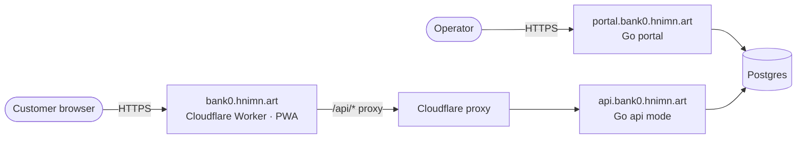
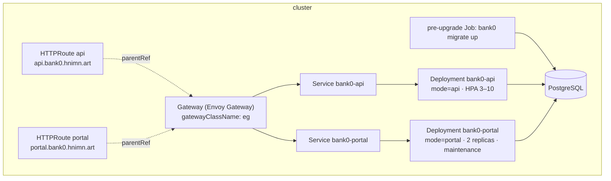

# bank0 — Deployment, Scaling & API Contract

> How bank0 runs: three public surfaces, one Go image (two run modes), a
> Cloudflare edge, in-cluster migrations, and a contract-first OpenAPI surface.

---

## 0. Topology — three surfaces, three hosts

| Host | Surface | Tech | Served by |
|------|---------|------|-----------|
| `portal.bank0.hnimn.art` | **Admin UI** — operator console + admin API | Go + Templ/HTMX (server-rendered HTML) | bank0 binary, `mode=portal` ([`05-admin-ui.md`](05-admin-ui.md)) |
| `api.bank0.hnimn.art` | **Client API** — customer JSON API | Go (same binary), `mode=api` | bank0 binary, **behind a Cloudflare proxy** ([`06-client-api.md`](06-client-api.md)) |
| `bank0.hnimn.art` | **Client web app** — customer PWA | TypeScript (Preact/Vite) | **Cloudflare Worker** (static assets + `/api/*` proxy) ([`07-client-web-app.md`](07-client-web-app.md)) |

The two Go surfaces are the *same* binary in different modes (§1). The PWA is not
served by Go at all — it lives on a Cloudflare Worker that also proxies the
browser's `/api/*` calls to `api.bank0.hnimn.art`, so the browser stays
same-origin (no CORS) and tokens never traverse a third origin.



### Edge: Cloudflare now, Gateway API as an option

**Today** the client API sits **behind a Cloudflare proxy** (TLS termination,
WAF/rate-limiting, DDoS protection at the edge); the PWA is a Cloudflare Worker.
This needs no in-cluster ingress for the customer surfaces. The **Helm + Gateway
API/Envoy** setup in §3 remains a fully-supported **alternative/cluster-internal**
path (e.g. self-hosted, or to expose `portal.*`) — choose one edge per host; the
Go app is identical either way.

---

## 1. One image, run modes (`api` · `portal` · `all`)

The binary serves different route surfaces based on `server.mode`
(`APP_SERVER_MODE`):

| Mode | Serves | Used by |
|------|--------|---------|
| `api` | client JSON API + `/docs` | `api.bank0.hnimn.art` (HA, autoscaled) |
| `portal` | admin JSON API + operator console + `/docs` | `portal.bank0.hnimn.art` |
| `all` | everything | local docker-compose (single container) |

The separation is enforced **in the app**, not just at the edge: an `api` pod
literally does not register the admin routes or the console (they return 404), so
a misrouted internal request can't reach admin operations. Verified:

```
mode=api     /auth/login=200  /admin/reconcile=404  /=404
mode=portal  /auth/login=404  /admin/reconcile=200  /=200
mode=all     everything served
```

Subcommands of the same binary:

```
bank0 serve            # default
bank0 migrate up|down|status
bank0 maintenance      # run expire_holds + cleanup once
```

### Auth per surface

| Surface | Mechanism | Public routes |
|---------|-----------|---------------|
| `api` (client) | **JWT bearer** (HS256) + rotating **refresh tokens**. `POST /auth/login` issues an access token (`aud=bank0-client`) + refresh token; `requireJWT` validates and ownership-scopes every request to the subject ([`06-client-api.md`](06-client-api.md)). | `/auth/login`, `/auth/refresh`, `/auth/logout`, `/health`, `/docs`, `/openapi.yaml` |
| `portal` (admin) | **DB-backed cookie session** (`bank0_session`), staff-role check, 30-min sliding idle. | `/login`, `/logout`, `/health`, `/docs`, `/openapi.yaml` |

Set the JWT key via `APP_AUTH_JWT_SECRET` (Helm: `auth.existingSecret` or
`auth.jwtSecret`); it must be **shared across all api replicas**. An empty secret
falls back to an insecure dev value with a startup warning.

> **`all`-mode note:** when one container serves both surfaces (local dev), the
> client and admin route sets overlap. Shared reads resolve to the client (JWT)
> surface; the one static admin route that would be shadowed by the client's
> `/transfers/{id}` — `GET /transfers/pending` — is registered ahead of it behind
> the session guard, so both work. In production the surfaces are separate
> deployments (`mode=api` / `mode=portal`) with no overlap.

---

## 2. Local: docker-compose (1 postgres + 1 app)

```bash
docker compose -f deploy/docker-compose.dev.yml up --build
```

The app runs `mode=all` with `APP_SERVER_AUTO_MIGRATE=true`, so it applies the
embedded migrations on startup and serves both surfaces on `:8080`. Visit
`http://localhost:8080/` (console) and `/docs` (API reference).

---

## 3. Kubernetes: Helm chart (`deploy/helm/bank0`)

```bash
helm install bank0 deploy/helm/bank0 \
  --set database.existingSecret=bank0-db    # secret with key "dsn"
```

What the chart creates:



| Concern | How |
|---|---|
| **HA / scaling** | `bank0-api` is a Deployment behind an HPA (CPU-based, 3–10 replicas). Stateless — all state is in Postgres. |
| **Routing / two domains** | **Gateway API on Envoy Gateway.** One `Gateway` with a per-host HTTPS listener; two `HTTPRoute`s (api/portal) attach by `parentRef`/`sectionName` and fan out to the two Services. Same image, different `mode`, scaled independently. The chart can create the Gateway (`gateway.create=true`) or attach to a shared one. |
| **Migrations** | A `pre-install,pre-upgrade` hook Job runs `bank0 migrate up` (embedded migrations) before new pods roll. |
| **Maintenance** | `expire_holds` + cleanup run **in-process on portal pods only** (`run_maintenance=true`), each tick guarded by a Postgres **advisory lock** (`pg_try_advisory_xact_lock`) so multiple replicas never duplicate the sweep. |
| **DB credentials** | `APP_DATABASE_DSN` from a Secret (`existingSecret` recommended; chart can create one from `database.dsn` for dev). |
| **Probes** | `/health` readiness + liveness on both deployments. |
| **TLS** | Per-host HTTPS listeners on the Gateway, `mode: Terminate`. cert-manager's gateway-shim provisions a cert per listener when the Gateway is annotated with `gateway.tls.clusterIssuer`. An optional `RequestRedirect` HTTPRoute on the `:80` listener forces HTTP→HTTPS. |

### Gateway API objects (rendered)

```
Gateway/bank0                 gatewayClassName=eg
  listeners: http(:80), https-api(:443, api.bank0.hnimn.art), https-portal(:443, portal.bank0.hnimn.art)
HTTPRoute/bank0-api           parentRef bank0 sectionName=https-api    -> Service/bank0-api
HTTPRoute/bank0-portal        parentRef bank0 sectionName=https-portal -> Service/bank0-portal
HTTPRoute/bank0-https-redirect parentRef bank0 sectionName=http        -> 301 https
```

> **Prereq:** the Envoy Gateway controller and its `GatewayClass` (`eg` by
> default) must already be installed in the cluster. Set `gateway.gatewayClassName`
> to match your install. To attach to a platform-managed shared Gateway instead of
> creating one, set `gateway.create=false` and point `gateway.name`/`gateway.namespace`
> at it (that Gateway's `allowedRoutes` must permit routes from this namespace).

> **Why advisory-locked in-process instead of a CronJob?** It keeps one mechanism
> and works identically for compose and K8s. A `bank0 maintenance` subcommand also
> exists if you prefer a Kubernetes `CronJob` with `run_maintenance=false`
> everywhere.

### HA correctness note
Every money operation is a single DB function with row locks + idempotency keys
(see [`03-...md`](03-ledger-lifecycle-idempotency.md)), so **N api replicas are
safe by construction**: concurrent duplicate requests dedup on the idempotency
key, and concurrent transfers serialize on `FOR UPDATE`. There is no in-memory
state to share between replicas.

---

## 4. API contract (contract-first, OpenAPI 3.1)

`api/openapi.yaml` is the **source of truth**. `oapi-codegen` generates a Go
`ServerInterface` per surface (filtered by tag), and `*Server` implements both:

```
api/openapi.yaml ──oapi-codegen──> internal/api/genclient (tag: client)
                 └────────────────> internal/api/genadmin  (tag: admin)
internal/api/server.go:  var _ genclient.ServerInterface = (*Server)(nil)
                         var _ genadmin.ServerInterface  = (*Server)(nil)
```

Those compile-time assertions mean **spec/handler drift is a build error**: add an
operation to the spec, regenerate, and the code won't compile until you implement
it (and vice-versa for signatures/params).

Workflow:

```bash
# edit api/openapi.yaml, then:
task generate:oapi      # regenerate both interfaces
task lint:openapi       # Spectral audit (needs node/npx)
go build ./...          # drift surfaces here
```

The spec is served at `/openapi.yaml` and rendered at `/docs` (Scalar UI) on
every surface.

> **Tag/codegen constraint:** an operation shared by both surfaces must be
> path-param-only (no generated `Params` struct), otherwise the two packages
> produce conflicting types. That's why `getAccountLedger` (query params) is
> `client`-only; the console reads the ledger directly from the DB instead.

---

## 5. CI generation checklist

Generated code is committed (so `go build` works without tools). After changing a
source, regenerate and commit:

| Change | Regenerate |
|--------|-----------|
| `db/queries/*.sql` or migrations | `task generate:sqlc` |
| `api/openapi.yaml` | `task generate:oapi` |
| `web/template/*.templ` | `task generate:templ` |
| any of the above | or just `task generate` |
