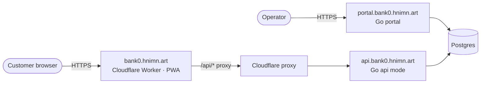

# bank0 — Deployment, Scaling & API Contract

> How bank0 runs: three public surfaces, one Go image (run modes `api`/`portal`/`all`),
> in-cluster migrations, and a contract-first OpenAPI surface.
>
> **This is the deployment path** — self-hosted Postgres 18 + Kubernetes/Helm +
> Gateway API. It is the only one; there is no managed/serverless variant. The
> image and chart now publish to GHCR (§6); what remains — per-surface Gateway
> attachment and PWA hosting — is
> [`specs/spec-container-helm-pivot.md`](specs/spec-container-helm-pivot.md).

---

## 0. Topology — three surfaces, three hosts

| Host | Surface | Tech | Served by |
|------|---------|------|-----------|
| `portal.bank0.hnimn.art` | **Admin UI** — operator console + admin API | Go + Templ/HTMX (server-rendered HTML) | bank0 binary, `mode=portal` ([`05-admin-ui.md`](05-admin-ui.md)) |
| `api.bank0.hnimn.art` | **Client API** — customer JSON API | Go (same binary), `mode=api` | bank0 binary, **behind a Cloudflare proxy** ([`06-client-api.md`](06-client-api.md)) |
| `bank0.hnimn.art` | **Client web app** — customer PWA | TypeScript (Preact/Vite) | **Cloudflare Worker** (static assets + `/api/*` proxy) ([`07-client-web-app.md`](07-client-web-app.md)) |

The two Go surfaces are the *same* binary in different modes (§1). The PWA is not
served by Go at all — it lives on a Cloudflare Worker that also proxies the
browser's `/api/*` calls to `api.bank0.hnimn.art`, so the browser stays
same-origin (no CORS) and tokens never traverse a third origin.


```mermaid
graph LR
    Op([Operator]) -->|HTTPS| Portal[portal.bank0.hnimn.art<br/>Go portal]
    Cust([Customer browser]) -->|HTTPS| CFW[bank0.hnimn.art<br/>Cloudflare Worker · PWA]
    CFW -->|/api/* proxy| CF[Cloudflare proxy]
    CF --> API[api.bank0.hnimn.art<br/>Go api mode]
    Portal --> PG[(Postgres)]
    API --> PG
```

### Edge: Gateway API

The **Helm + Gateway API/Envoy** setup in §3 fronts the Go surfaces in-cluster —
TLS, routing, and rate-limiting are the Gateway's job. The PWA is still built and
served as a Cloudflare Worker today; moving it in-cluster (and what that means for
the same-origin `/api/*` proxy) is planned in
[`specs/spec-container-helm-pivot.md`](specs/spec-container-helm-pivot.md) §5.

---

## 1. One image, run modes (`api` · `portal` · `all`)

The binary serves different route surfaces based on `server.mode`
(`APP_SERVER_MODE`):

| Mode | Serves | Used by |
|------|--------|---------|
| `api` | client JSON API + `/docs` | `api.bank0.hnimn.art` (HA, autoscaled) |
| `portal` | admin JSON API + operator console + `/docs` | `portal.bank0.hnimn.art` |
| `all` | everything | local docker-compose (single container) |

The separation is enforced **in the app**, not just at the edge: an `api` pod
literally does not register the admin routes or the console (they return 404), so
a misrouted internal request can't reach admin operations. Verified:

```
mode=api     /auth/login=200  /admin/reconcile=404  /=404
mode=portal  /auth/login=404  /admin/reconcile=200  /=200
mode=all     everything served
```

Subcommands of the same binary:

```
bank0 serve            # default
bank0 migrate up|down|status
bank0 maintenance      # run expire_holds + cleanup once
```

### Auth per surface

| Surface | Mechanism | Public routes |
|---------|-----------|---------------|
| `api` (client) | **JWT bearer** (HS256) + rotating **refresh tokens**. `POST /auth/login` issues an access token (`aud=bank0-client`) + refresh token; `requireJWT` validates and ownership-scopes every request to the subject ([`06-client-api.md`](06-client-api.md)). | `/auth/login`, `/auth/refresh`, `/auth/logout`, `/auth/register`, `/auth/verify-contact`, `/auth/resend-code`, `/auth/mfa/verify` (all rate-limited), `/health`, `/readyz`, `/metrics`, `/docs`, `/openapi.yaml` |
| `portal` (admin) | **DB-backed cookie session** (`bank0_session`), staff-role check, 30-min sliding idle. | `/login`, `/logout`, `/health`, `/readyz`, `/metrics`, `/docs`, `/openapi.yaml` |

`/health` is a DB-blind liveness probe; `/readyz` is DB-aware readiness; `/metrics`
exposes Prometheus counters (restrict at the network layer).

Set the JWT key via `APP_AUTH_JWT_SECRET` (Helm: `auth.existingSecret` or
`auth.jwtSecret`); it must be **shared across all api replicas**. An empty secret
**fails closed** when `app.env != development`: `Config.Validate()` returns an error
and `cmd/app/main.go` logs `invalid configuration` and exits non-zero. Only in
`development` does it fall back to an insecure dev value with a startup warning.
The check runs on the **serve** path only — `migrate` and `maintenance` serve no
surface, so the pre-upgrade migrate Job runs on `app.env=production` with the DSN
alone and no JWT secret.

> **`all`-mode note:** when one container serves both surfaces (local dev), the
> client and admin route sets overlap. Shared reads resolve to the client (JWT)
> surface; the one static admin route that would be shadowed by the client's
> `/transfers/{id}` — `GET /transfers/pending` — is registered ahead of it behind
> the session guard, so both work. In production the surfaces are separate
> deployments (`mode=api` / `mode=portal`) with no overlap.

---

## 2. Local: docker-compose (postgres + migrate + admin + client)

```bash
docker compose -f deploy/docker-compose.dev.yml up --build
```

The stack is **four services**, mirroring the split-surface production topology
rather than collapsing into `mode=all`:

| Service | Role | Notes |
|---------|------|-------|
| `db` | `postgres:18` | exposes `:5432` |
| `migrate` | one-shot `migrate up`, then exits | runs after `db` is healthy |
| `admin` | `APP_SERVER_MODE=portal` → `:8080` | console + admin API; auto-migrate **off**, maintenance loop on |
| `client` | `APP_SERVER_MODE=api` → `:8090` | client JSON API; auto-migrate **off** |

No container runs `mode=all` or `APP_SERVER_AUTO_MIGRATE=true` — migrations are
applied by the dedicated `migrate` job. The stack comes up migrated but
**unseeded**: load data with `task seed` (or `task dev:reset` for a fresh seeded
stack), then visit `http://localhost:8080/` (console) and
`http://localhost:8090/docs` (client API reference).

---

## 3. Kubernetes: Helm chart (`deploy/helm/bank0`)

```bash
# database secret has key "dsn"; auth secret has key "jwt-secret"
# (api pods fail closed without a JWT secret — see §1)
helm install bank0 oci://ghcr.io/minhtt159/charts/bank0 --version 1.0.2 \
  --set database.existingSecret=bank0-db \
  --set auth.existingSecret=bank0-auth
```

Both the chart and the image are published to GHCR by
[`publish.yml`](../.github/workflows/publish.yml) (§6). Swap the OCI reference for
a local path (`helm install bank0 deploy/helm/bank0 …`) to install the working
tree instead.

What the chart creates:


```mermaid
graph TD
    subgraph cluster
      GW["Gateway (Envoy Gateway)<br/>gatewayClassName: eg"]
      RtA["HTTPRoute api<br/>api.bank0.hnimn.art"] -.parentRef.-> GW
      RtP["HTTPRoute portal<br/>portal.bank0.hnimn.art"] -.parentRef.-> GW
      GW --> SvcA[Service bank0-api]
      GW --> SvcP[Service bank0-portal]
      SvcA --> DepA["Deployment bank0-api<br/>mode=api · HPA 3–10"]
      SvcP --> DepP["Deployment bank0-portal<br/>mode=portal · 2 replicas · maintenance"]
      Job["pre-install/pre-upgrade Job: bank0 migrate up"] --> PG[(PostgreSQL)]
      DepA --> PG
      DepP --> PG
    end
```

| Concern | How |
|---|---|
| **HA / scaling** | `bank0-api` is a Deployment behind an HPA (CPU-based, 3–10 replicas). Stateless — all state is in Postgres. Opt-in: an Argo Rollouts canary instead of the Deployment (`api.rollout.enabled` — see *Canary releases* below). |
| **Routing / two domains** | **Gateway API on Envoy Gateway.** One `Gateway` with a per-host HTTPS listener; two `HTTPRoute`s (api/portal) attach by `parentRef`/`sectionName` and fan out to the two Services. Same image, different `mode`, scaled independently. The chart can create the Gateway (`gateway.create=true`) or attach to a shared one. |
| **Migrations** | A `pre-install,pre-upgrade` hook Job runs `bank0 migrate up` (embedded migrations) before new pods roll. `migrations.activeDeadlineSeconds` (default 240) caps it — keep it **shorter than the helm `--timeout`** (default 5m), so a lock-blocked migration fails the upgrade loudly instead of hanging it and outliving it. |
| **Disruptions** | One PDB per surface (`api.pdb.enabled` / `portal.pdb.enabled`, default on), `maxUnavailable: 1` — deliberately not `minAvailable`, which on a 1-replica install blocks node drains forever. |
| **Secret rotation** | Pods don't restart when a mounted Secret changes. Recommended on clusters running [stakater/Reloader](https://github.com/stakater/Reloader): `workloadAnnotations: {reloader.stakater.com/auto: "true"}` — covers both chart-created and externally-managed (`existingSecret`/ESO) Secrets, which a render-time checksum annotation structurally cannot. The api Rollout needs Reloader's `--is-argo-rollouts=true` flag. Without Reloader, rotate then `kubectl rollout restart` by hand. |
| **Maintenance** | `expire_holds` + cleanup **and `reconcile()`** run **in-process on portal pods only** (`run_maintenance=true`), each tick guarded by a Postgres **advisory lock** (`pg_try_advisory_xact_lock`) so multiple replicas never duplicate the sweep. A non-zero `reconcile()` result (ledger/cache drift) is logged at WARN — page on it. |
| **DB credentials** | `APP_DATABASE_DSN` from a Secret (`existingSecret` recommended; chart can create one from `database.dsn` for dev). |
| **Probes** | **liveness → `/health`** (cheap, DB-blind — a DB blip must not kill the pod); **readiness → `/readyz`** (pings Postgres with a 1s deadline, 503 when the pool can't serve, so a pod with a dead/exhausted pool leaves the Service rotation). Both deployments. Readiness `timeoutSeconds: 2` — above `/readyz`'s own 1s DB deadline, so a slow-but-successful ping can't count as a probe failure. |
| **Metrics** | `/metrics` — a real Prometheus **histogram** (`bank0_http_request_duration_seconds`, labelled by method/route-template/status → `histogram_quantile` p50/p95/p99 + rate + error-rate) plus a live pgxpool gauge and the Go/process collectors (`client_golang`). Optional, off by default: a **ServiceMonitor** (`metrics.serviceMonitor.enabled`, needs the Prometheus Operator) and a **Grafana dashboard** ConfigMap auto-discovered by the kube-prometheus-stack sidecar (`metrics.dashboard.enabled`). |
| **Logging** | `logging.level` (default `info`) and `logging.encoding` (default `json`) are set on both Deployments and the migrate Job. The image's baked `config.yaml` also defaults to `info` — only the local compose stack opts into `debug` — so an unconfigured pod never logs at debug. Raise `logging.level` to troubleshoot a live release without rebuilding the image. |
| **Hardening** | Image is `distroless:nonroot`; pods run with `runAsNonRoot`, a **read-only root filesystem**, all capabilities dropped, `seccompProfile: RuntimeDefault` (values: `podSecurityContext` / `securityContext`), and a hardcoded `automountServiceAccountToken: false`. |
| **Request timeout / proxy trust** | `server.request_timeout` (default 15s) bounds each request so a stuck query can't pin a pool connection. `trustProxyHeaders` (values; **true** here) makes the auth rate limiter key on the real client IP instead of `RemoteAddr`: `CF-Connecting-IP` when present, else `X-Forwarded-For` read **right-to-left**, `trustedProxyHops` entries in (default 1 — count every proxy between client and pod). Right-to-left because an `use_remote_address` Gateway **appends** rather than replaces, so only the right-most entries are proxy-authored ([`10`](10-security-review.md)). |
| **First login** | The seeded `admin` account (from `00016`) is flagged `must_change_password`, so the console holds it on `/console/password` until it is rotated and the admin JSON API answers `403` meanwhile ([`05`](05-admin-ui.md) §4.6a). The flag is set only while the account still holds the seeded password. |
| **JWT secret** | The `api` deployment mounts `APP_AUTH_JWT_SECRET` (Helm `auth.existingSecret`); the `portal` deployment doesn't need one (cookie sessions), and `Config.Validate` only requires it when the served mode includes the api surface. |
| **TLS** | Per-host HTTPS listeners on the Gateway, `mode: Terminate`. cert-manager's gateway-shim provisions a cert per listener when the Gateway is annotated with `gateway.tls.clusterIssuer`. An optional `RequestRedirect` HTTPRoute on the `:80` listener forces HTTP→HTTPS. |

### Gateway modes

The chart supports three shapes; the third is what a cluster with its own
platform-owned Gateways wants.

| Mode | Values | Renders |
|---|---|---|
| **Chart owns the Gateway** (default) | `gateway.create=true` | a `Gateway` (per-host HTTPS listeners, cert-manager annotation), both HTTPRoutes, and the HTTP→HTTPS redirect route |
| **Attach to a shared Gateway** | `gateway.create=false` + `gateway.name`/`namespace`; per-surface `api.gateway`/`portal.gateway` (`name`/`namespace`/`sectionName`) where those defaults don't fit | both HTTPRoutes only, parented to that Gateway. The default `sectionName`s are the chart's own listener naming (`https-api`/`https-portal`/`http`); a platform Gateway names its listeners itself, so set `api.gateway.sectionName`/`portal.gateway.sectionName` to *its* names (e.g. `https`). The per-surface blocks also let api and portal parent **different** Gateways (external + internal), and `api.routeAnnotations`/`portal.routeAnnotations` carry platform conventions (e.g. a Gatus endpoint) onto the chart's routes. TLS and redirect are the platform's business here. |
| **Bring your own routes** | `gateway.create=false`, `api.exposed=false`, `portal.exposed=false` | **no** Gateway API objects at all — just Deployments/Services. Write the HTTPRoutes yourself — still the mode for routes the chart shouldn't own (extra rules, filters). Incompatible with the canary mode below, which needs the api route chart-managed. |

**Two releases in one cluster:** the chart's object names are release-scoped
(`{{ .Release.Name }}-api`), but if you write your own HTTPRoutes for a staging and a
production namespace, give them names — or discovery labels — that differ across
namespaces. Anything that indexes routes cluster-wide by name alone (Gatus's endpoint
registry, for one) rejects the duplicate and can take the whole watcher down, not just
the colliding entry.

The redirect route renders only in the first mode: it hardcodes `sectionName: http`,
which a platform Gateway may not have, and an unexposed release would otherwise emit
it with an empty `hostnames` list — matching every host on that listener.

### Gateway API objects (rendered)

```
Gateway/bank0                 gatewayClassName=eg
  listeners: http(:80), https-api(:443, api.bank0.hnimn.art), https-portal(:443, portal.bank0.hnimn.art)
HTTPRoute/bank0-api           parentRef bank0 sectionName=https-api    -> Service/bank0-api
HTTPRoute/bank0-portal        parentRef bank0 sectionName=https-portal -> Service/bank0-portal
HTTPRoute/bank0-https-redirect parentRef bank0 sectionName=http        -> 301 https
```

> **Prereq:** the Envoy Gateway controller and its `GatewayClass` (`eg` by
> default) must already be installed in the cluster. Set `gateway.gatewayClassName`
> to match your install. To attach to a platform-managed shared Gateway instead of
> creating one, set `gateway.create=false` and point `gateway.name`/`gateway.namespace`
> at it (that Gateway's `allowedRoutes` must permit routes from this namespace).

### Canary releases (Argo Rollouts, opt-in)

`api.rollout.enabled=true` switches the **api** surface from a Deployment to an
[Argo Rollouts](https://argo-rollouts.readthedocs.io/en/stable/) canary — one
**or** the other renders, never both. Portal stays a plain Deployment (2
replicas of server-rendered HTML don't need progressive delivery). Off by
default: the default render is unchanged and needs no Argo CRDs.

What flips when it's on:

| Object | Change |
|---|---|
| `Deployment/bank0-api` | replaced by a `Rollout` (same pod template — both render from one helper, so they can't drift) |
| `Service/bank0-api-canary` | added; the route's second backendRef. The Rollouts controller pins **both** api Services to the right ReplicaSets by injecting `rollouts-pod-template-hash` into their selectors ([spec](https://argo-rollouts.readthedocs.io/en/stable/features/specification/)) |
| `HTTPRoute/bank0-api` | gains the canary backendRef, explicit weights `100`/`0`. Explicit because Gateway API defaults an unspecified weight to **1** ([traffic splitting](https://gateway-api.sigs.k8s.io/guides/traffic-splitting/)) — two weightless refs would split 50/50 before Rollouts ever acted |
| `HPA/bank0-api` | `scaleTargetRef` retargets `kind: Rollout, apiVersion: argoproj.io/v1alpha1` ([HPA support](https://argo-rollouts.readthedocs.io/en/stable/features/hpa-support/)) — left on the Deployment it would silently scale nothing |

Traffic shifts through the [Gateway API traffic-router
plugin](https://rollouts-plugin-trafficrouter-gatewayapi.readthedocs.io/), which
**rewrites the two backendRef weights on the chart's api HTTPRoute** at every
`setWeight` step. That is why `api.rollout.enabled` **requires
`api.exposed=true`** (the chart `fail`s otherwise): the canary route must be
chart-managed — an object whose weights two owners fight over converges on
whichever wrote last. Bring-your-own-routes cannot carry a canary.

**Cluster prerequisites** (not this chart's to install):

- the Argo Rollouts controller, with the plugin declared in the
  `argo-rollouts-config` ConfigMap (`trafficRouterPlugins` key, binary from a
  GitHub release URL or an init-container-mounted `file:///plugins/…`), then a
  controller restart ([plugin installation](https://rollouts-plugin-trafficrouter-gatewayapi.readthedocs.io/en/latest/installation/));
- RBAC for the controller to `get`/`patch`/`update` HTTPRoutes ([quick start](https://rollouts-plugin-trafficrouter-gatewayapi.readthedocs.io/en/latest/quick-start/));
- under GitOps, the tool that owns the route must tolerate the plugin's weight
  writes — Argo CD needs `ignoreDifferences` on the route's
  `backendRefs[].weight` *plus* the `RespectIgnoreDifferences=true` sync option,
  or self-heal reverts the canary to 100/0 mid-rollout.

`api.rollout.steps` is `spec.strategy.canary.steps` verbatim. The default is
10% → `pause: {}` → 50% → 1m soak: a bare `pause: {}` holds **indefinitely**
until a human runs `kubectl argo rollouts promote`, while `pause: {duration:}`
resumes on its own ([canary strategy](https://argo-rollouts.readthedocs.io/en/stable/features/canary/)).
`api.rollout.analysis` (also verbatim) attaches background analysis;
`startingStep: N` delays it until step index N ([analysis](https://argo-rollouts.readthedocs.io/en/stable/features/analysis/)).
An `AnalysisTemplate` it references must live in the **app namespace** — Kargo
Stage verification reads templates from the **project namespace** instead
([Kargo verification](https://docs.kargo.io/user-guide/how-to-guides/verification)),
so a namespace-scoped template is duplicated per consumer; only a
`ClusterAnalysisTemplate` (`clusterScope: true` here, `kind:
ClusterAnalysisTemplate` in Kargo) can be shared. Same CRDs, different
executors: the Rollouts controller runs canary analysis, Kargo's controller
runs its own verification AnalysisRuns.

> **⚠️ Shared-schema constraint — read before canarying.** Migrations run as a
> **pre-upgrade hook**, so the schema is migrated **before** the first canary
> pod starts: for the entire canary window, the OLD pods run against the NEW
> schema, and a 50/50 split means half of production traffic does. A canary
> release is therefore only safe when its migrations are **backward-compatible
> with the previous binary** (additive columns, no renames/drops/retyped
> columns, no changed PL/pgSQL signatures the old binary calls). If a release
> can't meet that, don't canary it — promote it in one step, or split the
> migration expand/contract-style across two releases. This is a property of
> the app's release discipline, not something the chart can check for you.
> Aborting a rollout returns *traffic* to stable, not the *schema* — `migrate
> down` stays a manual, deliberate act.

One-time flips of `api.rollout.enabled` are **not** canaried: Helm deletes the
Deployment and creates the Rollout in the same upgrade, a plain pod
replacement. Flip it in a quiet moment, not bundled with an app version bump.

> **Why advisory-locked in-process instead of a CronJob?** It keeps one mechanism
> and works identically for compose and K8s. A `bank0 maintenance` subcommand also
> exists if you prefer a Kubernetes `CronJob` with `run_maintenance=false`
> everywhere.

### HA correctness note
Every money operation is a single DB function with row locks + idempotency keys
(see [`03-...md`](03-ledger-lifecycle-idempotency.md)), so **N api replicas are
safe by construction**: concurrent duplicate requests dedup on the idempotency
key, and concurrent transfers serialize on `FOR UPDATE`. There is no in-memory
state to share between replicas.

---

## 4. API contract (contract-first, OpenAPI 3.1)

`api/openapi.yaml` is the **source of truth**. `oapi-codegen` generates a Go
`ServerInterface` per surface (filtered by tag), and `*Server` implements both:

```
api/openapi.yaml ──oapi-codegen──> internal/api/genclient (tag: client)
                 └────────────────> internal/api/genadmin  (tag: admin)
internal/api/server.go:  var _ genclient.ServerInterface = (*Server)(nil)
                         var _ genadmin.ServerInterface  = (*Server)(nil)
```

Those compile-time assertions mean **spec/handler drift is a build error**: add an
operation to the spec, regenerate, and the code won't compile until you implement
it (and vice-versa for signatures/params).

Workflow:

```bash
# edit api/openapi.yaml, then:
task generate:oapi      # regenerate both interfaces
task lint:openapi       # Spectral audit (needs node/npx)
go build ./...          # drift surfaces here
```

The spec is served at `/openapi.yaml` and rendered at `/docs` (Scalar UI) on
every surface.

> **Tag/codegen constraint:** an operation shared by both surfaces must be
> path-param-only (no generated `Params` struct), otherwise the two packages
> produce conflicting types. That's why `getAccountLedger` (query params) is
> `client`-only; the console reads the ledger directly from the DB instead.

---

## 5. CI generation checklist

Generated code is committed (so `go build` works without tools). After changing a
source, regenerate and commit:

| Change | Regenerate |
|--------|-----------|
| `db/queries/*.sql` or migrations | `task generate:sqlc` |
| `api/openapi.yaml` | `task generate:oapi` |
| `web/template/*.templ` | `task generate:templ` |
| any of the above | or just `task generate` |

---

## 6. Publishing artifacts (`publish.yml`)

CI publishes; it never deploys. The cluster sits behind a tunnel and Actions has
no path to it, so `helm upgrade` stays an operator command.

| Trigger | Artifact |
|---|---|
| push to `main` | `ghcr.io/minhtt159/bank0:sha-<shortsha>` — the "deploy whatever main is" handle (`helm upgrade … --set image.tag=sha-…`) |
| push tag `vX.Y.Z` | the same image as `:X.Y.Z` + `:X.Y` (unprefixed — the chart defaults `image.tag` to `.Chart.AppVersion`), **and** the chart at `oci://ghcr.io/minhtt159/charts/bank0` |

Both images are multi-arch (`linux/amd64` + `linux/arm64`): the Dockerfile's build
stage pins `--platform=$BUILDPLATFORM` and cross-compiles with `GOARCH`, so the
second arch costs a `go build`, not a QEMU-emulated toolchain.

There is **no `latest` tag** — the cluster's admission control rejects an unpinned
image, and an unpinned tag defeats "what exactly is running?".

Tagging a release means bumping `Chart.yaml`'s `version` **and** `appVersion` to
the same `X.Y.Z` in the release commit: the chart job refuses to publish a chart
whose versions disagree with the tag. The only credential is the ambient
`GITHUB_TOKEN`.

A third job then cuts the **GitHub Release**, gated on both artifacts existing —
announcing an image and a chart before they are pushed is the same half-release
failure the chart job's `needs: image` prevents. Its notes are assembled from:

| Part | Source |
|---|---|
| the "why" | `docs/releases/<tag>.md`, hand-written in the version-bump PR (optional — a missing file only warns) |
| artifact refs + install snippet | generated, so a release is never published without them |
| the PR list | `--generate-notes` |

A tag containing a hyphen (`v1.1.0-rc.1`) is published as a **pre-release** and does
not become `latest`. Re-running the workflow on an existing tag is a no-op rather
than an error.

There is no `CHANGELOG.md` by convention: the release notes are the changelog, and
they are what dependency bots surface when they propose a bump.
