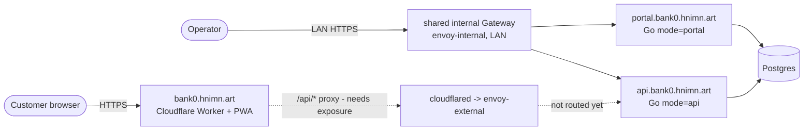
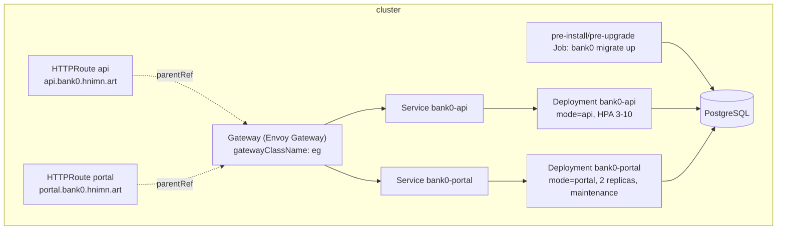
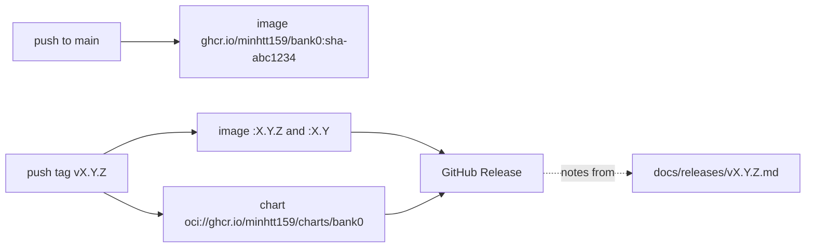

# bank0 - Deployment and scaling

**TL;DR.** One Go image runs both server surfaces (`mode=api`, `mode=portal`);
the PWA is a Cloudflare Worker. Install the published chart from GHCR against a
Postgres 18 you provision yourself; migrations run as a pre-upgrade job.
Liveness is DB-blind and readiness is DB-aware, deliberately. CI publishes the
image and chart but never deploys - `helm upgrade` is an operator command.

> Self-hosted Postgres 18, Kubernetes, Helm and Gateway API is the only
> supported deployment path - there is no managed or serverless variant.
> §3 "As built: the home cluster" records the current install (staging + production on one home
> cluster, both LAN-only); "Exposing the client API to the internet" is the checklist for putting the client API on
> the internet, which the hosted Worker needs before it can reach the API at
> all. The API contract and the code generators moved to
> [`08-development.md`](08-development.md).

---

## 0. Topology - three surfaces, three hosts

| Host | Surface | Tech | Served by |
|------|---------|------|-----------|
| `portal.bank0.hnimn.art` | **Admin UI** - operator console + admin API | Go + Templ/HTMX (server-rendered HTML) | bank0 binary, `mode=portal`, behind the cluster's internal Gateway - LAN-only ([`05-admin-ui.md`](05-admin-ui.md)) |
| `api.bank0.hnimn.art` | **Client API** - customer JSON API | Go (same binary), `mode=api` | bank0 binary, behind the same internal Gateway - **LAN-only today**, see "Exposing the client API" in §3 ([`06-client-api.md`](06-client-api.md)) |
| `bank0.hnimn.art` | **Client web app** - customer PWA | TypeScript (Preact/Vite) | **Cloudflare Worker** (static assets + `/api/*` proxy) ([`07-client-web-app.md`](07-client-web-app.md)) |

The two Go surfaces are the *same* binary in different modes (§1). The PWA is not
served by Go at all - it lives on a Cloudflare Worker that also proxies the
browser's `/api/*` calls to `API_ORIGIN` (`https://api.bank0.hnimn.art`), so the
browser stays same-origin (no CORS) and tokens never traverse a third origin.

That proxy is the one hard dependency between the two halves: the Worker runs on
Cloudflare's edge, so it can only reach an API that is reachable *from the
internet*. Today both Go surfaces sit on the cluster's internal Gateway, so the
deployed Worker has nothing to proxy to and the PWA runs against a local dev API
or a LAN host instead. Closing that gap is the checklist at the end of §3.


```mermaid
graph LR
    Op([Operator]) -->|LAN HTTPS| GWi["shared internal Gateway<br/>envoy-internal, LAN"]
    Cust([Customer browser]) -->|HTTPS| CFW["bank0.hnimn.art<br/>Cloudflare Worker + PWA"]
    CFW -.->|"/api/* proxy - needs exposure"| GWx["cloudflared -> envoy-external"]
    GWx -.not routed yet.-> API
    GWi --> Portal["portal.bank0.hnimn.art<br/>Go mode=portal"]
    GWi --> API["api.bank0.hnimn.art<br/>Go mode=api"]
    Portal --> PG[(Postgres)]
    API --> PG
```

Diagram: solid edges are what runs today - both surfaces on the internal
Gateway, reachable from the LAN only. The dotted path is the Worker's `/api/*`
proxy, which starts working the moment the api route is re-parented to the
external Gateway.

### Edge: Gateway API

The **Helm + Gateway API/Envoy** setup in §3 fronts the Go surfaces in-cluster -
TLS, routing, and rate-limiting are the Gateway's job. The PWA stays a Cloudflare
Worker; hosting it in-cluster instead is
issue [#118](https://github.com/minhtt159/bank0/issues/118), and is not the
direction being taken while the Worker is also the seam for a token-holding BFF
([`07-client-web-app.md`](07-client-web-app.md) §6).

---

## 1. One image, run modes (`api` | `portal` | `all`)

The binary serves different route surfaces based on `server.mode`
(`APP_SERVER_MODE`):

| Mode | Serves | Used by |
|------|--------|---------|
| `api` | client JSON API + `/docs` | `api.bank0.hnimn.art` (HA, autoscaled) |
| `portal` | admin JSON API + operator console + `/docs` | `portal.bank0.hnimn.art` |
| `all` | everything | local development from one binary (`task run`). The compose stack does **not** use it - see §2. |

The separation is enforced **in the app**, not just at the edge: an `api` pod
literally does not register the admin routes or the console (they return 404), so
a misrouted internal request cannot reach admin operations. `mode=api` answers:

```
mode=api     /auth/login=200  /admin/reconcile=404  /=404
mode=portal  /auth/login=404  /admin/reconcile=200  /=200
mode=all     everything served
```

Subcommands of the same binary:

```
bank0 serve            # default
bank0 migrate up|down|status
bank0 maintenance      # one sweep: expire holds, clean keys and sessions, reconcile
```

### Auth per surface

| Surface | Mechanism | Public routes |
|---------|-----------|---------------|
| `api` (client) | **JWT bearer** (HS256) + rotating **refresh tokens**. `POST /auth/login` issues an access token (`aud=bank0-client`) + refresh token; `requireJWT` validates and ownership-scopes every request to the subject ([`06-client-api.md`](06-client-api.md)). | `/auth/login`, `/auth/refresh`, `/auth/logout`, `/auth/register`, `/auth/verify-contact`, `/auth/resend-code`, `/auth/mfa/verify` (all rate-limited), `/health`, `/readyz`, `/metrics`, `/docs`, `/openapi.yaml` |
| `portal` (admin) | **DB-backed cookie session** (`bank0_session`), staff-role check, 30-min sliding idle. | `/login`, `/logout`, `/health`, `/readyz`, `/metrics`, `/docs`, `/openapi.yaml` |

`/health` is a DB-blind liveness probe; `/readyz` is DB-aware readiness; `/metrics`
exposes Prometheus counters (restrict at the network layer).

Set the JWT key via `APP_AUTH_JWT_SECRET` (Helm: `auth.existingSecret` or
`auth.jwtSecret`); it must be **shared across all api replicas**. An empty secret
**fails closed** when `app.env != development`: `Config.Validate()` returns an error
and `cmd/app/main.go` logs `invalid configuration` and exits non-zero. Only in
`development` does it fall back to an insecure dev value with a startup warning.
The check runs on the **serve** path only - `migrate` and `maintenance` serve no
surface, so the pre-upgrade migrate Job runs on `app.env=production` with the DSN
alone and no JWT secret.

> **`all`-mode note:** when one container serves both surfaces (local dev), the
> client and admin route sets overlap. Shared reads resolve to the client (JWT)
> surface; the one static admin route that would be shadowed by the client's
> `/transfers/{id}` - `GET /transfers/pending` - is registered ahead of it behind
> the session guard, so both work. In production the surfaces are separate
> deployments (`mode=api` / `mode=portal`) with no overlap.

---

## 2. Local: docker-compose (postgres + migrate + admin + client)

```bash
docker compose -f deploy/docker-compose.dev.yml up --build
```

The stack is **four services**, mirroring the split-surface production topology
rather than collapsing into `mode=all`:

| Service | Role | Notes |
|---------|------|-------|
| `db` | `postgres:18` | exposes `:5432` |
| `migrate` | one-shot `migrate up`, then exits | runs after `db` is healthy |
| `admin` | `APP_SERVER_MODE=portal` -> `:8080` | console + admin API; auto-migrate **off**, maintenance loop on |
| `client` | `APP_SERVER_MODE=api` -> `:8090` | client JSON API; auto-migrate **off** |

No container runs `mode=all` or `APP_SERVER_AUTO_MIGRATE=true` - migrations are
applied by the dedicated `migrate` job. The stack comes up migrated but
**unseeded**: load data with `task seed` (or `task dev:reset` for a fresh seeded
stack), then visit `http://localhost:8080/` (console) and
`http://localhost:8090/docs` (client API reference).

---

## 3. Kubernetes: Helm chart (`deploy/helm/bank0`)

```bash
# database secret has key "dsn"; auth secret has key "jwt-secret"
# (api pods fail closed without a JWT secret - see §1)
helm install bank0 oci://ghcr.io/minhtt159/charts/bank0 --version 1.0.2 \
  --set database.existingSecret=bank0-db \
  --set auth.existingSecret=bank0-auth
```

Both the chart and the image are published to GHCR by
[`publish.yml`](../.github/workflows/publish.yml) (§6). Swap the OCI reference for
a local path (`helm install bank0 deploy/helm/bank0 ...`) to install the working
tree instead.

What the chart creates:


```mermaid
graph TD
    subgraph cluster
      GW["Gateway (Envoy Gateway)<br/>gatewayClassName: eg"]
      RtA["HTTPRoute api<br/>api.bank0.hnimn.art"] -.parentRef.-> GW
      RtP["HTTPRoute portal<br/>portal.bank0.hnimn.art"] -.parentRef.-> GW
      GW --> SvcA[Service bank0-api]
      GW --> SvcP[Service bank0-portal]
      SvcA --> DepA["Deployment bank0-api<br/>mode=api, HPA 3-10"]
      SvcP --> DepP["Deployment bank0-portal<br/>mode=portal, 2 replicas, maintenance"]
      Job["pre-install/pre-upgrade Job: bank0 migrate up"] --> PG[(PostgreSQL)]
      DepA --> PG
      DepP --> PG
    end
```

| Concern | How |
|---|---|
| **HA / scaling** | `bank0-api` is a Deployment behind an HPA (CPU-based, 3-10 replicas). Stateless - all state is in Postgres. |
| **Routing / two domains** | **Gateway API on Envoy Gateway.** One `Gateway` with a per-host HTTPS listener; two `HTTPRoute`s (api/portal) attach by `parentRef`/`sectionName` and fan out to the two Services. Same image, different `mode`, scaled independently. The chart can create the Gateway (`gateway.create=true`) or attach to a shared one. |
| **Migrations** | A `pre-install,pre-upgrade` hook Job runs `bank0 migrate up` (embedded migrations) before new pods roll. |
| **Maintenance** | One sweep - expire holds, clean idempotency keys and sessions, expire pending verifications, and run `reconcile()` - runs **in-process on portal pods only** (`run_maintenance=true`), each tick guarded by a Postgres **advisory lock** (`pg_try_advisory_xact_lock`) so multiple replicas never duplicate the sweep. A non-zero `reconcile()` result (ledger/cache drift) is logged at WARN - page on it. |
| **DB credentials** | `APP_DATABASE_DSN` from a Secret (`existingSecret` recommended; chart can create one from `database.dsn` for dev). |
| **Probes** | **liveness -> `/health`** (cheap, DB-blind - a DB blip must not kill the pod); **readiness -> `/readyz`** (pings Postgres with a 1s deadline, 503 when the pool can't serve, so a pod with a dead/exhausted pool leaves the Service rotation). Both deployments. |
| **Metrics** | `/metrics` - a real Prometheus **histogram** (`bank0_http_request_duration_seconds`, labelled by method/route-template/status -> `histogram_quantile` p50/p95/p99 + rate + error-rate) plus a live pgxpool gauge and the Go/process collectors (`client_golang`). Optional, off by default: a **ServiceMonitor** (`metrics.serviceMonitor.enabled`, needs the Prometheus Operator) and a **Grafana dashboard** ConfigMap auto-discovered by the kube-prometheus-stack sidecar (`metrics.dashboard.enabled`). |
| **Logging** | `logging.level` (default `info`) and `logging.encoding` (default `json`) are set on both Deployments and the migrate Job. The image's baked `config.yaml` also defaults to `info` - only the local compose stack opts into `debug` - so an unconfigured pod never logs at debug. Raise `logging.level` to troubleshoot a live release without rebuilding the image. |
| **Hardening** | Image is `distroless:nonroot`; pods run with `runAsNonRoot`, a **read-only root filesystem**, all capabilities dropped, `seccompProfile: RuntimeDefault` (values: `podSecurityContext` / `securityContext`), and a hardcoded `automountServiceAccountToken: false`. |
| **Request timeout / proxy trust** | `server.request_timeout` (default 15s) bounds each request so a stuck query can't pin a pool connection. `trustProxyHeaders` (values; **true** here) makes the auth rate limiter key on the real client IP instead of `RemoteAddr`: `CF-Connecting-IP` when present, else `X-Forwarded-For` read **right-to-left**, `trustedProxyHops` entries in (default 1 - count every proxy between client and pod). Right-to-left because an `use_remote_address` Gateway **appends** rather than replaces, so only the right-most entries are proxy-authored ([`10`](10-security-review.md)). |
| **First login** | The seeded `admin` account (seeded in `00016`, flagged by `00018`) is `must_change_password`, so the console holds it on `/console/password` until it is rotated and the admin JSON API answers `403` meanwhile ([`05`](05-admin-ui.md) §4.6a). The same flag binds the client API: a flagged customer's token reaches only `POST /me/password` ([`06`](06-client-api.md) §2.1). It is set only while the account still holds the seeded password. |
| **JWT secret** | The `api` deployment mounts `APP_AUTH_JWT_SECRET` (Helm `auth.existingSecret`); the `portal` deployment doesn't need one (cookie sessions), and `Config.Validate` only requires it when the served mode includes the api surface. |
| **MFA encryption key** | `APP_AUTH_MFA_ENC_KEY` encrypts the TOTP seed at rest. It is **not** required to boot, and an api pod without it answers `503` on every `/auth/mfa/*` route - so an install that follows only the two secrets above comes up with MFA broken and nothing in the logs saying why. Put it in the same secret as the JWT key. |
| **TLS** | Per-host HTTPS listeners on the Gateway, `mode: Terminate`. cert-manager's gateway-shim provisions a cert per listener when the Gateway is annotated with `gateway.tls.clusterIssuer`. An optional `RequestRedirect` HTTPRoute on the `:80` listener forces HTTP->HTTPS. |

### Gateway modes

The chart supports three shapes; the third is what a cluster with its own
platform-owned Gateways wants.

| Mode | Values | Renders |
|---|---|---|
| **Chart owns the Gateway** (default) | `gateway.create=true` | a `Gateway` (per-host HTTPS listeners, cert-manager annotation), both HTTPRoutes, and the HTTP->HTTPS redirect route |
| **Attach to a shared Gateway** | `gateway.create=false` + `gateway.name`/`namespace` | both HTTPRoutes only, parented to that Gateway. `sectionName` is the chart's own listener naming (`https-api`/`https-portal`/`http`), so the shared Gateway must use those names - otherwise use the mode below. TLS and redirect are the platform's business here. |
| **Bring your own routes** | `gateway.create=false`, `api.exposed=false`, `portal.exposed=false` | **no** Gateway API objects at all - just Deployments/Services. Write the HTTPRoutes yourself. This is also how you give api and portal *different* parentRefs - two platform Gateways, external + internal - and it is what the home cluster runs (see "As built" below); the chart deliberately gained no per-surface `gateway` values, because a cluster that owns two Gateways owns its routing anyway. |

**Two releases in one cluster:** the chart's object names are release-scoped
(`{{ .Release.Name }}-api`), but if you write your own HTTPRoutes for a staging and a
production namespace, give them names - or discovery labels - that differ across
namespaces. Anything that indexes routes cluster-wide by name alone (Gatus's endpoint
registry, for one) rejects the duplicate and can take the whole watcher down, not just
the colliding entry.

The redirect route renders only in the first mode: it hardcodes `sectionName: http`,
which a platform Gateway may not have, and an unexposed release would otherwise emit
it with an empty `hostnames` list - matching every host on that listener.

### Gateway API objects (rendered)

```
Gateway/bank0                 gatewayClassName=eg
  listeners: http(:80), https-api(:443, api.bank0.hnimn.art), https-portal(:443, portal.bank0.hnimn.art)
HTTPRoute/bank0-api           parentRef bank0 sectionName=https-api    -> Service/bank0-api
HTTPRoute/bank0-portal        parentRef bank0 sectionName=https-portal -> Service/bank0-portal
HTTPRoute/bank0-https-redirect parentRef bank0 sectionName=http        -> 301 https
```

> **Prereq:** the Envoy Gateway controller and its `GatewayClass` (`eg` by
> default) must already be installed in the cluster. Set `gateway.gatewayClassName`
> to match your install. To attach to a platform-managed shared Gateway instead of
> creating one, set `gateway.create=false` and point `gateway.name`/`gateway.namespace`
> at it (that Gateway's `allowedRoutes` must permit routes from this namespace).

> **Why advisory-locked in-process instead of a CronJob?** It keeps one mechanism
> and works identically for compose and K8s. A `bank0 maintenance` subcommand also
> exists if you prefer a Kubernetes `CronJob` with `run_maintenance=false`
> everywhere.

### HA correctness note
Every money operation is a single DB function with row locks + idempotency keys
(see [`03-...md`](03-ledger-lifecycle-idempotency.md)), so **N api replicas are
safe by construction**: concurrent duplicate requests dedup on the idempotency
key, and concurrent transfers serialize on `FOR UPDATE`. There is no in-memory
state to share between replicas.


### As built: the home cluster

Both environments run on one self-hosted Talos cluster
(the `infra-talos` repo), with ownership split down the middle of the release:

| Piece | Owner | Where |
|---|---|---|
| namespace, per-env CNPG Postgres cluster, JWT `ExternalSecret`, the HTTPRoutes | **Flux** | `kubernetes/apps/bank0-{staging,production}/` |
| the Helm release itself (this chart) | **Argo CD** - one `Application` per env from a file generator | `kubernetes/argocd/envs/bank0/{staging,production}.yaml` |
| promoting a chart version staging -> production | **Kargo** - rewrites `chartVersion` in the production file | `kubernetes/apps/kargo/bank0/` |

Flux owns nothing inside the Helm release and Argo CD owns nothing outside it,
which is why the platform Kustomization runs with `wait: false` - the HTTPRoutes
are created before Argo CD has made the Services they point at.

The values that shape the install:

| Value | Setting | Why |
|---|---|---|
| `gateway.create`, `api.exposed`, `portal.exposed` | all `false` | **Bring-your-own-routes** mode. Routing is the platform's, on the shared `envoy-internal` Gateway with its wildcard cert - the same shape as every other app in the cluster. |
| `database.existingSecret` | `bank0-<env>-app`, key `uri` | CNPG generates it for the env's own `Cluster`; `uri` is already a DSN. |
| `trustProxyHeaders` / `trustedProxyHops` | `true` / `1` | One proxy between client and pod. `envoy-internal` runs `use_remote_address`, so it *appends* the real client IP as the right-most XFF entry - proxy-authored and unforgeable, which is what makes the per-IP auth limiter key on a real client (§3, "Request timeout / proxy trust"). |
| replicas | staging 1 api / 1 portal; production 3-10 api (HPA) + 2 portal | staging is a canary, not an SLO. |
| `logging.level` | staging `debug`, production default `info` | |
| `metrics.serviceMonitor` / `metrics.dashboard` | both `true` | kube-prometheus-stack scrapes the Services and sideloads the dashboard ConfigMap. |

Staging auto-syncs; **production does not** (`autoSync: false`) - Kargo writes
the promotion commit, applying it stays a human's decision.

Both surfaces in both envs attach to `envoy-internal`
(`sectionName: https`), so **everything is LAN-only today, production included**.
Hosts are `api.bank0`, `portal.bank0` and the `*.staging.bank0` pair under the
cluster domain; the platform's wildcard certificate carries explicit
`*.bank0` and `*.staging.bank0` SANs, because one wildcard label does not cover a
nested one.

Health checks ride annotations on those HTTPRoutes rather than anything in this
chart: Gatus probes `/readyz` expecting `200` for api, and the portal's `/`
expecting **`401`** - an unauthenticated portal answering 401 *is* the healthy
signal, and `/health` is DB-blind by design so it cannot signal what matters.

One Argo CD wrinkle: the chart's migrate Job is a Helm `pre-install,pre-upgrade`
hook, which Argo CD maps onto its own **PreSync** phase. It therefore runs on
syncs, not on `helm upgrade`, and a failed migration fails the sync before any
new pod rolls - the intended behaviour, reached by a different mechanism.

### Exposing the client API to the internet

The PWA is hosted on Cloudflare and the API is not reachable from Cloudflare, so
the hosted PWA cannot work until this is done. The cluster already has the
edge for it: a `cloudflared` tunnel (no open ports) in front of an
`envoy-external` Gateway that carries Coraza/OWASP-CRS WAF, a global per-IP rate
limit backed by Valkey, HSTS, and ECS-shaped access logs.

Expose **the api surface only**. The portal is the admin surface, it has no MFA
yet ([#116](https://github.com/minhtt159/bank0/issues/116)), and nothing about it
needs to leave the LAN.

1. **Re-parent the production `bank0-api` HTTPRoute** to `envoy-external`
   (`namespace: network`, `sectionName: https`). One-line change in the platform
   repo; the external Gateway's https listener already accepts routes from all
   namespaces and the wildcard cert already covers the hostname. Leave staging
   internal.
2. **DNS follows the Gateway.** The external Gateway is annotated with
   `external-dns.../target: external.<domain>`, so external-dns writes the public
   record pointing at the tunnel CNAME. The tunnel's *public hostname* entry is
   dashboard-side (the tunnel is token-managed, not file-configured) - the one
   manual step.
3. **Re-check the proxy-hop count.** Internet traffic arrives as two hops
   (cloudflared, then Envoy), not one. `CF-Connecting-IP` covers the common case
   because Cloudflare *replaces* it and `clientIP` prefers it outright, and the
   XFF fallback clamps to the chain it actually got - but set
   `trustedProxyHops: 2` in the production values in the same change, so a
   request that arrives without the Cloudflare header still keys on the
   proxy-authored entry.
4. **Tune the WAF before flipping, not after.** CRS is *enforcing* on that
   Gateway, and this API posts JSON bodies full of exactly what CRS scores on -
   passwords, free-text descriptions, IBANs. Add a `DetectionOnly` per-authority
   directive for the api hostname first (the `flux-webhook` carve-out in the
   platform's `waf.yaml` is the pattern), watch the match log through a real
   login + transfer + dispute flow, then turn it on.
5. **Know what the edge limit does and does not do.** The Gateway's global limit
   is ~3000 req/min per distinct client IP, fail-open - flood protection, not an
   auth-abuse control. The real credential-stuffing backstop is the in-app
   per-IP `/auth/*` limiter, and it is **per replica** (§3): 3-10 api pods means
   the effective limit is 3-10x the configured one. Either pin `api.replicaCount`
   during the first public window or add a per-route rate limit on `/auth/*` at
   the Gateway, where the counters are shared.
6. **Ship the auth hardening that assumed a private API.** Bcrypt cost
   [#121](https://github.com/minhtt159/bank0/issues/121) and the breached-password
   check [#120](https://github.com/minhtt159/bank0/issues/120) both get materially
   more valuable the moment the login endpoint is public.

7. **Consider gating the hostname to the Worker.** Only one client ever calls
   this host - the Worker's `/api/*` proxy ([`07`](07-client-web-app.md) §1) -
   so the hostname does not have to be open to the internet at all: a Cloudflare
   Access policy with a service token the Worker presents shrinks the public
   surface to the Worker itself. That is an option the same-origin design buys
   and a direct browser-to-`api.` origin could never have; it is not a substitute
   for steps 4-6, because the Worker forwards whatever the browser sent.

No Worker change is needed: `API_ORIGIN` already points at the api hostname, so
the PWA starts working when the name resolves publicly (and, with step 7, when
the Worker carries the service token).

**Done when** a browser off the LAN completes login and a transfer through
`bank0.hnimn.art`; the Envoy access log shows real client IPs in `source.ip`
rather than a tunnel address; the WAF logs no matches on those flows; and Gatus
stays green on `/readyz`.
---

## 4. Publishing artifacts (`publish.yml`)

CI publishes; it never deploys. The cluster sits behind a tunnel and Actions has
no path to it, so `helm upgrade` stays an operator command.


```mermaid
flowchart LR
    M[push to main] --> I1["image ghcr.io/minhtt159/bank0:sha-abc1234"]
    T["push tag vX.Y.Z"] --> I2["image :X.Y.Z and :X.Y"]
    T --> C["chart oci://ghcr.io/minhtt159/charts/bank0"]
    I2 --> R[GitHub Release]
    C --> R
    R -.notes from.-> N["docs/releases/vX.Y.Z.md"]
```

Diagram: a push to main publishes one image tagged by commit sha. A version tag
publishes the same image under its semver tags and the Helm chart, and a third
job cuts the GitHub Release once both exist, taking the notes from the matching
file in `docs/releases/`.

The `sha-<shortsha>` tag is the "deploy whatever main is" handle
(`helm upgrade ... --set image.tag=sha-...`). The semver tags are unprefixed
because the chart defaults `image.tag` to `.Chart.AppVersion`.

Both images are multi-arch (`linux/amd64` + `linux/arm64`): the Dockerfile's build
stage pins `--platform=$BUILDPLATFORM` and cross-compiles with `GOARCH`, so the
second arch costs a `go build`, not a QEMU-emulated toolchain.

There is **no `latest` tag** - the cluster's admission control rejects an unpinned
image, and an unpinned tag defeats "what exactly is running?".

Tagging a release means bumping `Chart.yaml`'s `version` **and** `appVersion` to
the same `X.Y.Z` in the release commit: the chart job refuses to publish a chart
whose versions disagree with the tag. The only credential is the ambient
`GITHUB_TOKEN`.

A third job then cuts the **GitHub Release**, gated on both artifacts existing -
announcing an image and a chart before they are pushed is the same half-release
failure the chart job's `needs: image` prevents. Its notes are assembled from:

| Part | Source |
|---|---|
| the "why" | `docs/releases/<tag>.md`, hand-written in the version-bump PR (optional - a missing file only warns) |
| artifact refs + install snippet | generated, so a release is never published without them |
| the PR list | `--generate-notes` |

A tag containing a hyphen (`v1.1.0-rc.1`) is published as a **pre-release** and does
not become `latest`. Re-running the workflow on an existing tag is a no-op rather
than an error.

There is no `CHANGELOG.md` by convention: the release notes are the changelog, and
they are what dependency bots surface when they propose a bump.
