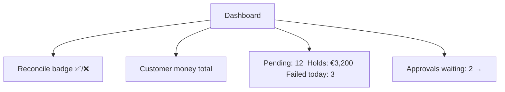

# bank0 — Operator Console (Admin UI/UX)

> The internal tool support/ops/finance staff use to run the bank.
> Stack stays server-rendered: **Go Templ + HTMX**, but redesigned around roles,
> safety, and the ledger truths from [`03-...md`](03-ledger-lifecycle-idempotency.md).

> **Status (in progress):** the full **IA shell** (§3) is built — top bar (role
> badge + operator + logout), left nav, HTMX-swapped main panel, right rail — on
> the portal surface behind session auth (§7). Working screens: **Dashboard**
> (reconcile badge + counters), **Users** (list → rail detail), **Accounts** (list
> → owner detail), **Transfers** (pending queue + Post/Cancel), **Reconciliation**.
> Admin/operator workflows: **create users, create accounts, add credit** (deposit,
> with `hx-confirm` + per-form idempotency key), **see/edit user details**, and
> **see/edit accounts** (freeze/unfreeze, set default, set transfer limit) — all
> role-gated (auditor read-only). Mutations fire `HX-Trigger: bank0:refresh` so the
> main-panel lists self-refresh. The console is now feature-complete: users,
> accounts, credit/withdraw, maker-checker approvals, transfers + drill-down,
> statement, audit, reconcile, search, pagination, auto-refresh, and an admin-only
> **"Revoke app sessions"** action. The client-facing app is a separate surface —
> its API is [`06-client-api.md`](06-client-api.md), its PWA is
> [`07-client-web-app.md`](07-client-web-app.md).

---

## 1. What tf-backend had, and why it's not enough

tf-backend's UI was a single page that loaded three flat tables (users, accounts,
transactions) behind one shared BasicAuth user. For a banking back office that
leaves real gaps:

| Gap | Consequence | bank0 answer |
|-----|-------------|--------------|
| One shared login, no roles | no attribution, no least-privilege | per-user sessions + 4 roles |
| BasicAuth (creds in every request) | no logout, no session expiry, creds on the wire | cookie session, idle timeout |
| Flat tables, no drill-down | can't investigate an account | account → statement → transfer detail |
| No view of holds / pending / available | the lifecycle is invisible | pending queue, holds panel, available vs ledger |
| Direct balance edit | silent, untraceable money | "credit/debit" = a ledger `deposit`/`withdraw` |
| No reconciliation surface | can't tell if the books are right | dashboard `reconcile()` badge |
| No guardrails on big actions | one mis-click moves real money | confirm modals + maker-checker |

---

## 2. Roles (least privilege)

Maps to `users.role`. Enforced in middleware (route → required role) **and**
mirrored in the UI (hide what you can't do).

| Role | Can | Cannot |
|------|-----|--------|
| `auditor` | read everything: accounts, ledgers, transfers, reconcile, audit log | change anything |
| `operator` | + create accounts, freeze/unfreeze, cancel *pending* transfers, request deposits/withdrawals up to a threshold | reverse posted transfers, large credits, manage users |
| `admin` | + reverse posted transfers, approve maker-checker items, large credits, manage operator accounts | (nothing app-level; still audited) |
| `customer` | no console access | — |

> Every state-changing screen calls a DB function that already enforces its own
> invariants — the role check is defense-in-depth and UX, not the primary control.

---

## 3. Information architecture

```
┌ Top bar: bank0 · role badge · operator name · logout ─────────────┐
│ Left nav            │  Main panel (HTMX-swapped)                   │
│ • Dashboard         │                                              │
│ • Accounts          │   [ context-specific content ]               │
│ • Transfers         │                                              │
│ • Approvals (N)     │   right rail: detail / actions               │
│ • Audit log         │                                              │
│ • Reconciliation    │                                              │
└─────────────────────┴──────────────────────────────────────────────┘
```

Each nav item loads into the main panel via `hx-get`; drill-downs open in the
right rail so the operator never loses their list context.

---

## 4. Screen by screen

### 4.1 Dashboard

The "is the bank healthy?" glance:

- **Reconciliation badge** — green if `reconcile()` returns 0 rows, red with the
  failing checks otherwise. This is the single most important widget; it proves
  I1–I3 hold right now.
- **Money-in-the-bank** — `−SUM(balance of system accounts)` = total customer
  money; `external_clearing` balance = net flows across the boundary.
- **Operational counters** — pending transfers, active holds (count + reserved
  total), failed/expired today, reversals today.
- **Pending-approvals** count (maker-checker queue) with a jump link.



### 4.2 Accounts (list → detail)

- **List**: search bar (IBAN / owner / username — the search-feature TODO),
  cursor-paginated, columns: owner, IBAN, status chip, **available** and
  **ledger balance** side by side, default-account star.
- **Detail (right rail)**:
  - Header: owner, IBAN, status, currency.
  - **Available vs Ledger balance** explained inline:
    `available €90.00 = ledger €100.00 − holds €10.00`. Demystifies the lifecycle.
  - **Statement**: `ledger_entries` newest-first with `balance_after` as a real
    running balance, each row linking to its transfer. Cursor pagination on
    `(posted_at, id)`.
  - **Active holds** list with expiry countdown.
  - **Actions** (role-gated, each a confirm modal):
    `Credit` (deposit), `Withdraw`, `Freeze/Unfreeze`, `Set default`,
    `Adjust transfer limit`, `Close`.

### 4.3 Transfers

- **Pending queue** (the operational heart): every `status='pending'` transfer
  with age and hold expiry, plus inline `Post` / `Cancel`. Double-click safe — the
  button sends an `Idempotency-Key` and disables on submit.
- **History**: cursor-paginated, filterable by status/kind/account/amount/date.
- **Transfer detail**: both ledger legs, the hold, the idempotency key, and — for
  reversals — a link to/from the original (`reverses_id`). A posted transfer shows
  a `Reverse` action (admin only, reason required, idempotency key auto-generated).

### 4.4 Approvals (maker-checker)

For high-risk actions (see §5), the maker submits and the action lands here as
*requested*; a different admin approves or rejects. The acting and approving user
are both recorded in `admin_actions` (`actor_user_id`, `approved_by`). An admin
cannot approve their own request.

### 4.5 Audit log

`admin_actions` joined to operators: who did what, to which target, when, with the
JSON detail and the approver. Filterable, read-only, exportable. Pairs with the
ledger to answer "who authorized this movement and why."

### 4.6 Reconciliation

Runs `reconcile()` on demand, lists any failing invariant with the offending
account/transfer and the drift amount. In a healthy system this is an empty,
green page — and that emptiness is the product.

### 4.7 Disputes

A **Disputes** nav screen renders the triage queue (newest first) and drives the
resolve state machine, backed by the same endpoints the JSON admin API exposes
([`06-client-api.md`](06-client-api.md) §1; spec
[`specs/spec-disputes.md`](specs/spec-disputes.md)):

- **Queue** (`GET /console/disputes` → `/console/disputes/results`): each row shows
  raised-at, raiser, category, status, from/to IBANs, and amount. Backed by
  `ListDisputesAdmin` (cursor-paginated; the JSON `GET /admin/disputes?status=` adds
  the status filter).
- **Resolve** (`POST /console/disputes/{id}/resolve?status=` + optional note): inline
  per-row actions — *Reviewing* (open → under_review), *Resolve*, *Reject* — with an
  optional resolution note. Terminal rows show their final status, no actions. The
  state machine (terminal transitions → 409) lives in `resolve_dispute`; the resolver
  is the session operator, audited in `admin_actions`.

Resolving is gated to **operators/admins** (`canActOnMoney`); auditors see the queue
read-only (no action buttons, and a direct resolve POST → 403). Raising a dispute
emits an `admin_actions` `dispute_raised` row — the flag-only fraud-engine seam (no
auto-freeze).

> **Admin-JSON RBAC (2026-06-13).** The JSON admin API now enforces roles **per
> handler**, not just a valid session: money / account / dispute mutations require
> `canActOnMoney`, user creation requires `canManageUsers`; reads stay open to any
> staff. This closed a broken-access-control gap — see
> [`10-security-review.md`](10-security-review.md) finding #1.

---

## 5. Safety patterns (the UX that protects money)

1. **Confirm modals** for every money/destructive action, restating the concrete
   effect: *"Credit €250.00 to IBAN …7821 (Alice Smith). This posts a ledger
   entry from external_clearing. Reason: ___"*.
2. **Idempotency keys are automatic.** The UI generates a key per action attempt
   and sends it; a retried/double-clicked submit reuses the key → the DB replays
   the original result. The operator literally cannot create a duplicate movement.
3. **Optimistic disable**: action buttons disable on click (`hx-disabled-elt`),
   re-enable on response — kills the double-submit instinct even before the key
   does.
4. **Maker-checker threshold**: deposits/withdrawals/reversals strictly above a
   configurable amount (**€10,000** by default, `admin.maker_checker_threshold_minor`)
   require a second admin via the Approvals queue. Smaller ops stay one-click.
5. **No raw balance field anywhere.** "Credit/Debit" always means a ledger
   `deposit`/`withdraw`; there is no input that writes `balance_minor`. The
   tf-backend "edit balance" footgun is removed by design.
6. **Reason required** on reverse, freeze, close, and any maker-checker action —
   stored in `admin_actions.detail` / `transfers.failure_reason`.
7. **Toasts + inline errors**: the DB error mapping (§5 of `03-...md`) surfaces as
   human messages ("Insufficient available funds: have €90.00, need €100.00").

---

## 6. HTMX interaction model

Keep the tf-backend `WrapJSONToHTML` idea — one handler feeds both JSON API and
HTML — but extend the patterns:

| Pattern | HTMX | Use |
|---------|------|-----|
| Drill-down | `hx-get` → right rail target | account/transfer detail |
| Live search | `hx-get` + `hx-trigger="input changed delay:300ms"` | account/transfer search |
| Safe action | `hx-post` + `hx-confirm` + `hx-disabled-elt="this"` + `Idempotency-Key` | credit, post, reverse |
| Auto-refresh | `hx-trigger="every 10s"` on the pending queue & reconcile badge | keep ops view live |
| Partial swap | `hx-target` + `hx-swap="outerHTML"` | update one row after an action, not the whole table |

Components (Templ): `Shell`, `Dashboard`, `AccountList`, `AccountDetail`,
`Statement`, `TransferQueue`, `TransferDetail`, `ApprovalQueue`, `AuditLog`,
`ReconcilePanel`, plus shared `ConfirmModal`, `StatusChip`, `Money` (formats
minor units → `€x.xx`).

---

## 7. Auth & session — ✅ built

Implemented as **DB-backed sessions** (migration `00012_sessions.sql`), consistent
with the "logic in the DB" principle:

- **Login** (`GET/POST /login`, public) → `create_staff_session(...)` verifies
  `crypt(pw, password_hash)` **and** staff role **and** `status='active'` in one
  function. The cookie holds an opaque 256-bit token; the DB stores only its
  **SHA-256** (a DB leak never exposes a live token).
- **Cookie**: `bank0_session`, HttpOnly, SameSite=Lax, `Secure` in production.
- **Idle timeout 30 min**, slid forward in `validate_session(...)` on every request
  — so all portal replicas share one source of truth, no in-memory state.
- **Logout** (`POST /logout`) calls `revoke_session(...)` (deletes the row).
- **Role in session** (`operator`/`admin`/`auditor`; customers are rejected at
  login) injected into request context for per-action gating (next step).
- Expired sessions are swept by the advisory-locked maintenance loop
  (`cleanup_sessions()`).
- **Revoke app sessions** (user-detail rail, admin only): `revoke_user_refresh`
  force-revokes every refresh token of any user — the operator-side control that
  complements the customer's own "log out everywhere" ([`06-client-api.md`](06-client-api.md) §3.3).
- Every portal route (admin JSON API **and** console HTML) is behind the
  `requireSession` middleware; browsers/HTMX get a redirect to `/login`,
  programmatic callers get `401`. `/health`, `/docs`, `/openapi.yaml`, `/login`
  stay public.

Still to add: route→minimum-role enforcement on mutating actions, login-attempt /
denied-action audit log, and per-IP rate limiting.

---

## 8. Build order

1. ✅ Session auth + roles + Shell + Dashboard (reconcile badge).
2. ✅ Accounts list + Pending queue (read path).
3. ✅ Pending-queue **actions**: Post / Cancel with `hx-confirm`, HTMX re-render,
   role-gated (operator/admin act; auditor read-only, 403 on direct POST).
4. ✅ **IA shell (nav + main + rail) + Users/Accounts management**: create users,
   create accounts, add **credit** (deposit, confirm + idempotency key), edit user
   details, edit accounts (freeze/unfreeze, set default, transfer limit). ✅ **Withdraw**
   (debit → external_clearing) with the same maker-checker routing as credit.
5. ✅ **Audit log** — every operator action written to `admin_actions` (actor +
   action + target + JSON detail), searchable screen, pairing with the ledger.
   ✅ **Maker-checker** — console credits **strictly above €10,000** become a PENDING
   deposit + an `approval_request`; the **Approvals** screen lets a *different* admin
   Approve (posts) or Reject (cancels). `approve_request` enforces approver ≠ maker
   (`approved_by` recorded); nav shows a pending-count badge. Reverse still ⬜.
6. 🟡 **Fuzzy search** ✅ (users/accounts/transfers via pg_trgm). **Transfers** = full
   history (status pills, pending rows actionable). ✅ **Drill-down**: account →
   **Statement** (ledger w/ running balance, in main panel) and **Transfer detail**
   (rail: both legs, hold, idempotency key, reverses link, admin **Reverse**). ✅
   **Pagination**: "Load more" with a **composite (timestamp, id) keyset cursor**
   (Transfers, Audit, Statement) — correct even when many rows share a timestamp.
   ✅ **Auto-refresh**: Dashboard + Approvals poll every 15s (`hx-trigger="every 15s"`);
   the top progress bar skips those polls. Active left-nav highlight + loading states added.

> The Post/Cancel actions are ready; the main *producer* of pending transfers is
> the maker-checker flow (step 5) — above-threshold money moves will call
> `request_transfer` (now wrapped as `Postgres.RequestTransfer`) to enqueue them.

---

## 9. Decisions (resolved 2026-06-05)

1. **Maker-checker threshold** (§5.4): **€10,000** (`admin.maker_checker_threshold_minor = 1000000`).
   Money moves strictly above this route to the Approvals queue for a second approver.
2. **Idle session timeout** (§7): **30 min** (`admin.session_idle_timeout = 30m`).
3. **Auto-post default**: **yes** — `POST /transfers` and the console "send" settle
   immediately. The pending queue still exists for deferred/maker-checker cases.
4. **Customer-facing surface**: **built** — a separate Cloudflare-hosted PWA
   ([`07-client-web-app.md`](07-client-web-app.md)) over the client API
   ([`06-client-api.md`](06-client-api.md)). The operator console remains the only
   *server-rendered* UI.
