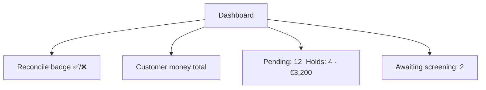

# bank0 — Operator Console (Admin UI/UX)

> The internal tool support/ops/finance staff use to run the bank. Server-rendered
> with **Go Templ + HTMX**, organized around roles, safety, and the ledger truths
> from [`03-...md`](03-ledger-lifecycle-idempotency.md). It runs on the portal
> surface behind session auth (§7); the client-facing app is a separate surface —
> its API is [`06-client-api.md`](06-client-api.md), its PWA is
> [`07-client-web-app.md`](07-client-web-app.md).

The console covers users, accounts, credit/withdraw, maker-checker approvals, the
AML screening queue, fraud-policy management (warning rules + watchlist),
transfers with drill-down, statements, audit log, reconciliation, fuzzy search,
keyset pagination, auto-refreshing views, disputes triage, and an admin-only
**"Revoke app sessions"** action. Mutations fire `HX-Trigger: bank0:refresh` so
the main-panel lists self-refresh.

---

## 1. What a banking back office needs

A single shared login over flat tables doesn't suffice for a banking back office.
The console is built around these requirements:

| Requirement | Why | How |
|-----|-------------|--------------|
| Per-user accountability, least privilege | attribution + scoped authority | per-user sessions + 4 roles |
| Real session lifecycle | logout, expiry, no creds on the wire | cookie session, idle timeout |
| Drill-down to investigate | follow money from account to entry | account → statement → transfer detail |
| Visibility into the lifecycle | holds / pending / available are first-class | pending queue, holds panel, available vs ledger |
| No direct balance edit | money is never silent or untraceable | "credit/debit" = a ledger `deposit`/`withdraw` |
| Reconciliation surface | prove the books are right | dashboard `reconcile()` badge |
| Guardrails on big actions | one mis-click can't move real money | confirm modals + maker-checker |

---

## 2. Roles (least privilege)

Maps to `users.role`. Enforced **in each handler** (a `requireRole` check on the
gated action — there is no route→role middleware; the portal subrouter carries only
`requireSession` + `csrfGuard`) **and** mirrored in the UI (hide what you can't do).

| Role | Can | Cannot |
|------|-----|--------|
| `auditor` | read everything: accounts, ledgers, transfers, reconcile, audit log, **and the fraud-policy panels (warning rules + watchlist), read-only** | change anything |
| `operator` | + create accounts, freeze/unfreeze, cancel *pending* transfers, post credits/withdrawals up to the maker-checker threshold, **create users + set a user's invite quota** (`canCreateUsers`) | reverse posted transfers, post above-threshold moves directly (they route to Approvals), release/refuse screening holds, mutate fraud policy, other user management (roles, status) |
| `admin` | + reverse posted transfers, approve maker-checker items (a different admin than the maker), **release/refuse AML screening holds** (`canApprove`, §4.4a), **manage fraud policy — warning rules + watchlist** (`canManageSettings`, §4.8/§4.9), manage all users | (nothing app-level; still audited) |
| `customer` | no console access | — |

> Every state-changing screen calls a DB function that already enforces its own
> invariants — the role check is defense-in-depth and UX, not the primary control.

---

## 3. Information architecture

```
┌ Top bar: bank0 · role badge · operator name · logout ─────────────┐
│ Left nav            │  Main panel (HTMX-swapped)                   │
│ • Dashboard         │                                              │
│ • Users             │                                              │
│ • Accounts          │   [ context-specific content ]               │
│ • Transfers         │                                              │
│ • Reconciliation    │   right rail: detail / actions               │
│ • Approvals (N)     │                                              │
│ • Limit requests    │                                              │
│ • Disputes          │                                              │
│ • Warning rules     │                                              │
│ • Watchlist         │                                              │
│ • Audit log         │                                              │
│ • Settings          │                                              │
└─────────────────────┴──────────────────────────────────────────────┘
```

Each nav item loads into the main panel via `hx-get`; drill-downs open in the
right rail so the operator never loses their list context.

---

## 4. Screen by screen

### 4.1 Dashboard

The "is the bank healthy?" glance:

- **Reconciliation badge** — green if `reconcile()` returns 0 rows, red with the
  failing checks otherwise. This is the single most important widget; it proves
  I1–I3 hold right now.
- **Customer money** — `SUM(accounts.balance_minor) WHERE kind='customer'`: every
  euro the bank owes its customers, in one number.
- **Operational counters** — the other three cards (`DashboardStats`): pending
  transfers, active holds (count + reserved total), and **Awaiting screening** —
  payments parked `under_review` after an AML watchlist hit
  (`CountPendingScreenings`, best-effort tile), the operator's cue to work the
  screening queue (§4.4a).
- The maker-checker queue depth is **not** a dashboard card — it rides the
  **Approvals** nav item's badge count.


```mermaid
graph TD
    D[Dashboard] --> R[Reconcile badge ✅/❌]
    D --> M[Customer money total]
    D --> Q[Pending: 12  Holds: 4 · €3,200]
    D --> A[Awaiting screening: 2]
```

### 4.2 Accounts (list → detail)

- **List**: search bar (IBAN / owner), cursor-paginated, columns: Owner, IBAN,
  status chip, **Ledger** and **Available** side by side.
- **Detail — the owner's user rail.** There is no standalone account detail:
  clicking a row opens the *owner's* user detail in the right rail
  (`hx-get /console/users/{id}`), which lists that user's accounts as cards. Each
  card shows the IBAN, a **★** for the default account, the status pill, and
  Ledger / Available / Limit side by side.
  - **Actions** on the card (role-gated, `hx-confirm` browser confirms):
    `Add credit` (deposit), `Withdraw`, `Freeze`/`Unfreeze`, `Set default`,
    and `Adjust transfer limit`. (`SetAccountStatus` also accepts `closed`, but no
    console control posts it — closing is not an operator button today.)
  - **Statement** (`Statement →` on the card) renders in the **main panel**, not
    the rail: `ledger_entries` newest-first with `balance_after` as a real running
    balance, cursor-paginated on `(posted_at, id)`, each row drilling into its
    transfer detail in the rail. Its header carries the IBAN, status, and
    Ledger / Available / Transfer-limit cards.
  - Active holds are shown on the **transfer** detail (the hold's amount, status and
    expiry), not as a per-account holds list.

### 4.3 Transfers

- **One list, not two.** The nav's Transfers item (`/console/pending`, the name is
  historical) renders the **full transfer history**, newest first: requested-at,
  from/to, kind, status, amount, description. `status='pending'` rows carry inline
  `Post` / `Cancel` buttons; every other status is read-only. The buttons are
  `hx-confirm`-gated and `hx-disabled-elt` on submit — but unlike credit/withdraw/
  reverse they send **no** `Idempotency-Key`; `post_transfer`/`cancel_transfer` are
  idempotent on the transfer's own status instead.
- **Search/paging**: one free-text `?q` box (IBAN or description, `SearchTransfers`)
  plus a `(requested_at, id)` keyset cursor. The richer status/kind/account/amount/
  date filters live on the **client** API's `GET /transfers`
  ([`06-client-api.md`](06-client-api.md) §1), not in the console.
- **Transfer detail**: both ledger legs, the hold, the idempotency key, and — for
  reversals — a link to/from the original (`reverses_id`). A posted transfer shows
  a `Reverse` action (admin only, reason required, idempotency key auto-generated).
  A **parked** transfer (`held`/`under_review`) shows a hold badge with its
  `hold_reason` and a **"Hold expires"** timestamp (the business-day window
  deadline) — so an operator sees at a glance why a payment hasn't posted and when
  its window lapses.

### 4.4 Approvals (maker-checker)

For high-risk actions (see §5), the maker submits and the action lands here as
*requested*; a different admin approves or rejects. The acting and approving user
are both recorded in `admin_actions` (`actor_user_id`, `approved_by`). An admin
cannot approve their own request.

### 4.4a Screening queue (AML, Rec 25)

The Approvals page carries a **second queue** below the four-eyes one. A client
payment whose debtor or creditor name matches an active watchlist entry is parked
`under_review` by the submit gate (`screen_payment` → `place_transfer_hold`,
[`03-...md`](03-ledger-lifecycle-idempotency.md) §2.8) and filed as a
`screening_hold` `admin_actions` row — surfaced here (`ListPendingScreenings`,
cursor-paginated, auto-refresh 15s). Each row shows the held-at time, payer, from/to
IBANs, amount, the hold reason + matched name (from the row's JSON detail), and the
**deadline** (`hold_expires_at`, a **4-business-day** window via `add_business_days`).

- **Release & post** / **Refuse & cancel** (admin only, `canApprove`) reuse the
  maker-checker endpoints: `approve_request` widens to `screening_hold` and posts the
  `under_review` transfer via `post_transfer(id, {under_review})`; `reject_request`
  cancels it. Both are confirm-gated buttons that fire `HX-Trigger: bank0:refresh`,
  so acting on either queue re-fetches both fragments.
- The screening actor is the *initiating customer*, so the four-eyes "can't approve
  your own request" guard is always satisfied — any admin may decide.
- A screening hold is **never auto-released**: only an operator decision posts it. If
  the 4-business-day window lapses first, the maintenance sweep **auto-cancels** it
  (`'review window expired'`), the fail-safe direction — the payment is refused, not
  quietly sent.

### 4.4b Limit requests (customer maker-checker)

Customer-initiated transfer-limit changes (`POST /accounts/{id}/limit-requests`
on the client surface) land in a **Limit requests** queue — same
`admin_actions` shape (`action = 'limit_request'`), same rules: an admin
applies (`approve_limit_change` runs `update_transfer_limit`) or rejects, the
requester can never apply their own, and a raise is therefore never
self-service. JSON twins: `GET /admin/limit-requests`,
`POST /admin/limit-requests/{id}/approve|reject`.

### 4.5 Audit log

`admin_actions` joined to operators: who did what, to which target, when, with the
JSON detail. Read-only, free-text searchable (action / operator / detail) and
cursor-paginated; **no export path** — pull the table directly if you need one.
`ListAuditLog` also resolves the `approved_by` operator, but the table doesn't
render an approver column yet. Pairs with the ledger to answer "who authorized
this movement and why."

### 4.6 Reconciliation

Runs `reconcile()` on demand, lists any failing invariant with the offending
account/transfer and the drift amount. In a healthy system this is an empty,
green page — and that emptiness is the product.

### 4.6a Your own password (`/console/password`)

Every staff member changes their own password here. It is the **only** operator-facing
password write: `POST /me/password` is the client (JWT) surface, and the admin JSON API
refuses password writes by design, so before this screen the seeded bootstrap admin
could only be rotated with `psql`.

`change_password()` remains the authority — it verifies the current password, enforces
≥ 12 chars and must-differ, and clears `must_change_password` itself. Rotating also
signs out the account's other sessions, which is the point when the credential being
replaced was a shared default.

**Forced rotation.** `00016` seeds a bootstrap `admin` whose password is published in
this repository. `00018` flags that row `must_change_password` — but only while it
still holds the seeded password, so an operator who already rotated by hand is not
nagged. While the flag is set, the console redirects every other screen (and the admin
JSON API answers `403 password_change_required`) until it is cleared. On a fresh
install the first login lands on this screen and cannot leave it.

**Forcing another user to rotate.** A user's rail (admin-only) has **Require
password change**: it sets the flag *and* drops every session that account holds, on
both surfaces. Flagging alone would only inconvenience the legitimate user — whoever
holds the old password keeps their session otherwise. The rail also shows when the
current password was set, and whether the account is currently locked out.

### 4.7 Disputes

A **Disputes** nav screen renders the triage queue (newest first) and drives the
resolve state machine, backed by the same endpoints the JSON admin API exposes
([`06-client-api.md`](06-client-api.md) §1):

- **Queue** (`GET /console/disputes` → `/console/disputes/results`): each row shows
  raised-at, raiser, category, status, from/to IBANs, and amount. Backed by
  `ListDisputesAdmin` (cursor-paginated; the JSON `GET /admin/disputes?status=` adds
  the status filter).
- **Decide / Recall (JSON, Rec 12)**: `POST /admin/disputes/{id}/decide`
  (`reimbursed` / `partially_reimbursed` — a REAL clearing→victim `adjustment`
  transfer, capped + excess-adjusted by `bank_settings`, excess waived for
  vulnerable customers — or `declined`) and `POST /admin/disputes/{id}/recall`
  (simulated pacs.004: `requested` → `funds_returned` | `refused`). Both audit
  to `admin_actions` and notify the filer on the events feed.
- **Resolve** (`POST /console/disputes/{id}/resolve?status=` + optional note): inline
  per-row actions — *Reviewing* (open → under_review), *Resolve*, *Reject* — with an
  optional resolution note. Terminal rows show their final status, no actions. The
  state machine (terminal transitions → 409) lives in `resolve_dispute`; the resolver
  is the session operator, audited in `admin_actions`.

Resolving is gated to **operators/admins** (`canActOnMoney`); auditors see the queue
read-only (no action buttons, and a direct resolve POST → 403). Raising a dispute
emits an `admin_actions` `dispute_raised` row — the flag-only fraud-engine seam (no
auto-freeze).

> **Admin-JSON RBAC.** The JSON admin API enforces roles **per handler**, not just
> a valid session: money / account / dispute mutations require `canActOnMoney`;
> creating users and editing a user's invite quota
> (`POST /console/users/{id}/invites`, audited as `set_invites`) require the
> `canCreateUsers` gate (operator|admin); other user management (role, status)
> stays admin-only (`canManageUsers`); reads stay open to any staff. See
> [`10-security-review.md`](10-security-review.md).

### 4.8 Warning rules (fraud policy, Rec 22)

A **Warning rules** nav screen manages the `warning_rules` policy table that drives
the customer-facing fraud warnings and the `held`/`block` decisions
([`03-...md`](03-ledger-lifecycle-idempotency.md) §2.8). Each rule *matches* a
transfer on its non-null keys — a fired `match_reason_code` (e.g.
`destination_flagged`) and/or a minimum assessed band (`match_min_band`) — and
carries the copy shown to the customer (`category`, `severity`, `headline`, `body`)
plus the behaviour: `decision` (`warn` | `review` | `block`), `required_ack`,
`cooling_off_seconds`, and a `priority` (higher wins among equal-severity matches).
The table ships **empty** (demo rules seed via `db/seed.sql`), so the gate degrades
to plain allow/step-up until a rule exists.

- **View**: all staff (`GET /console/warning-rules` → `/results`). Rules list with
  their match keys, decision, severity and active flag.
- **Mutate**: admins only (`canManageSettings`). Create
  (`POST /console/warning-rules`), edit (`POST /console/warning-rules/{id}`), and
  activate/deactivate (`POST /console/warning-rules/{id}/toggle`). Form input is
  validated against the DB `CHECK` sets (category/severity/decision/band,
  cooling-off 0–86400) for a friendly flash before it hits the database.
- **Audited**: every change writes an `admin_actions` row —
  `create_warning_rule` / `update_warning_rule` / `toggle_warning_rule` — via
  `s.audit`, exactly like `update_settings`.

### 4.9 Watchlist (AML screening, Rec 25)

A **Watchlist** nav screen manages `watchlist_entries` — the sanctions/AML name
list `screen_payment` checks between authorize and capture. Each entry is an
**ILIKE pattern** (with `%` wildcards) matched against a party's registered
`full_name`, plus a free-text `reason`. Also ships **empty** (demo entries in
`db/seed.sql`), so screening is a no-op until an entry exists; a match parks the
payment `under_review` and files it into the screening queue (§4.4a).

- **View**: all staff (`GET /console/watchlist` → `/results`).
- **Mutate**: admins only (`canManageSettings`). Add
  (`POST /console/watchlist`) and activate/deactivate
  (`POST /console/watchlist/{id}/toggle`).
- **Audited**: `create_watchlist_entry` / `toggle_watchlist_entry` in
  `admin_actions`.

---

## 5. Safety patterns (the UX that protects money)

1. **Confirm prompts** for every money/destructive action — `hx-confirm` (the
   browser's own dialog), restating the concrete effect: *"Credit this account
   (posts a ledger deposit from external_clearing)?"* Credit/withdraw take an
   amount only; their ledger description is fixed (`Console credit` /
   `Console withdrawal`), so there is no free-text reason on the money forms.
2. **Idempotency keys are automatic** on the forms that *create* a movement —
   credit, withdraw, reverse. The UI generates a key per action attempt and sends
   it; a retried/double-clicked submit reuses the key → the DB replays the original
   result. The operator literally cannot create a duplicate movement. (Post/cancel
   need no key — they only advance an existing transfer's status; see §4.3.)
3. **Optimistic disable**: action buttons disable on click (`hx-disabled-elt`),
   re-enable on response — kills the double-submit instinct even before the key
   does.
4. **Maker-checker threshold**: deposits/withdrawals strictly above a
   configurable amount (**€10,000** by default,
   `bank_settings.maker_checker_threshold_minor` — DB-resident, console-editable)
   require a second admin via the Approvals queue. Smaller ops stay one-click.
5. **No raw balance field anywhere.** "Credit/Debit" always means a ledger
   `deposit`/`withdraw`; there is no input that writes `balance_minor`. An
   "edit balance" field cannot exist by design.
6. **Reason required on reverse** — the one free-text field the console demands,
   stored via `reverse_transfer` and the `admin_actions.detail` row. Freeze/unfreeze
   and approve/reject collect no reason (the actor, target and action are audited
   regardless); dispute resolve takes an *optional* note.
7. **Toasts + inline errors**: the DB error mapping (§5 of `03-...md`) surfaces as
   human messages ("Insufficient available funds: have €90.00, need €100.00").

---

## 6. HTMX interaction model

One handler feeds both the JSON API and HTML. The interaction patterns:

| Pattern | HTMX | Use |
|---------|------|-----|
| Drill-down | `hx-get` → right rail target | account/transfer detail |
| Live search | `hx-get` + `hx-trigger="input changed delay:300ms"` | account/transfer search |
| Safe action | `hx-post` + `hx-confirm` + `hx-disabled-elt="this"` (+ `Idempotency-Key` on credit/withdraw/reverse) | credit, post, reverse |
| Auto-refresh | `hx-trigger="… every 15s"` on Dashboard, Approvals + Screenings, and Limit requests | keep ops view live |
| Refresh on mutation | `hx-trigger="bank0:refresh from:body"` — Transfers and Reconciliation refresh **only** on this event, they don't poll | avoid churn on quiet screens |
| Partial swap | `hx-target` + `hx-swap="outerHTML"` | update one row after an action, not the whole table |

Components (Templ, `web/template/`): `Shell`, `DashboardCards`,
`UsersPanel`/`UsersRows`, `UserDetail`, `AccountsPanel`/`AccountsRows`,
`StatementView`/`StatementBody`/`StatementItems`,
`TransfersPanel`/`TransferTable`/`TransferItems`, `TransferDetail`,
`ApprovalsPanel`/`ApprovalRows`/`ScreeningRows`,
`LimitRequestsPanel`/`LimitRequestRows`, `DisputesPanel`/`DisputeRows`,
`AuditPanel`/`AuditRows`/`AuditItems`, `ReconcilePanel`, `SettingsPanel`,
`WarningRulesPanel`/`WarningRulesList`, `WatchlistPanel`/`WatchlistList`,
`LoginPage`, `CreateUserForm`. The recurring `…Panel` / `…Rows` split is the
"chrome vs. results fragment" pattern: the panel ships the search box + container,
the rows fragment is what HTMX swaps back in. There is no confirm-modal component
(`hx-confirm` does the job), no status-chip or money component — a status is a
`span.pill` and money goes through `money.FormatMinor` (minor units → `€x.xx`).

---

## 7. Auth & session

Portal auth is **DB-backed sessions** (the `sessions` table and session functions
in [`00004_auth_tokens.sql`](../db/migrations/00004_auth_tokens.sql)), consistent with the
"logic in the DB" principle:

- **Login** (`GET/POST /login`, public) → `create_staff_session(...)` verifies
  `crypt(pw, password_hash)` **and** staff role **and** `status='active'` in one
  function. The cookie holds an opaque 256-bit token; the DB stores only its
  **SHA-256** (a DB leak never exposes a live token).
- **Cookie**: `bank0_session`, HttpOnly, SameSite=Strict, `Secure` in production.
- **Idle timeout 30 min**, slid forward in `validate_session(...)` on every request
  — so all portal replicas share one source of truth, no in-memory state.
- **Logout** (`POST /logout`) calls `revoke_session(...)` (deletes the row).
- **Role in session** (`operator`/`admin`/`auditor`; customers are rejected at
  login) is injected into request context for per-action gating.
- Expired sessions are swept by the advisory-locked maintenance loop
  (`cleanup_sessions()`).
- **Revoke app sessions** (user-detail rail, admin only): `revoke_user_refresh`
  force-revokes every refresh token of any user — the operator-side control that
  complements the customer's own "log out everywhere" ([`06-client-api.md`](06-client-api.md) §3.3).
- Every portal route (admin JSON API **and** console HTML) sits behind the
  `requireSession` middleware; browsers/HTMX get a redirect to `/login`,
  programmatic callers get `401`. Public on the portal: `/health`, `/readyz`,
  `/metrics`, `/docs`, `/openapi.yaml`, `GET`/`POST /login`, `POST /logout`, and
  the embedded console assets under `/static/` (the login page is styled too).
  Both `/login` POST and `/logout` still pass the `csrfGuard`.

---

## 8. Settings & defaults

The console's safety thresholds are DB-resident in `bank_settings`
([`00009_maker_checker.sql`](../db/migrations/00009_maker_checker.sql)) and
console-editable:

- **Maker-checker threshold** (§5.4): **€10,000**
  (`bank_settings.maker_checker_threshold_minor = 1000000`). Money moves strictly
  above this route to the Approvals queue for a second approver; smaller ops stay
  one-click.
- **Idle session timeout** (§7): **30 min** (`admin.session_idle_timeout = 30m`).
- **Auto-post**: `POST /transfers` and the console "send" settle immediately. The
  pending queue still exists for deferred and maker-checker cases — above-threshold
  money moves call `request_transfer` to enqueue a pending deposit + an
  `approval_request`, which the Approvals screen lets a *different* admin Approve
  (posts) or Reject (cancels). `approve_request` enforces approver ≠ maker
  (`approved_by` recorded).

Search across users/accounts/transfers uses `pg_trgm`; list pagination uses a
composite `(timestamp, id)` keyset cursor — correct even when many rows share a
timestamp. Dashboard and Approvals auto-refresh every 15s.
