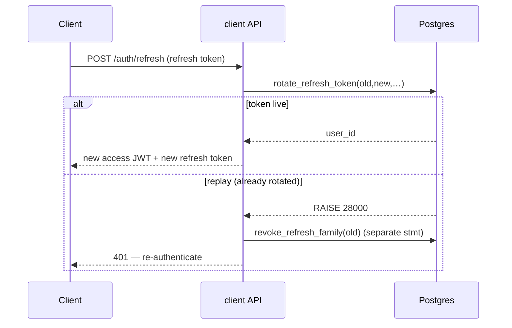

# bank0 — Client API (`api.bank0.hnimn.art`)

> The customer-facing JSON API: the same Go binary as the portal, run in
> `server.mode=api`. JWT bearer auth, ownership-scoped to the token subject, and
> **fronted by a Cloudflare proxy** (see [`04-deployment.md`](04-deployment.md)).
> The browser never calls this host directly — the PWA's Worker proxies `/api/*`
> here ([`07-client-web-app.md`](07-client-web-app.md)).
>
> Status: **built and verified.** Login + refresh + ownership are live; MFA and
> step-up are designed (§6) but not yet implemented.

---

## 1. The surface

`api/openapi.yaml` is the source of truth; `oapi-codegen` generates the
`genclient.ServerInterface` (tag `client`), and the handlers implement it, so
spec/handler drift is a build error ([`04-deployment.md`](04-deployment.md) §4).
Every route except the public ones is wrapped by `requireJWT` and scoped to the
JWT subject.

| Area | Method | Path | Auth | Notes |
|------|--------|------|------|-------|
| Auth | POST | `/auth/login` | public | username+password → access JWT **+ refresh token** |
| Auth | POST | `/auth/refresh` | refresh token | rotate → new access + refresh pair |
| Auth | POST | `/auth/logout` | refresh token | revoke one refresh token |
| Auth | POST | `/auth/logout-all` | bearer | revoke every refresh token for the caller |
| Profile | GET | `/me` | bearer | the caller's own `User` (no password hash) |
| Accounts | GET | `/users/{id}/accounts` | bearer | own accounts only (404 otherwise) |
| Accounts | GET | `/accounts/{id}` | bearer | account + available balance |
| Statement | GET | `/accounts/{id}/ledger?cursor&limit` | bearer | cursor-paginated, running balance, counterparty |
| Beneficiaries | GET | `/beneficiaries` | bearer | saved payees (fuzzy search is client-side) |
| Beneficiaries | GET | `/beneficiaries/resolve?iban=` | bearer | confirmation-of-payee: masked owner name |
| Beneficiaries | POST | `/beneficiaries` | bearer | resolve an IBAN + save |
| Beneficiaries | DELETE | `/beneficiaries/{id}` | bearer | scoped removal |
| Transfers | POST | `/transfers` | bearer | create (auto-post); `Idempotency-Key` required |
| Transfers | GET | `/transfers/{id}` | bearer | transfer status (a party must be owned) |
| Transfers | POST | `/transfers/{id}/post` · `/cancel` | bearer | deferred-settlement lifecycle |
| Health | GET | `/health` | public | liveness/version |

Public routes (`/auth/login`, `/auth/refresh`, `/auth/logout`, `/health`,
`/docs`, `/openapi.yaml`) are registered on the parent router ahead of the
JWT-guarded subrouter, so they aren't shadowed. `logout-all` needs the subject,
so it stays behind `requireJWT`.

---

## 2. Authentication — access tokens

`POST /auth/login` verifies credentials (bcrypt, in the DB) and mints an **HS256
JWT** (`internal/api/jwt.go`):

- Claims: `sub` (user id), `role`, `username`, `iss=bank0`, `aud=bank0-client`, `exp`.
- TTL `auth.jwt_ttl` (**default 15m** — short, because clients rotate; see §3).
- Secret `auth.jwt_secret` (`APP_AUTH_JWT_SECRET`); empty ⇒ insecure dev fallback + warn.
- `requireJWT` validates `WithIssuer`/`WithAudience`/`WithExpirationRequired`/
  `WithValidMethods([HS256])` on every client route and injects the subject.

`aud=bank0-client` isolates client tokens from the portal's cookie session — the
two are never interchangeable.

---

## 3. Authentication — refresh tokens (implemented)

Short access tokens need a way to stay logged in without a long-lived bearer.
The refresh token is an **opaque random string**; the DB stores only
`sha256(token)` (migration `00017_refresh_tokens.sql`), so a DB leak never yields
a live token. All state and transitions live in PL/pgSQL — the Go layer calls one
function and maps typed errors to HTTP, the project's standard discipline
([`01-overview.md`](01-overview.md) P2/P5).

### 3.1 Model

`refresh_tokens` is keyed by the token hash, with a **`family_id`** (one login =
one family) and `parent_id` chaining each rotation. Lifetime state — `expires_at`
(idle, slid on rotate), `rotated_at`, `revoked_at`/`revoked_reason` — lives on the
row. Config: `auth.refresh_ttl` (30d idle) and `auth.refresh_absolute_ttl` (90d
hard cap per family).

### 3.2 Rotation with reuse detection

`POST /auth/refresh` calls `rotate_refresh_token(old, new, …)`, one atomic
transition:

1. **Live token** → mark it `rotated_at`, insert the child (`parent_id=old`, same
   family, new idle expiry), return the user → new access + refresh pair.
2. **Already rotated/revoked** (a replay — theft signal) → `RAISE 28000`. The API
   then revokes the **whole family** in a *separate, committing* statement
   (`revoke_refresh_family`), because a `RAISE` rolls back the function's own
   writes. The client must re-authenticate.
3. **Expired / past the absolute cap / unknown** → `RAISE 28P01`.

`mapDBError` maps `28000`/`28P01` → **401**.

### 3.3 Logout & operator revoke

- `POST /auth/logout` → `revoke_refresh_token` (single session; idempotent).
- `POST /auth/logout-all` → `revoke_user_refresh(subject)` (every family).
- **Operators** can force-revoke a user's app sessions from the console
  (user-detail → "Revoke app sessions" → `revoke_user_refresh`, admin-only,
  audited; [`05-admin-ui.md`](05-admin-ui.md)).
- `cleanup_refresh_tokens()` runs in the advisory-locked maintenance sweep.

---

## 4. Ownership scoping (the IDOR fix)

Every client request is scoped to the JWT `sub` (the `clientSubject` helper):

- `GET /accounts/{id}`, `/accounts/{id}/ledger`, `/users/{id}/accounts`, `/me` →
  **404** for anything not owned by the caller.
- `POST /transfers` requires the **debit** account to belong to the caller
  (**403** otherwise); `GET /transfers/{id}` and the post/cancel lifecycle check
  that the caller is a party.
- Beneficiaries are always scoped to `owner_user_id = subject`.

Scoping applies only on the client surface (a `clientSubject` is present);
operators on the portal are deliberately unscoped (they act on the bank's
behalf). Verified end-to-end: alice cannot read or debit bob's account.

---

## 5. Idempotency, errors & money

- `POST /transfers` **requires** an `Idempotency-Key` header; replays return the
  original result and never double-post ([`03-ledger-lifecycle-idempotency.md`](03-ledger-lifecycle-idempotency.md)).
- `mapDBError` is the only place HTTP status is derived from DB SQLSTATEs — every
  business rule still lives in the database.
- Money is **int64 minor units** end to end; `currency` is single (EUR) for now.

---

## 6. Planned: MFA & step-up (designed, not built)

The next auth increment hardens login and money moves. Same DB-first discipline;
the access-token path (`requireJWT`) barely changes. Tables land in
`00018_mfa.sql`.

### 6.1 TOTP MFA

- `mfa_credentials` (kind `totp`/`webauthn`, encrypted seed, `confirmed_at`),
  `mfa_recovery_codes` (stored `sha256` only, one-time), `mfa_attempts`
  (throttle/lockout). "MFA enabled" = a confirmed credential exists.
- Endpoints: `/auth/mfa/enroll` (→ otpauth URI), `/auth/mfa/confirm` (first code →
  recovery codes), `/auth/mfa/verify` (exchange a short-lived `mfa_token` + code →
  tokens). The HMAC-SHA1 TOTP math lives in Go (`pquerna/otp`); the **seed is
  encrypted at rest** with an app-side AEAD key (`auth.mfa_enc_key`).
- `LoginResponse` gains `mfa_required` + `mfa_token`; when required, **no** access
  token is issued until `/auth/mfa/verify`.

### 6.2 Step-up

The access JWT carries `amr` (`["pwd","otp"]`) and `auth_time`. A transfer ≥
`auth.step_up_limit_minor` with a stale `auth_time` returns **403
`step_up_required`**; the client re-runs `/auth/mfa/verify` and retries with the
**same `Idempotency-Key`**. Customer control, complementing the operator-side
maker-checker.

### 6.3 Toward OIDC / asymmetric keys

When a managed IdP arrives, the Cloudflare Worker can run OAuth2/OIDC
authorization-code + PKCE and hold tokens in httpOnly cookies (the BFF in
[`07-client-web-app.md`](07-client-web-app.md)), and `parseJWT` switches from the
HS256 shared secret to **RS256/JWKS**. `aud=bank0-client` and `sub → users.id`
are unchanged, so the ledger and ownership logic don't move.

### 6.4 Security checklist (when MFA goes real)

- [ ] Refresh tokens & recovery codes stored as `sha256` only; never logged.
- [ ] TOTP seed encrypted at rest; recovery codes one-time; 6-digit verify throttled/locked.
- [ ] Step-up enforced server-side via `amr`/`auth_time`, never client-trusted.
- [ ] Rate-limit `/auth/login`, `/auth/refresh`, `/auth/mfa/verify` per subject + IP.
- [ ] PII handling vs. the immutable ledger: erase PII in `users`, keep pseudonymous ledger rows.

---

## 7. Appendix — rationale & history

This surface began as a **deferred plan** ("how we'd add a customer surface
later") and was built out in phases. The reasoning is worth keeping:

- **Not a new backend.** The client surface is an auth/identity + ownership layer
  on the *existing* ledger API — no second source of truth.
- **The blocking gaps, all now closed:**
  1. *Ownership enforcement (IDOR).* Was the #1 pre-req; now every read/write is
     subject-scoped (§4).
  2. *Real authentication.* Began as a single HS256 access token; now access +
     rotating refresh with reuse detection (§2–3). MFA/step-up is the next step (§6).
  3. *Authorization model.* Customers are `role=customer`; admin ops live only on
     the portal cookie surface; the client JWT's `aud=bank0-client` can't be
     replayed against a (future) admin audience.
- **Why a Cloudflare-fronted single binary, not a separate BFF service (yet):**
  the Worker already gives us a same-origin seam and a place to hold refresh
  cookies later, without standing up another deployment. The BFF/OIDC path is
  described in [`07-client-web-app.md`](07-client-web-app.md) and §6.3.
- **New backend work that did land beyond the original API:** `GET /me`,
  saved **beneficiaries** (`00016`, with confirmation-of-payee masking), and the
  refresh-token tables/functions (`00017`).
- **Still deferred:** onboarding/KYC state on `users`, self-service profile edits,
  notifications, statement export (PDF/CSV), multi-currency.
