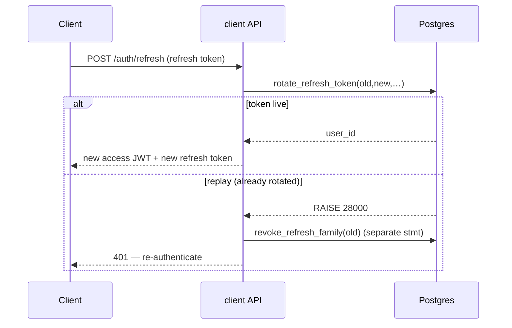

# bank0 — Client API (`api.bank0.hnimn.art`)

> The customer-facing JSON API: the same Go binary as the portal, run in
> `server.mode=api`. JWT bearer auth, ownership-scoped to the token subject, and
> **fronted by a Cloudflare proxy** (see [`04-deployment.md`](04-deployment.md)).
> The browser never calls this host directly — the PWA's Worker proxies `/api/*`
> here ([`07-client-web-app.md`](07-client-web-app.md)). MFA and step-up auth are
> shipped (§6).

---

## 1. The surface

`api/openapi.yaml` is the source of truth; `oapi-codegen` generates the
`genclient.ServerInterface` (tag `client`), and the handlers implement it, so
spec/handler drift is a build error ([`04-deployment.md`](04-deployment.md) §4).
Every route except the public ones is wrapped by `requireJWT` and scoped to the
JWT subject.

| Area | Method | Path | Auth | Notes |
|------|--------|------|------|-------|
| Auth | POST | `/auth/login` | public | username+password → access JWT **+ refresh token** |
| Auth | POST | `/auth/refresh` | refresh token | rotate → new access + refresh pair |
| Auth | POST | `/auth/logout` | refresh token | revoke one refresh token |
| Auth | POST | `/auth/logout-all` | bearer | revoke every refresh token for the caller |
| Onboarding | POST | `/auth/register` | public | **invitation-gated** self-registration → locked `pending_verification` customer; body carries a single-use `invitation_code` (14-day expiry, not email-bound; empty → 422, unknown → 404, used/expired → 409); `Idempotency-Key` required (the code is folded into the fingerprint; replay returns the original body + `Idempotency-Replayed: true`); verification code dispatched out-of-band |
| Onboarding | POST | `/auth/verify-contact` | public | consume the 6-digit code via the opaque `verify_token`; unlocks login (401 wrong/expired, 422 after 5 attempts, 404 unknown token) |
| Onboarding | POST | `/auth/resend-code` | public | re-dispatch (60s DB cooldown → 429; unknown token → silent 202) |
| MFA | POST | `/auth/mfa/enroll` | bearer | begin TOTP enrollment → otpauth URI + base32 secret (shown once); 409 if already enabled |
| MFA | POST | `/auth/mfa/confirm` | bearer | first live code → MFA on + 10 one-time recovery codes (shown once, stored hashed) |
| MFA | POST | `/auth/mfa/verify` | public | exchange the login-issued `mfa_token` + TOTP/recovery code → real token pair (`amr=["pwd","otp"]`); lockout → 429 |
| Profile | GET | `/me` | bearer | the caller's own `User` (no password hash); includes `invites_remaining` (the caller's lifetime invite quota) |
| Profile | PATCH | `/me` | bearer | self-service edit of name/email/phone (password/status/role can't be set here) |
| Profile | POST | `/me/password` | bearer | change password (verify current); revokes other refresh families, spares the current session |
| Invitations | POST | `/me/invitations` | bearer | mint a single-use invite code → **201** `{code, expires_at, invites_remaining}`; verified-active callers only (else **403**); decrements the caller's lifetime `invites_remaining`, **409** `invitation_limit` once exhausted (expired codes never refund) |
| Invitations | GET | `/me/invitations` | bearer | the caller's issued invites — bare array `[{code, status, created_at, expires_at, consumed_at}]`; `status` is derived `pending`/`consumed`/`expired` |
| Sessions | GET | `/me/sessions` | bearer | active devices (refresh-token families); `X-Refresh-Token` header flags the current one |
| Sessions | DELETE | `/me/sessions/{family_id}` | bearer | selective sign-out of one device (idempotent; 404 if not the caller's) |
| Accounts | GET | `/users/{id}/accounts` | bearer | own accounts only (404 otherwise) |
| Accounts | GET | `/accounts/{id}` | bearer | account + available balance |
| Accounts | POST | `/me/accounts` | bearer | open a new account for the caller — server-minted ISO SE IBAN, default limit + per-user cap from `bank_settings`; `Idempotency-Key` required; cap → 409 `account_limit` |
| Accounts | POST | `/accounts/{id}/limit-requests` | bearer | ask for a transfer-limit change on an OWNED account (403 otherwise); lands in the operator maker-checker queue — never self-applied |
| Statement | GET | `/accounts/{id}/ledger?cursor&cursor_id&limit&from&to&direction&q&min_minor&max_minor` | bearer | composite-keyset cursor (`cursor`+`cursor_id`, fixes same-timestamp tie-skip), running balance, counterparty; server-side filters (date range, direction, free text, amount range) |
| Beneficiaries | GET | `/beneficiaries` | bearer | saved payees (fuzzy search is client-side) |
| Beneficiaries | GET | `/beneficiaries/resolve?iban=&name=` | bearer | confirmation-of-payee: masked owner name + the **server-side CoP/VOP verdict** (`match_result`, `reason_code`, `suggested_name` on close_match only, `gate`) + **recipient risk** (`recipient_risk`, `mule_suspected`, `signals[]`, `is_first_payment_to_payee`) — clients render, never decide |
| Beneficiaries | POST | `/beneficiaries` | bearer | resolve an IBAN + save |
| Beneficiaries | DELETE | `/beneficiaries/{id}` | bearer | scoped removal |
| Transfers | GET | `/transfers/suggestion?from_account&amount_minor` | bearer | guided-transfer "mule menu": `{"options":[…]}` with up to 3 third-party candidates drawn at random from the active `guided_scenarios` short-list (`source=scenario`); `{"options":[]}` when none → the client picks one at random, or falls back to the caller's own account. Read-only ([spec](specs/spec-banking-grade-hardening.md) §5) |
| Transfers | GET | `/transfers?cursor&cursor_id&limit&from&to&status&kind&direction&q` | bearer | caller's cross-account history, newest first; composite-keyset cursor; caller-relative `direction` (out/in); masked counterparty; filterable. Bare array |
| Transfers | POST | `/transfers/intent` | bearer | **read-only fraud preflight** (§8): returns the collapsed `decision` + `risk_band` + `reason_codes[]` + optional `warning{}` + `step_up_method`; reserves nothing, posts nothing, writes no row; **never** a numeric score; 403 if the debit isn't owned. AML watchlist screening deliberately does **not** run here (no tipping-off) — a hit surfaces only at submit as `under_review` |
| Transfers | POST | `/transfers` | bearer | create (auto-post); `Idempotency-Key` required; optional `end_to_end_id` (ISO 20022, fingerprinted); replay → `Idempotency-Replayed: true`. The fraud/AML gate may park the payment: status `held` (customer cooling-off) or `under_review` (operator screening) instead of `posted` (§8); `422 payment_blocked` / `409 ack_required` are the gate's refusals |
| Transfers | GET | `/transfers/{id}` | bearer | transfer status (a party must be owned); `held`/`under_review` carry `hold_reason` + `hold_expires_at` |
| Transfers | POST | `/transfers/{id}/post` · `/cancel` | bearer | deferred-settlement lifecycle; `cancel` also releases a `held` transfer, but refuses `under_review` (409, operator-only) |
| Transfers | POST | `/transfers/{id}/confirm` | bearer | **release a `held` transfer** → `posted` (Rec 22 cooling-off); owner only (foreign/unknown → 404); idempotent (already-`posted` → `posted`); not-held / `under_review` / expired window → 409 |
| Notifications | GET | `/me/events?cursor&cursor_id&limit&type&unread_only` | bearer | append-only feed (`transfer.posted`/`payment.incoming`/`transfer.held`/`device.new`/`dispute.updated`), written in the same txn as its cause; bare array, composite keyset |
| Notifications | GET | `/me/events/unread` | bearer | unread count (badge) |
| Notifications | POST | `/me/events/read` | bearer | mark read up to a cursor (or all); idempotent |
| Fraud evidence | POST | `/me/warning-acks` | bearer | "warned and proceeded / backed out" liability evidence (CoP/VOP pivot); append-only, debit account must be the caller's |
| Disputes | POST | `/transfers/{id}/dispute` | bearer | "I don't recognise this" — party-only, one open per (transfer, caller); optional `scam_type` starts the PSR claim (15-BBD `sla_due_at`) |
| Disputes | GET | `/disputes` · `/disputes/{id}` | bearer | track own disputes (raiser-scoped; foreign id → 404) |
| Health | GET | `/health` | public | DB-blind liveness/version |
| Health | GET | `/readyz` | public | DB-aware readiness (pings the DB) |
| Metrics | GET | `/metrics` | public | RED counters |

Public routes (`/auth/login`, `/auth/refresh`, `/auth/logout`, `/auth/register`,
`/auth/verify-contact`, `/auth/resend-code`, `/health`, `/readyz`, `/metrics`,
`/docs`, `/openapi.yaml`) are registered on the parent router ahead of the
JWT-guarded subrouter, so they aren't shadowed. `logout-all` needs the subject,
so it stays behind `requireJWT`. The three onboarding routes share the strict
per-IP login limiter; every `Transfer` carries the rail-ready `uetr`
(bank-minted UUIDv4) and optional originator `end_to_end_id`.

---

## 2. Authentication — access tokens

`POST /auth/login` verifies credentials (bcrypt, in the DB) and mints an **HS256
JWT** (`internal/api/jwt.go`):

- Claims: `sub` (user id), `role`, `username`, `iss=bank0`, `aud=bank0-client`, `exp`.
- TTL `auth.jwt_ttl` (**default 15m** — short, because clients rotate; see §3).
- Secret `auth.jwt_secret` (`APP_AUTH_JWT_SECRET`); empty ⇒ insecure dev fallback + warn.
- `requireJWT` validates `WithIssuer`/`WithAudience`/`WithExpirationRequired`/
  `WithValidMethods([HS256])` on every client route and injects the subject.

`aud=bank0-client` isolates client tokens from the portal's cookie session — the
two are never interchangeable.

---

## 3. Authentication — refresh tokens

Short access tokens need a way to stay logged in without a long-lived bearer.
The refresh token is an **opaque random string**; the DB stores only
`sha256(token)` (the `refresh_tokens` table in
[`00004_auth_tokens.sql`](../db/migrations/00004_auth_tokens.sql)), so a DB leak never yields
a live token. All state and transitions live in PL/pgSQL — the Go layer calls one
function and maps typed errors to HTTP, the project's standard discipline
([`01-overview.md`](01-overview.md)).

### 3.1 Model

`refresh_tokens` is keyed by the token hash, with a **`family_id`** (one login =
one family) and `parent_id` chaining each rotation. Lifetime state — `expires_at`
(idle, slid on rotate), `rotated_at`, `revoked_at`/`revoked_reason` — lives on the
row. Config: `auth.refresh_ttl` (30d idle) and `auth.refresh_absolute_ttl` (90d
hard cap per family).

### 3.2 Rotation with reuse detection

`POST /auth/refresh` calls `rotate_refresh_token(old, new, …)`, one atomic
transition:

1. **Live token** → mark it `rotated_at`, insert the child (`parent_id=old`, same
   family, new idle expiry), return the user → new access + refresh pair.
2. **Already rotated/revoked** (a replay — theft signal) → `RAISE 28000`. The API
   then revokes the **whole family** in a *separate, committing* statement
   (`revoke_refresh_family`), because a `RAISE` rolls back the function's own
   writes. The client must re-authenticate.
3. **Expired / past the absolute cap / unknown** → `RAISE 28P01`.

`mapDBError` maps `28000`/`28P01` → **401**.



### 3.3 Logout & operator revoke

- `POST /auth/logout` → `revoke_refresh_token` (single session; idempotent).
- `POST /auth/logout-all` → `revoke_user_refresh(subject)` (every family).
- **Operators** can force-revoke a user's app sessions from the console
  (user-detail → "Revoke app sessions" → `revoke_user_refresh`, admin-only,
  audited; [`05-admin-ui.md`](05-admin-ui.md)).
- `cleanup_refresh_tokens()` runs in the advisory-locked maintenance sweep.

---

## 4. Ownership scoping

Every client request is scoped to the JWT `sub` (the `clientSubject` helper):

- `GET /accounts/{id}`, `/accounts/{id}/ledger`, `/users/{id}/accounts`, `/me` →
  **404** for anything not owned by the caller.
- `POST /transfers` requires the **debit** account to belong to the caller
  (**403** otherwise); `GET /transfers/{id}` and the post/cancel lifecycle check
  that the caller is a party.
- Beneficiaries are always scoped to `owner_user_id = subject`.

Scoping applies only on the client surface (a `clientSubject` is present);
operators on the portal are deliberately unscoped (they act on the bank's
behalf). One customer can never read or debit another's account.

---

## 5. Idempotency, errors & money

- `POST /transfers` **requires** an `Idempotency-Key` header; replays return the
  original result and never double-post ([`03-ledger-lifecycle-idempotency.md`](03-ledger-lifecycle-idempotency.md)).
- **Documented header semantics (Rec 4).** The OpenAPI spec now spells the
  `Idempotency-Key` contract out on every mutating money POST that carries one —
  `postTransfer`, `confirmTransfer`, `cancelTransfer`, `raiseDispute`,
  `reverseTransfer`: a replay with the same key + same parameters returns the
  original result with **`Idempotency-Replayed: true`**; the same key with different
  parameters is **`422 idempotency_key_conflict`**; a duplicate racing an in-flight
  request is **`409 in_progress`**; keys are retained **~7 days**, after which the
  same key is a fresh request. (`raiseDispute` is naturally idempotent on
  `(transfer, caller)` — at most one open dispute per pair — rather than on a header.)
- **Reverse is idempotent on the transfer, not just the key (Rec 4).** A second
  reverse of an already-reversed transfer — even under a **different** key — returns
  the **existing** reversal id (`200`), never a second inverse pair
  ([`03-...md`](03-ledger-lifecycle-idempotency.md) §2.4).
- `mapDBError` is the only place HTTP status is derived from DB SQLSTATEs — every
  business rule still lives in the database. New codes: `422 payment_blocked` and
  `409 ack_required` from the fraud gate (§8).
- Money is **int64 minor units** end to end; `currency` is single (EUR) for now.

---

## 6. MFA & step-up (SHIPPED)

The MFA/step-up increment hardens login and money moves. Same DB-first discipline;
the access-token path (`requireJWT`) barely changes. As-built: tables + the
mfa_* PL/pgSQL live in `00006_mfa.sql`; handlers in
`internal/api/handlers_mfa.go`; the planning spec is retired.

### 6.1 TOTP MFA

- `mfa_credentials` (kind `totp`/`webauthn`, encrypted seed, `confirmed_at`),
  `mfa_recovery_codes` (stored `sha256` only, one-time), `mfa_attempts`
  (throttle/lockout). "MFA enabled" = a confirmed credential exists.
- Endpoints: `/auth/mfa/enroll` (→ otpauth URI), `/auth/mfa/confirm` (first code →
  recovery codes), `/auth/mfa/verify` (exchange a short-lived `mfa_token` + code →
  tokens; public — the token, audience `bank0-mfa`, is the credential; shares the
  login rate limiter). The HMAC-SHA1 TOTP math lives in Go (`pquerna/otp`,
  SHA1/6/30s, ±1-step drift); the **seed is encrypted at rest** (AES-256-GCM,
  `auth.mfa_enc_key`; unset key ⇒ MFA endpoints 503).
- `LoginResponse` gains `mfa_required` + `mfa_token`; when required, **no** access
  token is issued until `/auth/mfa/verify`.

### 6.2 Step-up

The access JWT carries `amr` (`["pwd","otp"]`), `auth_time` and — from a linked
verify — `txn_link`. For an MFA-enabled caller, a transfer ≥
`auth.step_up_limit_minor`, **or to a new payee** (not among their saved
beneficiaries), **or scored `high` by the server-side TRA seam**
(`assess_transfer_risk()`: flagged/reported destination, 24h velocity count &
value, first payment, fresh debit account) returns **403 `step_up_required`**
unless the token carries a **fresh otp dynamically linked to this exact
payment** (PSD2 RTS Art. 5 / WYSIWYS): the client re-runs `/auth/mfa/verify`
with `link: {debit_account, credit_account, amount_minor}` and retries with the
**same `Idempotency-Key`** (the gate runs before the key is claimed, so the
retry posts exactly once). A generic fresh OTP — including the login-time
verify — does NOT authorize a gated transfer; changing amount or payee
invalidates the factor. Freshness is per-verify — deliberately NOT preserved
across `/auth/refresh`. Users without MFA are not gated (they could never
satisfy it); limits + maker-checker still apply. Customer control,
complementing the operator-side maker-checker.

### 6.3 Toward OIDC / asymmetric keys

When a managed IdP arrives, the Cloudflare Worker can run OAuth2/OIDC
authorization-code + PKCE and hold tokens in httpOnly cookies (the BFF in
[`07-client-web-app.md`](07-client-web-app.md)), and `parseJWT` switches from the
HS256 shared secret to **RS256/JWKS**. `aud=bank0-client` and `sub → users.id`
are unchanged, so the ledger and ownership logic don't move.

### 6.4 Security requirements for MFA

- Refresh tokens & recovery codes stored as `sha256` only; never logged.
- TOTP seed encrypted at rest; recovery codes one-time; 6-digit verify throttled/locked.
- Step-up enforced server-side via `amr`/`auth_time`, never client-trusted.
- Rate-limit `/auth/login`, `/auth/refresh`, `/auth/mfa/verify` per subject + IP.
- PII handling vs. the immutable ledger: erase PII in `users`, keep pseudonymous ledger rows.

---

## 7. Design notes

- **Not a separate backend.** The client surface is an auth/identity + ownership
  layer on the *same* ledger API — no second source of truth.
- **Authentication.** Login mints a short HS256 access token plus a rotating
  refresh token with reuse detection (§2–3); MFA/step-up is the designed
  extension (§6).
- **Authorization model.** Customers are `role=customer`; admin ops live only on
  the portal cookie surface, and the client JWT's `aud=bank0-client` can't be
  replayed against an admin audience.
- **Why a Cloudflare-fronted single binary rather than a separate BFF service:**
  the Worker provides a same-origin seam and a place to hold refresh cookies
  without standing up another deployment. The BFF/OIDC path is described in
  [`07-client-web-app.md`](07-client-web-app.md) and §6.3.
- **Beyond the core ledger API**, this surface adds `GET /me`, saved
  **beneficiaries** (with confirmation-of-payee masking), and the refresh-token
  tables/functions — schema in
  [`00004_auth_tokens.sql`](../db/migrations/00004_auth_tokens.sql) and
  [`00011_beneficiaries.sql`](../db/migrations/00011_beneficiaries.sql).
- **Onboarding v1 is shipped**: invitation-gated self-registration + contact
  verification (§1 Onboarding/Invitations rows; schema/functions in
  [`00005_onboarding.sql`](../db/migrations/00005_onboarding.sql)) and customer
  self-service account opening / limit requests (§1 Accounts rows). Registration
  **requires** a single-use `invitation_code` (14-day expiry, not email-bound);
  every verified customer mints codes from a lifetime `invites_remaining` quota
  (`POST /me/invitations`) and lists their own (`GET /me/invitations`). A
  self-registered user is `locked` + `pending_verification` until a code is
  verified; codes and the `verify_token` are stored hashed; failed attempts are
  persisted from Go in a second statement (a `RAISE` rolls back the function's
  own writes). Registration idempotency claims land in a dedicated owner namespace
  (UUID `…0001`), not the all-zero system/money sentinel, closing the
  key-squatting vector on deterministic system keys
  ([`03-...md`](03-ledger-lifecycle-idempotency.md) §3).
- **Open backlog** (full KYC/document capture, notifications, statement
  export, multi-currency) lives in [`specs/`](specs/) — see
  [`specs/spec-p3-roadmap.md`](specs/spec-p3-roadmap.md).

---

## 8. Fraud preflight, warnings & held payments (SHIPPED)

The adaptive-fraud surfaces (Recs 22/23/25) let the customer surface see — and act
on — the **same** server-side risk decision the ledger enforces at submit. As
always the logic lives in the DB (`evaluate_transfer`, `screen_payment`,
`assert_warning_ack`, `place_transfer_hold`, `client_confirm_transfer`); the client
renders and the engine decides. The mechanics are in
[`03-ledger-lifecycle-idempotency.md`](03-ledger-lifecycle-idempotency.md) §2.8/§1;
this is the client contract.

### 8.1 The preflight — `POST /transfers/intent`

A **read-only** preview of what would happen if the caller submitted a given
transfer. It runs the exact evaluation `POST /transfers` applies but reserves
nothing, posts nothing, and writes no row — call it as often as you like (e.g. on
amount/payee change). It requires the caller to own the debit account (**403**
otherwise). The response:

```jsonc
{
  "decision": "warn",                       // allow | warn | step_up | review | block
  "risk_band": "medium",                    // low | medium | high (server-authoritative)
  "reason_codes": ["first_payment_to_payee"],// machine tokens; ALWAYS an array, never null
  "warning": {                               // present only when a warning rule matched, else null
    "warning_id": "…", "category": "risk_warning",
    "severity": "warning",                   // info | warning | critical
    "headline": "…", "body": "…",
    "required_ack": true, "cooling_off_seconds": 15
  },
  "step_up_method": null                     // "otp" when decision = step_up, else null
}
```

**There is no numeric risk score in the response, by design** — the score never
leaves the database. `decision` is the single collapsed outcome (precedence
`block > review > step_up > warn > allow`):

| `decision` | Meaning for the client |
|---|---|
| `allow` | Proceed; submit will post. |
| `warn` | Show `warning`; the customer may proceed (record the ack if `required_ack`). |
| `step_up` | Re-verification **dynamically linked to this exact payment** is required before submit — run the step-up flow in §6.2 (`step_up_method` says how, e.g. `otp`). |
| `review` | Submitting will **park** the payment as `held` for the customer to confirm (§8.3). |
| `block` | Submitting will be refused `422 payment_blocked`. |

Because both the preflight and the submit gate call `evaluate_transfer`, and the
submit path excludes its own just-created pending row from the velocity math, the
two agree at a boundary. One deliberate divergence: the preflight **downgrades
`step_up → allow`** (dropping `step_up_method`) when the caller could never be gated
— they have no MFA enrolled, or their token already carries a fresh OTP linked to
exactly this `(debit, credit, amount)` — so the client isn't told to step up for a
payment it can already make. `warn`/`review`/`block` are never downgraded.

### 8.2 The acknowledgement rule (liability evidence)

When `warning.required_ack` is true, the customer must record a
"warned-and-proceeded" acknowledgement via `POST /me/warning-acks` (§1 Fraud
evidence; category `risk_warning` joins the existing CoP/VOP categories) **before**
submitting. At submit time the DB (`assert_warning_ack`) requires a matching
`warning_acks` row on all of:

- `user` = the caller, `category` = the warning's category, `acknowledged = true`;
- `debit account` = the debit, `counterparty IBAN` = the credit party's IBAN,
  `amount_minor` = the **exact** amount;
- **aged** at least `cooling_off_seconds` old, yet still **fresh** — within
  `cooling_off_seconds + 30 minutes`.

The dual bound is deliberate: the age floor stops a customer pre-clicking "I
understand" far in advance, and the 30-minute ceiling stops a stale ack from a prior
session authorising a later payment. Change the amount or the payee and the old ack
no longer matches. A missing / too-fresh / too-old / mismatched ack is
**`409 ack_required`**; the client re-acknowledges (respecting the cooling-off) and
retries with the **same** `Idempotency-Key` — a blocked/ack-required attempt leaves
no claimed key (it rolls back), so the retry posts exactly once
([`03-...md`](03-ledger-lifecycle-idempotency.md) §3).

### 8.3 Held & under-review payments (the customer's view)

The submit gate can return a **parked** transfer instead of `posted` — funds
reserved, no ledger entry yet, `hold_reason` + `hold_expires_at` populated on the
`Transfer`, and a `transfer.held` event pushed to the payer's feed:

- **`held`** — the customer's own cooling-off (a `review` decision, 1 business day).
  The owner releases it with **`POST /transfers/{id}/confirm`** (→ `posted`) or
  withdraws it with `POST /transfers/{id}/cancel`. Confirming an already-posted
  transfer is an idempotent no-op; a lapsed confirmation window is `409`.
- **`under_review`** — operator AML screening (a `screen_payment` watchlist hit, 4
  business days). The customer can **neither confirm nor cancel** it (both → `409`);
  an operator releases or refuses it from the console screening queue
  ([`05-admin-ui.md`](05-admin-ui.md) §4.4a). It is **never auto-released**.

Either way, if the window lapses the maintenance sweep **auto-cancels** the transfer
(`'confirmation window expired'` / `'review window expired'`) — the fail-safe
direction. `GET /transfers` and `GET /transfers/{id}` accept and return `held` /
`under_review` alongside the other statuses.

### 8.4 PWA behaviour

The Transfer flow (`web/app/src/routes/Transfer.tsx`) calls `/transfers/intent` on
the confirm screen and renders the `warning` as a severity-styled card with the
correct ARIA role (`alert` for `critical`, `aria-live="polite"` otherwise). When
`required_ack`, it shows an acknowledgement checkbox that posts the ack, then runs a
live **cooling-off countdown** (`lib/duration.ts`) off the ack timestamp and keeps
the **Send** button disabled until the countdown elapses. Submit-time
`422 payment_blocked` / `409 ack_required` responses are mapped back into the same
warning card (rather than a raw banner), so the DB stays the source of truth even if
the advisory preflight was skipped or raced. `held`/`under_review` results route to
the receipt like any other status.
