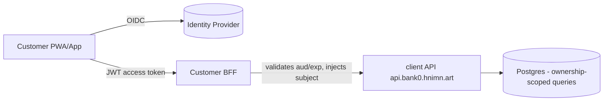

# bank0 — Customer-Facing Surface (deferred plan)

> **Status: out of scope for the current PoC.** The operator console
> ([`04-admin-ui.md`](04-admin-ui.md)) is the only UI we build now. This document
> records *how* the customer surface would be added later so today's decisions
> don't paint us into a corner.

---

## 1. What already exists as the substrate

The client API (`server.mode=api`, `api.bank0.hnimn.art`) is already generated
from the contract and running:

| Method | Path | Purpose |
|--------|------|---------|
| POST | `/auth/login` | verify credentials (bcrypt) |
| GET | `/accounts/{id}` | account + balances |
| GET | `/accounts/{id}/ledger` | statement (cursor-paginated) |
| GET | `/users/{id}/accounts` | a user's accounts |
| POST | `/transfers` | create transfer (auto-post, idempotent) |
| POST | `/transfers/{id}/post` · `/cancel` | deferred settlement |
| GET | `/transfers/{id}` | transfer status |

So the customer surface is **not a new backend** — it's an auth/identity layer, an
ownership-enforcement layer, and a UI on top of this API.

---

## 2. The blocking gaps

1. **Ownership enforcement — ✅ done.** The client surface now scopes every request
   to the JWT subject: `getAccount`/`getAccountLedger`/`listUserAccounts` return
   404 for non-owned resources, `createTransfer` requires the **debit** account to
   belong to the caller (403 otherwise), and `getTransfer`/`postTransfer`/
   `cancelTransfer` check the transfer's party ownership. Enforced only on the
   client surface (`clientSubject` present); operators on the portal are unscoped.
   Verified end-to-end (alice cannot read/debit bob's account).
2. **Real customer authentication — ✅ basic (JWT access token).** `POST /auth/login`
   issues an HS256 JWT (`sub`, `role`, `username`, `iss=bank0`, `aud=bank0-client`,
   `exp`); `requireJWT` validates it on every client route. *Still to add:* refresh
   tokens + rotation, MFA/WebAuthn, and step-up for large transfers — **designed in
   [`07-auth-refresh-mfa.md`](07-auth-refresh-mfa.md)**.
3. **Authorization model.** Customers are `role=customer`; admin ops live only on
   the `portal` surface (cookie session), and the client JWT carries `aud=bank0-client`
   so it can't be replayed against a (future) admin JWT audience. Role is in the
   client JWT for future per-action policy.

---

## 3. Identity & auth (recommended shape)

- **Separate IdP, OIDC.** Run customer identity as OAuth2/OIDC (e.g. an embedded
  IdP or a managed one). The client API validates **JWT access tokens** (audience
  `bank0-customer`, short TTL ~5–15 min) + refresh tokens; portal keeps its own
  cookie session. Two audiences, never interchangeable.
- **MFA** (TOTP/WebAuthn) at login and **step-up** for money movement above a
  per-customer limit.
- **Subject claim → user_id.** Middleware resolves `sub` to the bank0 `users.id`
  and injects it; handlers enforce ownership against it (gap #1).
- **Per-subject + per-device rate limiting** and refresh-token rotation/revocation.

A thin **BFF** (backend-for-frontend) is recommended: it holds the refresh token
in an httpOnly cookie, talks to the client API with the access token, and shapes
responses for the UI. Keeps tokens out of browser JS.

---

## 4. UI options

| Option | Notes |
|--------|-------|
| **PWA / SPA** (recommended first) | One responsive web app, installable. Fastest path; reuses the JSON API. |
| Native iOS/Android | Later; same API + OIDC. Adds device attestation, push. |
| Server-rendered (Templ+HTMX) | Possible (consistent with the console) but customer UX usually wants an SPA/native feel. |

The customer app gets its **own host** (e.g. `app.bank0.hnimn.art`) and its own
`HTTPRoute` on the existing Gateway — the multi-domain/mode pattern already
supports adding a third surface.

---

## 5. New backend work (beyond what exists)

- **Ownership-scoped query variants** (or a `subject` filter pushed into the SQL /
  DB functions) so the DB enforces scoping, consistent with our "logic in the DB"
  principle — e.g. `get_my_account(p_subject, p_account_id)` that raises if the
  account isn't the subject's.
- **Self-service profile** (limited): change password (re-hash), manage MFA,
  view/revoke sessions.
- **Onboarding/KYC** state on `users` (status `pending_kyc → active`), and account
  opening as an *application* that an operator approves in the console
  (ties into maker-checker).
- **Notifications** (transfer posted, low balance) — out of band.
- **Statements/exports** (PDF/CSV) off the ledger view.
- **Spec & codegen:** add a `customer` tag (or a third tag) in `api/openapi.yaml`
  and generate a `gencustomer` server, mirroring the client/admin split. Mind the
  shared-op/`Params` constraint noted in [`05-deployment.md`](05-deployment.md) §4.

---

## 6. Security & compliance checklist (when it goes real)

- TLS everywhere (already terminated at the Gateway), HSTS, secure cookies.
- Audit every customer money action (the ledger already does; add auth-event log).
- PII handling, data-retention, and right-to-erasure vs. immutable-ledger tension
  (erase PII in `users`, keep pseudonymous ledger rows).
- Fraud/velocity checks before `post`; tie into holds + maker-checker.
- Pen-test the IDOR surface specifically (gap #1).

---

## 7. Phased roadmap

1. ✅ **Gap #1 (ownership scoping)** closed on the client API.
2. ✅ **JWT validation middleware** (`aud=bank0-client`) + login issues access token.
   *Remaining:* refresh tokens + rotation, MFA, step-up; optionally move to a managed
   OIDC IdP and asymmetric (RS256/JWKS) keys — **planned in
   [`07-auth-refresh-mfa.md`](07-auth-refresh-mfa.md)**.
3. ⬜ Customer BFF + PWA: login (MFA), accounts, statement, make a transfer.
4. ⬜ Self-service profile + session management.
5. ⬜ Onboarding/KYC flow with operator approval in the console.
6. ⬜ Native apps + notifications.

---

## 8. Open questions (for when we pick this up)

- Managed IdP vs. self-hosted? (Affects MFA/WebAuthn effort.)
- Per-customer daily limits + step-up thresholds — who sets them (operator vs.
  fixed policy)?
- Multi-currency for customers? (Today single-currency; see [`02-data-model.md`](02-data-model.md).)
- Does "customer" ever need more than one login per `users` row (joint accounts,
  delegates)?
