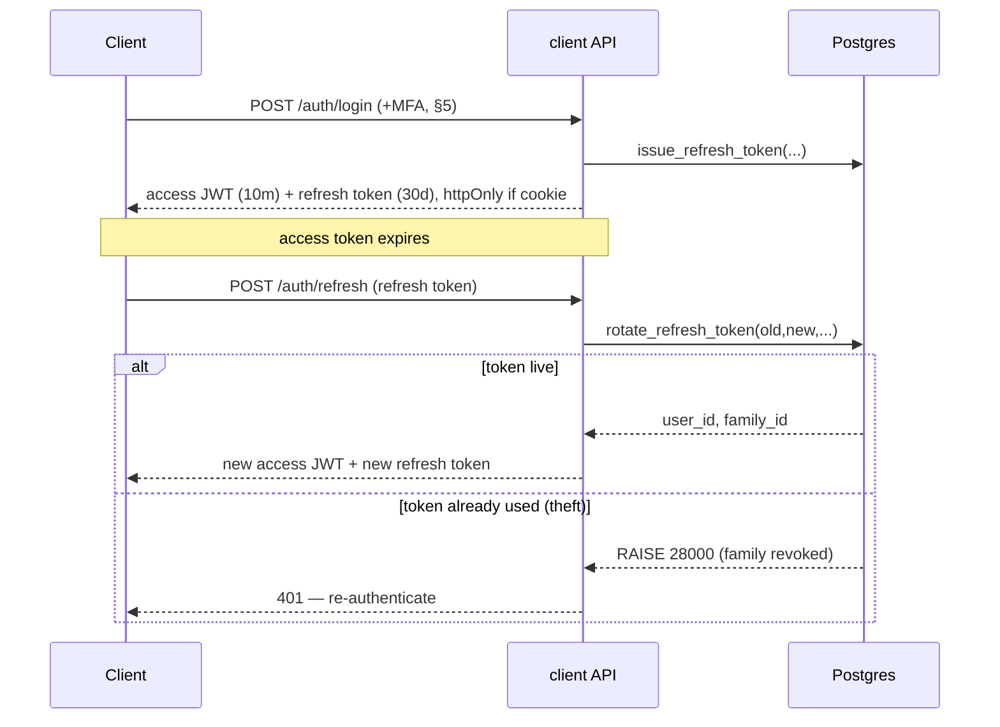
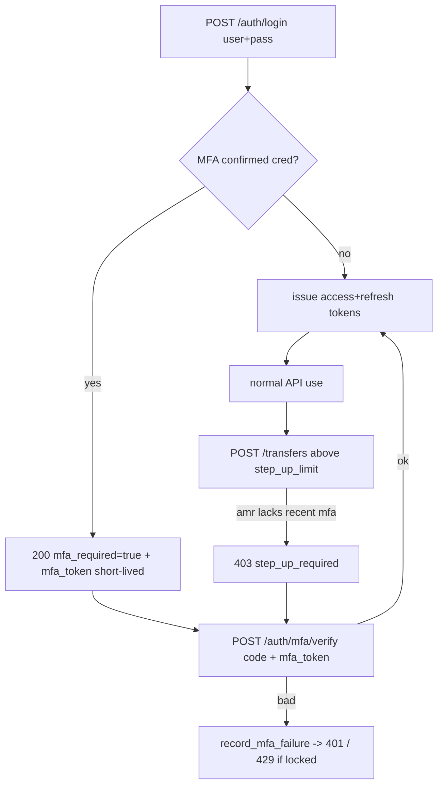

# bank0 — Client Auth Hardening: Refresh Tokens & MFA (plan)

> **Status: deferred / plan only.** Flagged as the remaining auth work in
> [`06-customer-app-plan.md`](06-customer-app-plan.md) §2 and §7. This document is the
> concrete design for *how* we add refresh-token rotation and MFA to the **client
> surface** (`api.bank0.hnimn.art`) without violating the project's "logic in the DB,
> thin API" principle ([`01-overview.md`](01-overview.md) §2). No code yet.

---

## 1. Where we are today

The client surface already has a working **access token**:

- `POST /auth/login` → `issueJWT(userID, role, username)` mints an **HS256 JWT**
  (`sub`, `role`, `username`, `iss=bank0`, `aud=bank0-client`, `exp`) — see
  `internal/api/jwt.go`. `requireJWT` validates it on every client route
  (`WithIssuer`, `WithAudience`, `WithExpirationRequired`, `WithValidMethods[HS256]`).
- TTL is `auth.jwt_ttl` (`AuthConfig` in `internal/config/config.go`); the secret is
  `auth.jwt_secret` (empty ⇒ insecure dev fallback + warn).
- `LoginResponse` (in `api/openapi.yaml`) returns `{user_id, token, token_type, expires_at}`.
- Ownership scoping (the IDOR fix) is done and keys off the `sub` claim
  (`clientSubject`).

**The two gaps this plan closes:**

1. **No refresh.** The access token is the *only* token. A long TTL is a theft window;
   a short TTL forces re-login. We need short-lived access tokens **+** rotating refresh
   tokens with reuse detection and server-side revocation.
2. **No MFA.** Login is single-factor (bcrypt password). We need TOTP (and a path to
   WebAuthn) at login, recovery codes, and **step-up** for money movement.

The portal surface (`portal.bank0.hnimn.art`) keeps its **DB cookie session**
([`00012_sessions.sql`](../db/migrations/00012_sessions.sql)) — it is *not* in scope
here. Two audiences, never interchangeable.

---

## 2. Goals & non-goals

**Goals**
- Short access-token TTL (~10 min) backed by a rotating refresh token (~30 days idle,
  sliding) so customers stay logged in without a long-lived bearer.
- **Refresh-token rotation with reuse detection** — a replayed (already-rotated) token
  revokes the whole token *family* (theft signal) and forces re-auth.
- Server-side revocation: "log out", "log out everywhere", and operator-forced revoke.
- **MFA at login**: TOTP (RFC 6238) first, recovery codes, WebAuthn as a later credential
  type behind the same tables.
- **Step-up**: money moves above a per-customer limit require a fresh second factor; ties
  into the existing `transfer_limit` / maker-checker thresholds.
- Keep the access-token path (`requireJWT`) almost unchanged — middleware still validates a
  short-lived JWT; refresh/MFA are new endpoints + new DB state.

**Non-goals (still deferred, per `06`)**
- The customer PWA/BFF and managed OIDC IdP. (This plan is HS256-symmetric and self-hosted,
  consistent with today; §10 notes the RS256/JWKS migration path.)
- SMS/email OTP (phishable, telco-dependent) — TOTP + WebAuthn only.
- Changing the **portal** cookie-session model.

---

## 3. Design principles inherited

| Principle | How it applies here |
|---|---|
| **Logic in the DB** ([`01`](01-overview.md) §2 P2/P5) | Refresh & MFA state are tables + PL/pgSQL functions; the Go layer calls one function and maps typed errors → HTTP, exactly like `create_staff_session`/`validate_session`. |
| **Opaque token, store only the hash** ([`00012`](../db/migrations/00012_sessions.sql)) | Refresh tokens and recovery codes are random opaque strings; the DB stores only `sha256(token)`. A DB leak never yields a live token. (Access JWTs stay stateless/signed.) |
| **Idempotency & atomic transitions** ([`03`](03-ledger-lifecycle-idempotency.md)) | Rotation is a single atomic statement (consume old + mint new, or detect reuse). No read-modify-write race. |
| **Append-only & auditable** ([`01`](01-overview.md) §2 P4) | Auth events (login, refresh, reuse-detected, mfa_enrolled, step-up) recorded; reuse a dedicated `auth_events` log (the `admin_actions` audit is operator-only). |

---

## 4. Refresh tokens — DB-first design

### 4.1 Schema (migration `00016_refresh_tokens.sql`)

Mirrors the `sessions` table: PK is the token **hash**, all lifetime state in the row.
Adds a **family** so rotation can be tracked and a stolen token's lineage revoked.

```sql
CREATE TABLE refresh_tokens (
    id           TEXT PRIMARY KEY,                       -- sha256(token) hex
    family_id    UUID NOT NULL DEFAULT uuidv7(),         -- one login = one family
    user_id      UUID NOT NULL REFERENCES users(id) ON DELETE CASCADE,
    parent_id    TEXT REFERENCES refresh_tokens(id),     -- previous token in the chain
    issued_at    TIMESTAMPTZ NOT NULL DEFAULT now(),
    expires_at   TIMESTAMPTZ NOT NULL,                   -- idle window, slid on rotate
    rotated_at   TIMESTAMPTZ,                            -- set when consumed by rotate
    revoked_at   TIMESTAMPTZ,                            -- set on logout / reuse / force
    revoked_reason TEXT,                                 -- 'logout'|'reuse_detected'|'forced'|'expired'
    user_agent   TEXT,
    ip           TEXT
);
CREATE INDEX idx_refresh_user    ON refresh_tokens (user_id);
CREATE INDEX idx_refresh_family  ON refresh_tokens (family_id);
CREATE INDEX idx_refresh_expires ON refresh_tokens (expires_at);
-- "live" = not rotated, not revoked, not expired (checked in the rotate fn).
```

### 4.2 Functions (PL/pgSQL, errors mapped by `mapDBError`)

- `issue_refresh_token(p_user_id, p_token_hash, p_idle_seconds, p_ua, p_ip) → family_id`
  — new family at login.
- `rotate_refresh_token(p_old_hash, p_new_hash, p_idle_seconds, p_ua, p_ip) → (user_id, family_id)`
  — **the heart of it**, one atomic statement:
  1. If the old token is **live** → mark `rotated_at=now()`, insert the new token with
     `parent_id=old`, same `family_id`, `expires_at=now()+idle`. Return the user.
  2. If the old token exists but is **already rotated or revoked** → **reuse detected**:
     revoke the entire `family_id` (`revoked_reason='reuse_detected'`) and
     `RAISE EXCEPTION ... ERRCODE='28000'`. Client must re-login (and we log a security event).
  3. If unknown/expired → `RAISE ... 28P01`.
- `revoke_refresh_token(p_hash, p_reason)` — single-session logout.
- `revoke_user_refresh(p_user_id, p_reason)` — "log out everywhere" / operator force-revoke
  (wire into the console: a "Revoke sessions" action on the user detail screen).
- `cleanup_refresh_tokens()` — delete expired/old-revoked rows; add to the existing
  in-process maintenance sweep next to `cleanup_sessions()`
  ([`05-deployment.md`](05-deployment.md), advisory-lock guarded).

### 4.3 Flow



### 4.4 Token transport

- **API-only clients (today):** return the refresh token in the JSON body; client stores it
  and calls `POST /auth/refresh`.
- **Browser (future PWA/BFF):** the BFF holds the refresh token in an **httpOnly, Secure,
  SameSite=Strict** cookie scoped to `/auth/refresh`; access token stays in memory. Keeps
  both out of reach of XSS. (BFF itself is `06` scope; the endpoints here support both.)

---

## 5. MFA — DB-first design

### 5.1 Schema (migration `00017_mfa.sql`)

```sql
CREATE TYPE mfa_kind AS ENUM ('totp', 'webauthn');  -- webauthn lands later, same table

CREATE TABLE mfa_credentials (
    id           UUID PRIMARY KEY DEFAULT uuidv7(),
    user_id      UUID NOT NULL REFERENCES users(id) ON DELETE CASCADE,
    kind         mfa_kind NOT NULL,
    label        TEXT,                          -- "iPhone", "YubiKey 5"
    secret_enc   BYTEA,                          -- TOTP: encrypted seed (see 5.4); webauthn: public key/CBOR
    confirmed_at TIMESTAMPTZ,                    -- NULL until the enroll code is verified once
    last_used_at TIMESTAMPTZ,
    created_at   TIMESTAMPTZ NOT NULL DEFAULT now()
);
CREATE INDEX idx_mfa_user ON mfa_credentials (user_id) WHERE confirmed_at IS NOT NULL;

-- One-time recovery codes (opaque, stored hashed — same discipline as refresh tokens).
CREATE TABLE mfa_recovery_codes (
    id         TEXT PRIMARY KEY,                 -- sha256(code) hex
    user_id    UUID NOT NULL REFERENCES users(id) ON DELETE CASCADE,
    used_at    TIMESTAMPTZ,
    created_at TIMESTAMPTZ NOT NULL DEFAULT now()
);

-- Failed-attempt throttle so TOTP can't be brute-forced (6 digits = 1e6 space).
CREATE TABLE mfa_attempts (
    user_id      UUID PRIMARY KEY REFERENCES users(id) ON DELETE CASCADE,
    fail_count   INT NOT NULL DEFAULT 0,
    locked_until TIMESTAMPTZ
);
```

`users` gains no column; "MFA enabled" = *exists a confirmed credential*. Optionally add
`users.mfa_required BOOLEAN` later if policy must force it per-user.

### 5.2 Functions

- `enroll_mfa(p_user_id, 'totp', p_label, p_secret_enc) → mfa_id` — inserts **unconfirmed**.
- `confirm_mfa(p_user_id, p_mfa_id)` — flips `confirmed_at`; the Go layer verifies the first
  TOTP code *before* calling this (HMAC math stays in Go; see 5.4).
- `verify_mfa(p_user_id) / record_mfa_failure(p_user_id) / clear_mfa_failures(...)` —
  attempt throttling with `locked_until` (exponential backoff after N fails ⇒ `RAISE 42901`).
- `generate_recovery_codes(p_user_id, p_hashes[])` — replaces the set; `consume_recovery_code(p_user_id, p_hash)`
  marks one used atomically (`RAISE` if already used/absent).

### 5.3 Login & step-up flow



- **`amr`/`auth_time` claims.** The access JWT carries how the session was authenticated
  (`amr:["pwd","otp"]`) and `auth_time`. The transfer handler checks: amount ≥
  `auth.step_up_limit_minor` **and** `now - auth_time > auth.step_up_max_age` ⇒ `403
  step_up_required`; the client re-runs `/auth/mfa/verify` to mint a fresh token. This reuses
  the per-customer `transfer_limit` notion already in the ledger and complements maker-checker
  (which is an *operator* control; step-up is a *customer* control).

### 5.4 TOTP secret handling (the one real decision)

The HMAC-SHA1 TOTP math lives in **Go** (e.g. `pquerna/otp`) — DB functions don't compute
codes. The *seed* must be encrypted at rest. Two options, pick at build:

| Option | How | Trade-off |
|---|---|---|
| **App-side AEAD (recommended)** | Go encrypts the seed with a key from `auth.mfa_enc_key` (KMS/secret), stores ciphertext in `secret_enc`. | Key never in the DB; DB leak ⇒ ciphertext only. Slightly more app code. |
| `pgcrypto` `pgp_sym_encrypt` | DB encrypts with a key passed per-call. | Key transits to the DB each call; simpler but weaker separation. |

Recovery codes are only ever stored as `sha256` (never recoverable) — shown once at
generation.

---

## 6. API surface changes (`api/openapi.yaml`)

New endpoints, all `tags:[client]`, `security:[]` except where a bearer/mfa_token is required:

| Method | Path | Purpose | Auth |
|---|---|---|---|
| POST | `/auth/refresh` | rotate refresh → new access+refresh | refresh token |
| POST | `/auth/logout` | revoke current refresh token | refresh token |
| POST | `/auth/logout-all` | revoke whole family/user | access token |
| POST | `/auth/mfa/enroll` | begin TOTP enroll → otpauth URI + secret | access token |
| POST | `/auth/mfa/confirm` | confirm enroll with first code; returns recovery codes | access token |
| POST | `/auth/mfa/verify` | exchange `mfa_token`+code → access+refresh | mfa_token |
| DELETE | `/auth/mfa/{id}` | remove a credential (requires step-up) | access token + step-up |

Schema deltas:
- `LoginResponse`: add `refresh_token`, `mfa_required: boolean`, `mfa_token` (present iff
  `mfa_required`). When `mfa_required`, **no** access token is issued yet.
- New `RefreshRequest{refresh_token}`, `MfaVerifyRequest{mfa_token, code}`,
  `MfaEnrollResponse{secret, otpauth_uri}`, `MfaConfirmResponse{recovery_codes:[string]}`.
- Add a `step_up_required` error variant (403) documented on `/transfers`.

The codegen split is unchanged (these are client-tagged; regenerate `genclient`). Mind the
shared-op/`Params` constraint in [`05-deployment.md`](05-deployment.md) §4.

---

## 7. Go / server changes

- `internal/api/jwt.go`: drop `auth.jwt_ttl` to a short **access** TTL; add `amr`/`auth_time`
  to `clientClaims`. `requireJWT` is otherwise unchanged. Add a small `requireStepUp(amount)`
  helper used by `createTransfer`/`postTransfer`.
- New `internal/api/refresh.go` (rotate/logout handlers) and `internal/api/mfa.go`
  (enroll/confirm/verify) — each a thin call to the new DB functions + `mapDBError`.
- `mapDBError` table gains: `28000`→401 (`reuse_detected`/expired refresh ⇒ re-auth),
  `42901`→429 (mfa locked), plus a sentinel for `step_up_required`→403.
- A random opaque-token generator already exists (`newSessionToken`/`hashToken` in
  `internal/api/auth.go`) — reuse it for refresh tokens and recovery codes.
- Console: add a **"Revoke sessions"** action on the user-detail screen (calls
  `revoke_user_refresh`) and surface "MFA: enabled/—" on the user row. Audited via `s.audit`.

---

## 8. Config knobs (`internal/config/config.go`, `AuthConfig`)

```
auth.access_ttl            (rename of jwt_ttl; default 10m)
auth.refresh_ttl           (idle window, default 720h / 30d)
auth.refresh_absolute_ttl  (hard cap regardless of activity, default 2160h / 90d)
auth.mfa_enc_key           (secret; TOTP seed encryption — empty ⇒ dev warn)
auth.mfa_required          (bool; force enrollment before money moves, default false)
auth.step_up_limit_minor   (≥ this transfer amount needs fresh MFA; default = maker-checker threshold)
auth.step_up_max_age       (default 5m)
```

Helm: add these under the existing `auth` secret/values; `mfa_enc_key` and the (existing)
`jwt_secret` come from the `auth.existingSecret`.

---

## 9. Migrations & rollout

1. `00016_refresh_tokens.sql`, `00017_mfa.sql` — additive (new tables/types/functions only;
   no change to `users` or the ledger). Embedded + applied by the pre-upgrade migrate Job.
2. **Backward compatible:** existing access-token login keeps working; refresh is opt-in by
   the client calling `/auth/refresh`. MFA is opt-in until `auth.mfa_required=true`.
3. Roll out access-TTL shortening **after** refresh is live, else clients get logged out.

---

## 10. Security checklist

- [ ] Refresh tokens & recovery codes stored as `sha256` only; never logged.
- [ ] Rotation is atomic; **reuse revokes the family** and emits an `auth_events` security row.
- [ ] Access TTL short (≤15m); refresh has both idle **and** absolute caps.
- [ ] TOTP: 6 digits, ±1 step skew, **throttled/locked** after N fails (`mfa_attempts`).
- [ ] TOTP seed encrypted at rest (app-side AEAD preferred, §5.4); recovery codes one-time.
- [ ] Step-up enforced server-side on money moves via `amr`/`auth_time`, not client-trusted.
- [ ] `aud=bank0-client` still isolates client tokens from the portal cookie session.
- [ ] Logout / log-out-everywhere / operator force-revoke all effective immediately (DB-side).
- [ ] Rate-limit `/auth/login`, `/auth/refresh`, `/auth/mfa/verify` per subject + per IP.
- [ ] **Migration to RS256/JWKS** when a managed OIDC IdP arrives (`06` §3): `parseJWT`
      switches to a key set; refresh/MFA tables can stay or be delegated to the IdP.

---

## 11. Testing plan (extends the existing 3-layer suite)

Same layering as the current suite (unit / DB-integration / HTTP-integration; DSN-gated,
CI on postgres:18):

- **Unit** (`internal/api`): JWT now carries `amr`/`auth_time`; `requireStepUp` truth table;
  `mapDBError` new SQLSTATEs (28000→401, 42901→429); TOTP verify with known RFC 6238 vectors.
- **DB integration** (`internal/db/integration_test.go`): `rotate_refresh_token` happy path;
  **reuse-detection revokes the family** (the headline test); idle vs absolute expiry;
  `revoke_user_refresh`; `consume_recovery_code` single-use; `mfa_attempts` lockout.
- **HTTP integration** (`internal/api/integration_test.go`): login→refresh→refresh chain;
  replay an old refresh ⇒ 401 + subsequent refresh in family fails; MFA-required login ⇒
  `mfa_token` → `/auth/mfa/verify` → tokens; step-up: large transfer ⇒ 403 then succeeds
  after re-verify.

---

## 12. Phased roadmap

1. ✅ **Refresh tokens** — `00017_refresh_tokens.sql`, `/auth/refresh` + `/auth/logout` +
   `/auth/logout-all`, rotation with **reuse detection** (a replayed rotated token revokes the
   whole family, via a separate committing statement since rotate's RAISE rolls back its own
   work). Login now returns a refresh token; the web app refreshes transparently on 401
   (single-flight, same Idempotency-Key on retry). Access TTL shortened to 15m, and the
   console user-detail screen has an admin-only **"Revoke app sessions"** action
   (`revoke_user_refresh`). Verified end-to-end on PostgreSQL 18 (native `uuidv7()`).
2. ⬜ **TOTP MFA** — `00018`, enroll/confirm/verify, recovery codes, throttle.
3. ⬜ **Step-up** for money moves (`amr`/`auth_time` + `step_up_limit_minor`).
4. ⬜ **WebAuthn** credential type (same tables) — passkeys.
5. ⬜ **RS256/JWKS + managed OIDC** when the customer app/BFF lands (`06`).

---

## 13. Open questions

- **`mfa_required` policy:** global, per-role, or per-customer (operator-set in the console)?
- **Step-up threshold source:** reuse `transfer_limit` per account, a global
  `step_up_limit_minor`, or both (min of)?
- **Recovery-code UX:** count (default 10), and re-generate flow (invalidate old set).
- **Refresh-token transport for the first API client:** JSON body now, httpOnly cookie once
  the BFF exists — do we support both indefinitely or cut over?
- **Device naming / trusted devices:** skip MFA on a remembered device (cookie-bound) — in or
  out of the PoC?
