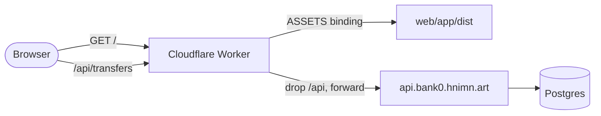

# bank0 - Customer PWA

**TL;DR.** A Preact SPA served by a Cloudflare Worker at `bank0.hnimn.art`. The
Worker also proxies `/api/*` to the client API, which means the browser only ever
talks to one origin and there is no CORS surface. Money data is never cached:
the service worker precaches the app shell and nothing else. Source is
`web/app/` (SPA) and `worker/` (Worker).

The API this app calls is documented in [`06-client-api.md`](06-client-api.md);
this page covers what the client does with it.

---

## 1. The Worker is a static host and a proxy



Diagram: the Worker serves the built SPA from its assets binding and forwards
anything under `/api/` to the client API, stripping the prefix. Both come back to
the browser from the same origin.

`worker/index.ts` does three things: rewrite and forward `/api/*` (passing
through `Authorization`, `Idempotency-Key`, method and body), serve everything
else from `ASSETS` with a single-page-application fallback so deep links work,
and set `Content-Security-Policy`, `Strict-Transport-Security`,
`X-Content-Type-Options` and `Referrer-Policy` on HTML responses.

`worker/wrangler.toml` carries the route, the assets binding and `API_ORIGIN`.
One trap: `routes` is a top-level key and must appear *before* any `[table]`
section, or TOML folds it into `[vars]` and the Worker silently serves nothing.

---

## 2. Stack

| Concern | Choice | Why |
|---|---|---|
| Framework | Preact + TypeScript | a ~4 KB runtime with React-compatible ergonomics |
| Build | Vite | fast, and `vite-plugin-pwa` is first-class |
| Router | `preact-iso` | history routing in about a kilobyte |
| State | `@preact/signals` | the auth token and an accounts cache; no store library |
| Data | a `fetch` wrapper over `/api/*` | adds the bearer, generates the idempotency key, maps errors |
| Fuzzy search | hand-rolled scorer in `lib/fuzzy.ts` | the lists are the user's own accounts and saved payees - small enough that a library would be heavier than the problem |
| Styling | hand-written CSS with custom properties, system font stack | no UI framework |
| PWA | `vite-plugin-pwa` | installable shell; `/api/*` is network-only |
| Money | `Intl.NumberFormat` over minor units | the API returns int64 `*_minor`; format `value/100` with the account currency |

Measure the bundle with `task webapp:build` rather than trusting a number
written down somewhere.

Two rules that are not negotiable in a banking client. The service worker never
caches a response carrying a balance or a transfer - only the static shell. And
every user-initiated transfer attempt carries one `Idempotency-Key`, reused on
every retry of *that* attempt, so a flaky network cannot double-post. A new
attempt, after the user edits something, gets a new key.

---

## 3. Routes

`src/app.tsx` registers thirteen routes plus a default. Everything except
`/login`, `/register` and `/verify` is wrapped in `<Protected>`.

```
/login        username and password        POST /auth/login, then the MFA exchange if asked
/register     invite-gated sign-up         POST /auth/register
/verify       6-digit contact code         POST /auth/verify-contact, POST /auth/resend-code
/             accounts home                GET /users/{id}/accounts
/accounts/:id account detail + statement   GET /accounts/:id, GET .../ledger
/profile      my details                   GET /me, PATCH /me
/password     change password              POST /me/password
/devices      signed-in devices            GET /me/sessions, DELETE /me/sessions/:family
/invite       invite a friend              GET and POST /me/invitations
/activity     notification feed            GET /me/events, POST /me/events/read
/disputes     my disputes                  GET /disputes, POST /transfers/:id/dispute
/transfer     the transfer card            see below
/transfer/:id receipt                      GET /transfers/:id
```

**Login** stores `{token, user_id, expires_at}` and redirects home. Three
responses need their own branch: `mfa_required` routes to the code entry,
`password_change_required` routes to `/password` with a notice (every other
screen would answer 403), and a 401 shows one generic error.

**Statements** page with an explicit "Load more" button rather than an infinite
scroll, passing the last row's cursor. On a list of money movements, a deliberate
tap beats a scroll heuristic. Each ledger entry already arrives with its
direction, signed amount, running balance, counterparty and description.

**The transfer card** is the involved one:

1. Pick a source from the user's own accounts, defaulting to the `is_default`
   one. Pick a destination from saved payees, or add one inline - enter an IBAN,
   `GET /beneficiaries/resolve` shows the masked owner name for confirmation,
   `POST /beneficiaries` saves it.
2. Amounts are entered in major units and converted to minor. The client checks
   the amount against the available balance, which the server checks again.
3. Entering the confirm step fires `POST /transfers/intent`, the read-only fraud
   preflight. It is advisory: if the call fails, the flow continues. A returned
   warning renders as a severity-styled card with both a colored border and a
   text tag, never color alone, and `role="alert"` when it is critical.
   `decision: "block"` hides Send. `required_ack` adds an "I understand" checkbox
   that posts the acknowledgement and starts the cooling-off countdown - Send
   enables when it reaches zero.
4. Submit with a `crypto.randomUUID()` idempotency key. A submit-time
   `409 ack_required` or `422 payment_blocked` re-renders the same warning card
   rather than a raw error banner, because the database is the authority even
   when the advisory preflight was skipped or raced.

**The receipt** shows status, amount, parties and time. `pending` means deferred
settlement or maker-checker. `held` explains the cooling-off, shows the expiry,
and offers Confirm and Cancel. `under_review` says the bank is reviewing it and
offers no actions, because the customer has none.

---

## 4. Layout

```
web/app/
  src/
    main.tsx  app.tsx        render, router, guard, shell
    api/client.ts            fetch wrapper: /api base, bearer, idempotency key, 401 refresh, error map
    api/types.ts             hand-kept mirror of the client schemas
    store/auth.ts            signals: access + refresh token (sessionStorage)
    routes/                  one file per route above
    components/              AddPayeePanel and friends
    hooks/useFraudGate.ts    preflight -> warning -> ack -> cooling-off state machine
    lib/                     money, fuzzy, iban, duration, labels, onboarding, fraudGate, feedback
  vite.config.ts             preset-vite + vite-plugin-pwa; dev proxy /api -> :8090
  playwright.config.ts e2e/  browser suite; globalSetup boots Postgres, the api binary and vite
worker/
  index.ts                   asset serving + /api/* proxy
  wrangler.toml              route, assets binding, API_ORIGIN
```

`src/api/types.ts` is maintained by hand against `api/openapi.yaml`. It could be
generated with `openapi-typescript` the way the Go side is generated; it is not
today, so a contract change means editing it.

Tasks: `task webapp:dev`, `task webapp:build` (`tsc --noEmit` then Vite),
`task webapp:deploy`, `task e2e` (arguments after `--`, for example
`task e2e -- --ui`).

---

## 5. Cross-cutting rules

**Errors.** The API answers `{error, message}`. Map `401` to re-login, `403` to a
permission message - except `step_up_required`, which routes to the MFA step and
retries with the same idempotency key, and `password_change_required`, which
routes to `/password`. `409 ack_required` and `422 payment_blocked` go back
through the warning card. Other `422`s are business rules shown inline
(insufficient funds, a limit, a frozen account). `429` backs off.

**Money.** Every amount is an int64 minor unit. Never a float, at any point.

**Tokens.** The access token lives in memory and `sessionStorage`, never
`localStorage`, and clears when the tab closes. The SPA refreshes transparently
on a 401 in a single flight, so a burst of parallel requests cannot each spend
the refresh token - a replayed refresh token revokes the whole family.

---

## 6. Security posture

The SPA talks only to its own origin. Ownership is enforced server-side by
subject scoping; the client is never trusted with it. `/beneficiaries/resolve`
returns a masked owner name and is rate limited, so it cannot be walked to
enumerate account holders. The confirm step always shows the resolved payee and
IBAN before anything is sent.

Two hardening steps are designed but not built. The refresh token could live in
an httpOnly cookie terminated at the Worker, so the SPA only ever holds a
short-lived access token - a Worker-only change, invisible to the SPA. And
customer identity could move to OIDC, with the Worker running
authorization-code + PKCE and `parseJWT` switching to RS256/JWKS. Neither changes
the ledger or ownership scoping, because `sub` still maps to `users.id`. See
[`06-client-api.md`](06-client-api.md) §6.3.

---

## 7. Decisions worth knowing

- **Self-transfers** appear as an implicit group in the destination picker: the
  user's own other accounts, then saved payees.
- **Confirmation of payee shows initials**, not the full name. That is the
  privacy-versus-usability trade-off made in `resolve_account_by_iban`.
- **The display locale is browser-detected** - `Intl.NumberFormat(undefined, ...)`
  in `lib/money.ts` - while the currency is single and comes from the account.
- **There is no offline mode.** It is a bank; the service worker caches the shell
  so the app opens, and every piece of data requires the network.
