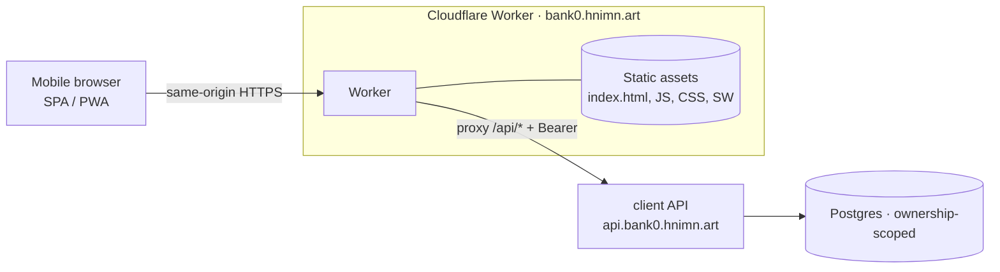

# bank0 — Customer Web App (SPA/PWA + JWT) — build plan

> **Status: plan, no code yet.** Turns the deferred customer surface
> ([`06-customer-app-plan.md`](06-customer-app-plan.md)) into a concrete build for a
> **lightweight, mobile-first SPA/PWA** hosted on a **Cloudflare Worker** at
> `bank0.hnimn.art`, talking to the existing JWT client API at
> `api.bank0.hnimn.art`. Auth hardening (refresh/MFA/step-up) stays in
> [`07-auth-refresh-mfa.md`](07-auth-refresh-mfa.md); this doc consumes it when it lands.

---

## 1. Scope

The six customer flows we're building:

1. Login with `username:password` → JWT (SSO/MFA later, §9).
2. View own details, accounts, statements.
3. Homepage = the user's accounts as a vertical scroll list.
4. Create a transaction (transfer).
5. Transfer card: **fuzzy-pick the source account**, **fuzzy-pick the destination**
   (from **saved beneficiaries**).
6. On success, show transfer details → back to homepage.

**Principles inherited** ([`01-overview.md`](01-overview.md)): the API stays thin, the
ledger/DB stays the source of truth, ownership is scoped to the JWT subject. The web app
adds **no business logic** — it's a presentation layer over the client API.

---

## 2. Architecture — Worker as static host + same-origin proxy



The Worker does two jobs:

- **Serve the built SPA** (Workers Static Assets) — `index.html` + hashed JS/CSS +
  `manifest.webmanifest` + service worker.
- **Proxy `/api/*` → `https://api.bank0.hnimn.art/*`**, stripping the `/api` prefix and
  forwarding the `Authorization` header.

**Why proxy instead of calling `api.*` directly:** the browser only ever talks to its own
origin (`bank0.hnimn.art`), so there is **no CORS** and **no backend change** to the api
surface. It also positions the Worker as the future **BFF** ([`06`](06-customer-app-plan.md) §3):
once refresh tokens exist ([`07`](07-auth-refresh-mfa.md)), the Worker can hold the refresh
token in an `httpOnly; Secure; SameSite=Strict` cookie and inject the access token server-side,
keeping tokens out of browser JS — **without changing the SPA**.

**MVP token handling:** the access token (1h TTL today) lives in the SPA in memory + a
`sessionStorage` mirror (survives reload, cleared on tab close). The Worker forwards it as
`Authorization: Bearer …`. This is the documented "lightweight/JWT" path; the httpOnly-cookie
BFF upgrade is a Worker-only change later.

---

## 3. What exists vs. what we add

### 3.1 Already on the client surface (no change) — `api/openapi.yaml`, `tags:[client]`

| Flow | Endpoint |
|------|----------|
| 1 Login | `POST /auth/login` → `{user_id, token, token_type, expires_at}` (HS256 JWT) |
| 2/3 Accounts | `GET /users/{id}/accounts` → `[Account]` (ownership-scoped to `sub`) |
| 2/3 Account + balance | `GET /accounts/{id}` → `Account` |
| 2/3 Statement | `GET /accounts/{id}/ledger?cursor&limit` → `[LedgerEntry]` (cursor-paginated, running balance, counterparty) |
| 4 Create transfer | `POST /transfers` (+`Idempotency-Key` header) → `TransferResult` |
| 6 Transfer detail | `GET /transfers/{id}` → `Transfer` |

### 3.2 Backend additions (decided)

Both are **client-tagged**, ownership-scoped to the JWT `sub` (the `clientSubject`
pattern already used by `getAccount`/`listUserAccounts`), generated into `genclient`,
audited where they mutate. Mind the **shared-op `Params` constraint**
([`05-deployment.md`](05-deployment.md) §4): keep these **client-only** so they may carry
query/body params without colliding with the admin package.

**(a) `GET /me` — own profile** (Flow 2)
- Returns the caller's own `User` (`full_name`, `email`, `phone_number`, `role`, `status`)
  resolved from `sub`. No new table — reuses the existing users read, scoped to the subject.
- Spec: new `tags:[client]` op `getMe`; reuse the `User` schema. Regenerate `genclient`.
- Handler: `internal/api/handlers_users.go`, thin call to the existing user-by-id query with
  `id := clientSubject(r)`.

**(b) Saved beneficiaries** (Flow 5) — new feature, DB-first per [`01`](01-overview.md) §2

- **Migration** `00016_beneficiaries.sql`:
  ```sql
  CREATE TABLE beneficiaries (
      id                 UUID PRIMARY KEY DEFAULT uuidv7(),
      owner_user_id      UUID NOT NULL REFERENCES users(id) ON DELETE CASCADE,
      label              TEXT NOT NULL,                 -- "Mum", "Landlord"
      credit_account_id  UUID NOT NULL REFERENCES accounts(id),
      iban               TEXT NOT NULL,                 -- denormalized for display/search
      owner_name_masked  TEXT,                          -- e.g. "J*** D**" from resolve
      created_at         TIMESTAMPTZ NOT NULL DEFAULT now(),
      UNIQUE (owner_user_id, credit_account_id)
  );
  CREATE INDEX idx_beneficiaries_owner ON beneficiaries (owner_user_id);
  ```
- **DB functions** (PL/pgSQL, errors via `mapDBError`):
  - `resolve_account_by_iban(p_iban) → (account_id, owner_name_masked)` — looks up an
    **active** account by IBAN, returns the id + a **masked** owner name (never the full
    PII or balance). `RAISE` (404-mapped) if not found/closed.
  - `add_beneficiary(p_owner, p_label, p_iban) → id` — resolves the IBAN, stores the row;
    rejects self-IBAN and duplicates.
  - `list_beneficiaries(p_owner) → [...]`, `delete_beneficiary(p_owner, p_id)` — both scoped.
- **Spec** (new `tags:[client]` ops, regenerate `genclient`):
  | Method | Path | Purpose |
  |---|---|---|
  | GET | `/beneficiaries` | list saved payees (fuzzy is **client-side**) |
  | POST | `/beneficiaries` | add by IBAN+label → resolves, stores |
  | DELETE | `/beneficiaries/{id}` | remove |
  | GET | `/beneficiaries/resolve?iban=` | preview an IBAN before saving (masked owner) |
- **Transfer stays unchanged:** the SPA sends `credit_account = beneficiary.credit_account_id`
  to the existing `POST /transfers`. Beneficiaries are purely a **lookup/directory**;
  `createTransfer` still enforces that the **debit** account belongs to the caller.
- **sqlc**: add `db/queries/beneficiaries.sql`, run `task generate:sqlc`.

> **Privacy note:** IBAN resolution exposes that an account exists + a masked owner name —
> standard for "confirmation of payee". No balances, no full PII. Rate-limit
> `/beneficiaries/resolve` per subject (enumeration guard).

---

## 4. Frontend stack (lightweight, mobile-first, PWA)

| Concern | Choice | Why |
|---|---|---|
| Framework | **Preact + TypeScript** | ~4 KB runtime, React-compatible DX, tiny bundle for mobile. |
| Build | **Vite** | Fast, first-class Cloudflare/Workers + `vite-plugin-pwa` support. |
| Router | **`preact-iso`** (or `wouter`) | Hash/history routing in ~1 KB; no heavy router. |
| State | Signals / context | No Redux; auth token + accounts cache in a small store. |
| Data | `fetch` wrapper → `/api/*` | Adds `Authorization`, generates `Idempotency-Key`, maps errors. |
| Fuzzy search | **Fuse.js** (~5 KB) or a hand-rolled scorer | Flows 5 source/destination pick; lists are small (own accounts + saved payees) so it runs entirely client-side. |
| Styling | Hand-written CSS, mobile-first, CSS variables; system font stack | No UI framework; keeps the bundle tiny and the look native-feeling. |
| PWA | `vite-plugin-pwa` → `manifest.webmanifest` + service worker | Installable, app-icon, offline shell. **Network-first** for `/api/*` (never cache money data); precache only the app shell. |
| Money formatting | `Intl.NumberFormat` over **minor units** | API returns `*_minor` int64; format = `value/100` with the account `currency`. |

**Hard rules for a banking PWA:** never cache API responses containing balances/transfers in
the service worker; the SW caches **only** the static shell. Always send a fresh
`Idempotency-Key` (UUID v4) per *user-initiated* transfer attempt, and **reuse the same key on
retry** of that same attempt so a flaky network can't double-post.

---

## 5. Screens & flow mapping

```
/login        →  username/password form           → POST /auth/login, store token+user_id
/             →  Accounts home (vertical scroll)   → GET /users/{id}/accounts        [Flow 3]
/accounts/:id →  Account detail + statement        → GET /accounts/:id, GET .../ledger (infinite scroll via cursor) [Flow 2/3]
/profile      →  My details                        → GET /me                          [Flow 2]
/transfer     →  Transfer card                     → fuzzy source (accounts) + fuzzy dest (beneficiaries) [Flow 4/5]
                 + "add payee" → GET /beneficiaries/resolve?iban= → POST /beneficiaries
                 submit → POST /transfers (Idempotency-Key)
/transfer/:id →  Result / receipt                  → GET /transfers/:id → "Back to home" [Flow 6]
```

Details per flow:

1. **Login.** Single card; on 200 store `{token, user_id, expires_at}`; redirect to `/`.
   401 → inline error. A 401 from any later call (token expired) → bounce to `/login`.
2. **Profile + statements.** `/profile` shows `GET /me`. Statements are the `ledger` view:
   each `LedgerEntry` already carries `direction`, `signed_amount`, `balance_after`,
   `counterparty_iban/owner`, `description` — render as a running list; **infinite-scroll**
   by passing the last row's `posted_at` as the next `cursor`.
3. **Home = accounts.** Vertical list of cards (IBAN, kind, `available_minor` prominent,
   `balance_minor` secondary, status badge if not `active`). Tap → `/accounts/:id`. Pull-to-refresh.
4. **Create transaction.** FAB / "Send" → `/transfer`.
5. **Transfer card.**
   - **Source:** fuzzy filter over the user's own accounts (already loaded). Default =
     `is_default` account.
   - **Destination:** fuzzy filter over `GET /beneficiaries`. Inline "**+ Add payee**":
     enter IBAN → `GET /beneficiaries/resolve` shows the masked owner for confirmation →
     `POST /beneficiaries` → it appears in the list, selected.
   - Amount input in major units → convert to `amount_minor`. Client-side guard against
     `amount_minor > available_minor`. Confirm step.
   - Submit `POST /transfers` with a UUID `Idempotency-Key` (held for the duration of the
     attempt so retries dedupe).
6. **Receipt.** On success use `transfer_id` → `GET /transfers/:id`; show status, amount,
   parties, `posted_at`. If `status=pending` (deferred settlement / maker-checker), say so.
   "Back to home" → `/` (refetch accounts so the new balance shows).

---

## 6. Repo layout & build

```
web/app/                     # the customer SPA (new; sibling of web/template/ which is the portal)
  index.html
  src/
    main.tsx  router.tsx
    api/client.ts            # fetch wrapper: base /api, Bearer, Idempotency-Key, error map
    api/types.ts             # generated/derived from openapi schemas
    store/auth.ts  store/accounts.ts
    routes/{Login,Home,Account,Profile,Transfer,Receipt}.tsx
    lib/{money.ts,fuzzy.ts}
    pwa/manifest.webmanifest  pwa/sw.ts
  vite.config.ts             # + vite-plugin-pwa
worker/
  index.ts                   # static-asset serving + /api/* proxy to api.bank0.hnimn.art
  wrangler.toml              # routes bank0.hnimn.art/*, [assets] binding, env API_ORIGIN
```

- **Type safety:** generate `src/api/types.ts` from `api/openapi.yaml` (e.g.
  `openapi-typescript`) so SPA types track the contract, mirroring the Go codegen discipline.
- **CI:** add a `web-app` job — `npm ci && npm run build` (typecheck + Vite) and
  `wrangler deploy --dry-run` to validate the Worker. Keep it separate from the Go pipeline.
- **Taskfile:** `task webapp:dev` (Vite + `wrangler dev`), `task webapp:build`,
  `task webapp:deploy`.

---

## 7. Cloudflare Worker

```toml
# worker/wrangler.toml (sketch)
name = "bank0-webapp"
main = "worker/index.ts"
compatibility_date = "2026-01-01"
routes = [{ pattern = "bank0.hnimn.art/*", zone_name = "hnimn.art" }]
assets = { directory = "web/app/dist", binding = "ASSETS" }
[vars]
API_ORIGIN = "https://api.bank0.hnimn.art"
```

Worker logic:
- `GET /api/*` (and other methods): rewrite path (drop `/api`), `fetch(API_ORIGIN + rest)`,
  pass through `Authorization`, `Idempotency-Key`, body, method; return the upstream response.
- Everything else: serve from `ASSETS`; **SPA fallback** → `index.html` for unknown paths so
  client routes deep-link.
- Security headers on HTML: `Content-Security-Policy` (default-src self; connect-src self),
  `Strict-Transport-Security`, `X-Content-Type-Options: nosniff`, `Referrer-Policy`.
- (Later/BFF) terminate refresh-token cookies here; never expose the refresh token to JS.

---

## 8. Idempotency, errors, money — cross-cutting rules

- **Idempotency-Key** is **required** by `POST /transfers`. Generate `crypto.randomUUID()`
  when the user taps "Confirm"; keep it pinned to that attempt and resend it on retry. A new
  attempt (user edits and resubmits) gets a new key.
- **Error mapping:** the API returns `{error, message}`. Map `401`→re-login,
  `403`→permission/ownership (or future `step_up_required`), `404`→not found,
  `422`→business rule (insufficient funds, limit, frozen) shown inline, `429`→back off.
- **Money:** all amounts are **int64 minor units**; never use floats. Display with
  `Intl.NumberFormat(locale, {style:'currency', currency})` on `minor/100`.

---

## 9. Auth lifecycle & SSO (later)

**Today (MVP):** username/password → `POST /auth/login` → 1h HS256 access token. On expiry the
user re-logs in. Good enough to ship; UX is "logged out after ~1h".

**Next (already designed, [`07-auth-refresh-mfa.md`](07-auth-refresh-mfa.md)):**
- **Refresh tokens + rotation** → short access TTL, silent refresh. The **Worker/BFF** holds
  the refresh token in an `httpOnly` cookie and calls `/auth/refresh`; the SPA only ever sees a
  short-lived access token in memory. SPA code is unaffected.
- **MFA (TOTP)** at login + **step-up** for large transfers — the transfer screen handles a
  `step_up_required` 403 by routing to an MFA-verify step, then retrying with the same
  `Idempotency-Key`.

**SSO / OIDC (future, [`06`](06-customer-app-plan.md) §3):**
- Move customer identity to OAuth2/OIDC (managed IdP or embedded). The Worker runs the
  **authorization-code + PKCE** flow, exchanges the code server-side, and holds tokens in
  httpOnly cookies — the SPA stays a pure relying party.
- API migrates JWT validation from HS256-shared-secret to **RS256/JWKS** (`parseJWT` swaps to a
  key set; `aud=bank0-client` unchanged). Login button becomes "Continue with <IdP>" alongside
  (or replacing) the password form. No ledger/ownership changes — `sub` still maps to `users.id`.

---

## 10. Security checklist (MVP)

- [ ] SPA talks **only** to its own origin; Worker proxies to `api.*` (no CORS surface).
- [ ] Access token in memory + `sessionStorage` (MVP); **path to httpOnly-cookie BFF** when
      refresh lands. Never `localStorage` once refresh exists.
- [ ] Service worker **never** caches `/api/*` (money data); precache the shell only.
- [ ] CSP/HSTS/nosniff headers from the Worker; HTTPS only.
- [ ] Every transfer carries a stable `Idempotency-Key`; retries never double-post.
- [ ] `/beneficiaries/resolve` returns masked owner only, **rate-limited** (enumeration guard).
- [ ] Ownership enforced server-side (existing `clientSubject` scoping) — the SPA is never trusted.
- [ ] Confirm-before-send on transfers; show the resolved payee/IBAN at confirm time.

---

## 11. Phased roadmap

1. ✅ **Backend: `GET /me`** + `00016_beneficiaries.sql` (table, DB fns, sqlc, spec, codegen,
   handlers, ownership tests) — **done**. Confirmation-of-payee `resolve` is hand-written
   pgx (`resolve_account_by_iban()` RETURNS TABLE, which sqlc can't expand). Verified
   end-to-end on Postgres: `GetMe` scoping + no password-hash leak; beneficiary
   add/list/delete, self-add & duplicate rejection, cross-user 404, masked owner name,
   and a transfer to a saved payee. Migration up/down/up clean.
2. ✅ **Worker scaffold** (`worker/`): static assets + `/api/*` proxy, `wrangler.toml`, SPA
   fallback, security headers. `wrangler deploy --dry-run` clean.
3. ✅ **SPA core** (`web/app/`): Vite+Preact+TS, api client (Bearer + Idempotency-Key + error
   map), signals auth store, login, accounts home (Flows 1/3).
4. ✅ **Account detail + statement** (cursor "load more") + **profile** via `GET /me` (Flow 2).
5. ✅ **Transfer card**: fuzzy source/dest, add-payee (resolve→save), confirm, idempotent
   submit, receipt (Flows 4/5/6).
6. ✅ **PWA**: manifest + icon, autoUpdate service worker that precaches the shell and treats
   `/api/*` as network-only. *Remaining polish:* install prompt, pull-to-refresh.
   Production build is ~14.5 KB gzipped JS.
7. ⬜ **Auth hardening hookup** (refresh/MFA via Worker BFF) — consumes [`07`](07-auth-refresh-mfa.md).
8. ⬜ **SSO/OIDC** via Worker (PKCE) + RS256/JWKS on the API.

---

## 12. Open questions

- **Beneficiary self-transfer:** include the user's own *other* accounts in the beneficiary
  picker automatically, or only externally-added payees? (MVP: show own accounts as an implicit
  group, saved payees as another.)
- **Confirmation of payee depth:** how much of the owner name do we unmask at resolve time
  (initials vs. first name)? Affects the privacy/UX trade-off in `resolve_account_by_iban`.
- **Locale/currency:** single currency today ([`02`](02-data-model.md)); fix the display locale
  or detect from the browser?
- **Token persistence:** `sessionStorage` (clears on tab close) vs. in-memory only (clears on
  reload) for the MVP, before the BFF cookie lands?
- **Offline:** any read-only offline (last-seen balances) later, or strictly online given it's a
  bank?
