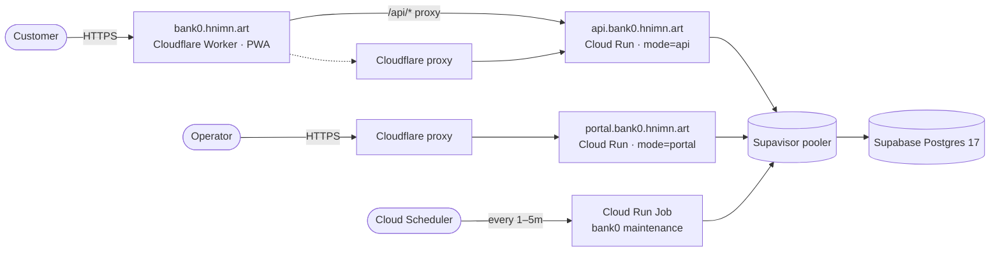
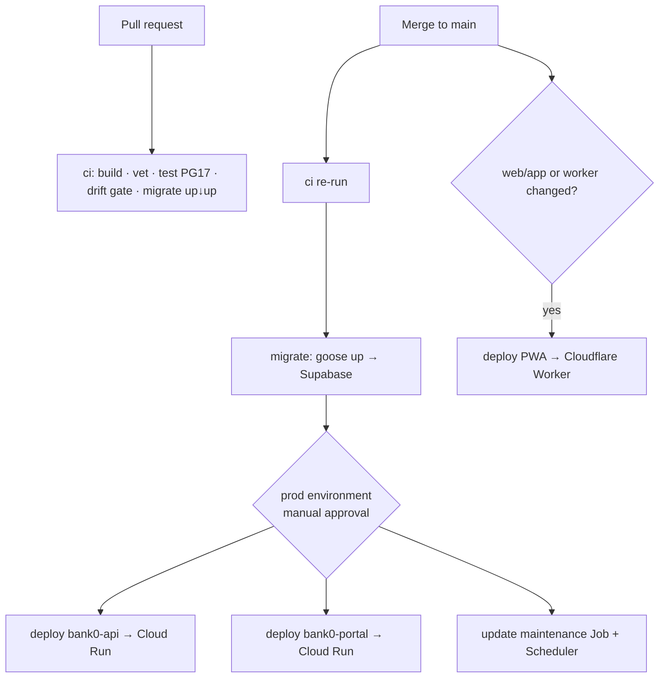

# bank0 — Deployment & CI/CD (Supabase · Cloud Run · Cloudflare)

> The **managed/serverless** deployment path: Supabase for Postgres, Google Cloud
> Run for the two Go surfaces, and a Cloudflare Worker for the PWA. This replaces
> the self-managed Postgres + Kubernetes/Helm path in [`04-deployment.md`](04-deployment.md)
> (which remains a supported alternative). The **application code is identical** —
> same image, same run modes, same migrations; only the hosting substrate changes.
>
> Status: **design** (this document) — no infra is provisioned yet.

---

## 0. Topology

| Host | Surface | Runs on | Notes |
|------|---------|---------|-------|
| `bank0.hnimn.art` | Customer PWA | **Cloudflare Worker** | unchanged — static assets + `/api/*` proxy ([`07`](07-client-web-app.md)) |
| `api.bank0.hnimn.art` | Client JSON API | **Cloud Run** `mode=api` | scale-to-zero, Cloudflare-fronted |
| `portal.bank0.hnimn.art` | Admin API + operator console | **Cloud Run** `mode=portal` | scale-to-zero, Cloudflare-fronted |
| (no host) | Periodic maintenance | **Cloud Run Job** `bank0 maintenance` | triggered by **Cloud Scheduler** (see §3.4) |
| — | Postgres 17 | **Supabase** (`bank0`, `eu-central-1`) | accessed via the Supavisor pooler |



The "logic lives in the database" design ports **unchanged**: Supabase is plain
Postgres, so every PL/pgSQL function, row lock, trigger, and goose migration runs
as-is. We use Supabase **only as Postgres** — not its Auth, RLS, PostgREST, or
Storage. bank0 keeps its own JWT + cookie-session layer.

---

## 1. Database — Supabase (Postgres 17)

### 1.1 The one blocker: `uuidv7()` is PG18-only, Supabase is PG17

The schema uses native **`uuidv7()`** in 10 places ([`00003`](../db/migrations/00003_init_tables.sql),
[`00016`](../db/migrations/00016_beneficiaries.sql), [`00017`](../db/migrations/00017_refresh_tokens.sql),
[`00019`](../db/migrations/00019_guided_scenarios.sql), [`00020`](../db/migrations/00020_disputes.sql)),
which only exists in Postgres 18. The live Supabase project is `17.6.1.127`, so
these migrations fail as written.

**Fix (chosen): a version-gated polyfill** in [`00001_init_extensions.sql`](../db/migrations/00001_init_extensions.sql).
Define a pure-SQL `uuidv7()` **only when the server is < PG18**, so it is a no-op
once Supabase ships 18 (the built-in wins and we drop the polyfill):

```sql
-- +goose Up
do $$
begin
  if current_setting('server_version_num')::int < 180000 then
    create or replace function uuidv7() returns uuid
    language sql volatile parallel safe as $f$
      select encode(
        set_bit(set_bit(
          overlay(uuid_send(gen_random_uuid())
                  placing substring(int8send((extract(epoch from clock_timestamp())*1000)::bigint) from 3)
                  from 1 for 6),
        52, 1), 53, 1), 'hex')::uuid;
    $f$;
  end if;
end $$;
```

> `gen_random_uuid()` is built into Postgres ≥ 13, so no `pgcrypto` needed. This
> produces a spec-shaped, time-ordered v7 UUID — same monotonic index locality the
> schema relies on.

**Test the same version as prod.** CI's test service defaults to `postgres:18`,
with **`postgres:17` opt-in** via workflow_dispatch so the polyfill path Supabase
runs gets exercised; the migration-reversibility job is pinned to `postgres:17` —
see §4. Run `migrate up → down → up` on a throwaway DB to confirm reversibility.

### 1.2 Connecting — Supavisor pooler, not a direct socket

Cloud Run scales horizontally and to zero; many short-lived instances must not
exhaust Postgres connections. Route the app through Supabase's **Supavisor**
pooler:

| Consumer | Pooler mode | Port | Why |
|---|---|---|---|
| **App** (`api`, `portal`, Job) | **Session** | `5432` | No app code change — pgx keeps prepared statements / statement cache. Cap the pool small. |
| **Migrations** (goose) | Session / direct | `5432` | DDL, `CREATE FUNCTION`, advisory locks need a stable backend. |

Keep each instance's pool small and cap Cloud Run fan-out so the product stays
under Supabase's connection ceiling:

```
APP_DATABASE_MAX_OPEN_CONNS = 5
Cloud Run --max-instances = 3        # per service
# worst case ≈ (api 3×5) + (portal 3×5) = 30 session conns
```

> **Scale path (not now):** for higher fan-out switch the app to **transaction
> mode** (`6543`). That requires pgx to stop using the extended protocol /
> prepared statements (`default_query_exec_mode=simple_protocol`, statement cache
> off) — a small change in the pgx pool setup. Session mode avoids it entirely and
> is fine at PoC scale.

### 1.3 Migrations

`auto_migrate` stays **false** on every Cloud Run service. Migrations run as an
explicit CI step (§4) using the binary's own subcommand against the session
pooler DSN:

```bash
bank0 migrate up      # APP_DATABASE_DSN = <supabase session pooler DSN>
```

Supabase's own migration history is **not** used — goose remains the single
migration authority (its embedded migrations are the source of truth).

---

## 2. Compute — Google Cloud Run (two services + one job)

One image (the existing [`deploy/Dockerfile`](../deploy/Dockerfile), already
`distroless/static`, scratch-friendly), three deployments differing only by env:

| Deployment | `APP_SERVER_MODE` | Ingress | Scaling |
|---|---|---|---|
| `bank0-api` | `api` | public (Cloudflare-fronted) | min 0 / max 3 |
| `bank0-portal` | `portal` | public (Cloudflare-fronted) | min 0 / max 3 |
| `bank0-maintenance` (Job) | — (`bank0 maintenance`) | none | Scheduler-triggered |

### 2.1 Configuration (env, all `APP_*` overrides honored by viper)

| Var | `api` / `portal` | Source |
|---|---|---|
| `APP_DATABASE_DSN` | Supabase session pooler URL | **Secret Manager** |
| `APP_AUTH_JWT_SECRET` | shared across all `api` instances | **Secret Manager** |
| `APP_SERVER_MODE` | `api` / `portal` | per service |
| `APP_SERVER_AUTO_MIGRATE` | `false` | env |
| `APP_ADMIN_RUN_MAINTENANCE` | `false` (see §3.4) | env |
| `APP_APP_ENV` | `production` | env |

> **Port:** Cloud Run sends traffic to `$PORT` (default `8080`); the app already
> defaults to `8080` and must listen on `0.0.0.0`. Confirm the listen address
> during implementation; set the Cloud Run container port to `8080`.

### 2.2 The scale-to-zero trade-offs (accepted)

- **Cold start** re-establishes the pgx pool to Supabase (~100–300 ms added to the
  first request after idle). Acceptable for an admin portal + light API. If the
  API path ever needs steady low latency, set `bank0-api --min-instances=1` (this
  is the only thing that costs ~always-on; everything else idles at $0).
- **No always-on process** means the in-process maintenance sweep can't run — see
  §3.4, solved with a scheduled Job.
- **HA correctness is unaffected:** every money op is a single row-locked,
  idempotent DB function ([`03`](03-ledger-lifecycle-idempotency.md)), so N
  stateless instances are safe by construction — same property that made the K8s
  HPA safe.

---

## 3. Edge, domains & maintenance

### 3.1 PWA (unchanged)

The Cloudflare Worker ([`worker/`](../worker/index.ts)) serves the SPA and proxies
`/api/*`. Point `API_ORIGIN` at the API. Simplest: target the Cloud Run
`*.run.app` URL directly (Google terminates TLS with a valid cert), which means
**the PWA path needs no custom domain on Cloud Run at all**.

### 3.2 Fronting `api.*` and `portal.*` with Cloudflare

Operators hit `portal.bank0.hnimn.art` directly, so that host needs a real
mapping. Options, easiest → most production-grade:

1. **Cloud Run domain mapping** + Cloudflare proxied CNAME (`Full (strict)` SSL).
   Quickest; region-limited.
2. **Serverless NEG + Google external HTTPS Load Balancer**, Cloudflare CNAME → LB
   IP. Robust, region-independent, the production choice.

> This is the **main open infra detail** — pick (1) for a fast bring-up, plan (2)
> for production. Either way Cloudflare provides the edge cert, WAF, and rate
> limiting; origin is Cloud Run over HTTPS.

**Not Cloudflare Tunnel.** Tunnel runs a `cloudflared` daemon that holds a
*persistent outbound* connection and delivers inbound traffic over it — which is
incompatible with **scale-to-zero**: when the instance is down there's no tunnel
for Cloudflare to reach, and no inbound request to its endpoint to wake it (Cloud
Run only scales from zero on a request to its *own* URL). Keeping the tunnel alive
forces `min-instances=1` + always-allocated CPU, erasing the ~$0-idle benefit that
motivated Cloud Run — and `cloudflared` on Cloud Run has a documented connection
reboot-loop. Cloud Run is already a public HTTPS endpoint, so it needs no tunnel.
To lock the origin to Cloudflare without a tunnel: require a secret header
Cloudflare injects (drop requests missing it) and/or allowlist Cloudflare IP
ranges. Reserve Tunnel for genuinely private origins (VPC-internal, on-prem, NAT)
with an always-on host.

### 3.3 Cloudflare account / zone

Single Cloudflare account on the `hnimn.art` zone hosts the Worker route
(`bank0.hnimn.art/*`) and the two proxied records for `api.*` / `portal.*`.

### 3.4 Periodic maintenance (the serverless gotcha)

`expire_holds` + cleanup currently run **in-process every 60 s on portal pods**.
With scale-to-zero there may be **no running instance**, so the sweep would stall.

**Design:** disable in-process maintenance (`APP_ADMIN_RUN_MAINTENANCE=false`) and
run the existing `bank0 maintenance` subcommand as a **Cloud Run Job** triggered by
**Cloud Scheduler** (e.g. every 1–5 min). The sweep is already guarded by a
Postgres advisory lock, so overlap is harmless. No new code — the subcommand and
lock already exist ([`04` §3](04-deployment.md)).

---

## 4. CI/CD — GitHub Actions

Builds on the existing [`.github/workflows/ci.yml`](../.github/workflows/ci.yml).
Pipeline shape: **every PR is fully validated; `main` migrates then deploys behind
a manual prod gate.**



### 4.1 `ci` (PRs and main) — gates, no deploy

| Step | Command | Enforces |
|---|---|---|
| Build / vet | `go build ./... && go vet ./...` | compiles |
| **Generate-drift gate** | `task generate && git diff --exit-code` | contract-first rule (no stale `gen*`, `*_templ.go`, sqlc) |
| Test | `go test -race ./...` against the `postgres:` service (**defaults to `18`**; `17` selectable) + polyfill | default 18; opt-in 17 for prod parity |
| Migration reversibility | `migrate up → down → up` on a throwaway **`postgres:17`** | every migration is reversible on the prod PG version |
| OpenAPI lint *(optional)* | `task lint:openapi` | spec hygiene |

> The test service defaults to **`postgres:18`** (`postgres:${{ github.event.inputs.pg_version || '18' }}`),
> with **17 opt-in** via **workflow_dispatch** (Actions → CI → Run workflow → `pg_version: 17`)
> to exercise the **polyfill** path Supabase runs. The separate
> migration-reversibility job is pinned to `postgres:17`.

### 4.2 `migrate` (main only, before any deploy)

```bash
bank0 migrate up        # APP_DATABASE_DSN = secrets.SUPABASE_SESSION_DSN
```

Runs first and **gates the deploy jobs** (`needs: migrate`) — the project rule is
DB-before-app. If this fails, nothing deploys.

### 4.3 `deploy-*` (main, gated by the `prod` Environment)

A GitHub **`prod` Environment with required reviewers** wraps the deploy jobs, so a
human clicks before anything ships:

- `deploy-api`  → `gcloud run deploy bank0-api ...` (or build+push to Artifact
  Registry, then deploy).
- `deploy-portal` → `gcloud run deploy bank0-portal ...`.
- `deploy-maintenance` → update the Job + Scheduler.
- `deploy-pwa` (path-filtered on `web/app/**`, `worker/**`) → `task webapp:deploy`
  (`wrangler deploy`).

### 4.4 Secrets (GitHub → Environments)

| Secret | Used by |
|---|---|
| `SUPABASE_SESSION_DSN` | `migrate` (and as the Cloud Run secret source) |
| `GCP_WORKLOAD_IDENTITY_PROVIDER` / `GCP_SERVICE_ACCOUNT` | `deploy-*` (keyless OIDC auth to GCP — preferred over a JSON key) |
| `CLOUDFLARE_API_TOKEN` / `CLOUDFLARE_ACCOUNT_ID` | `deploy-pwa` |
| `APP_AUTH_JWT_SECRET` | provisioned once into GCP Secret Manager, referenced by Cloud Run (not re-sent each deploy) |

> Prefer **GCP Workload Identity Federation** (OIDC from GitHub) so no long-lived
> service-account key sits in GitHub.

### 4.5 Environments (optional, recommended next)

Use **Supabase branching** (a preview Postgres branch per PR) + a Cloud Run
revision/tag per PR for true preview environments. Not required for first
bring-up; called out so the pipeline can grow into it.

---

## 5. What changed in the repo (implemented)

The deltas were small and additive — no application logic, handler, or ledger
changes; the engine is untouched:

1. ✅ **[`db/migrations/00001_init_extensions.sql`](../db/migrations/00001_init_extensions.sql)** —
   version-gated `uuidv7()` polyfill (§1.1). Verified on PG17: all 31 migrations
   apply, reverse (`up→reset→up`), and the full DB+HTTP suite passes; the polyfill
   emits spec-valid, time-ordered v7 UUIDs.
2. ✅ **[`.github/workflows/ci.yml`](../.github/workflows/ci.yml)** — test service
   defaults to `postgres:18` with `17` opt-in via workflow_dispatch (Supabase
   parity); a dedicated migration-reversibility job (up→reset→up) pinned to
   `postgres:17`; plus the `generate-drift` gate.
3. ✅ **[`.github/workflows/deploy.yml`](../.github/workflows/deploy.yml)** —
   `build-push`, `migrate`, `deploy-api`, `deploy-portal`, `deploy-maintenance`,
   `deploy-pwa`, all behind the `prod` Environment approval gate.
4. ✅ **[`internal/config/config.go`](../internal/config/config.go)** — bind Cloud
   Run's `$PORT` (in addition to `APP_SERVER_PORT`). Pool max already honors
   `APP_DATABASE_MAX_OPEN_CONNS`; the listener already binds `0.0.0.0`.
5. ✅ **[`deploy/cloudrun/README.md`](../deploy/cloudrun/README.md)** — one-time
   provisioning (APIs, Artifact Registry, WIF, Secret Manager, Scheduler, domains).

**Still operator-driven (not code):** create the GCP project + run the provisioning
in the README, set the GitHub `prod` reviewers + variables/secrets, choose §3.2
option (1) or (2) for `api.*`/`portal.*`, and point the Worker's `API_ORIGIN`
([`worker/wrangler.toml`](../worker/wrangler.toml)) at the api service URL.

---

## 6. Open decisions / risks

| Item | Status |
|---|---|
| `api.*` / `portal.*` fronting — domain mapping vs LB+NEG (§3.2) | **decide at implementation** |
| Supabase connection ceiling vs Cloud Run `max-instances` × pool (§1.2) | sized conservatively; revisit under load |
| Cold-start latency on `api` | accept; or `--min-instances=1` if needed |
| PG18 arrival on Supabase | polyfill becomes a no-op; drop it later |
| Cost | idles ~$0 (scale-to-zero); pay-per-use on traffic; Supabase free/pro tier; Cloudflare Worker free tier |
