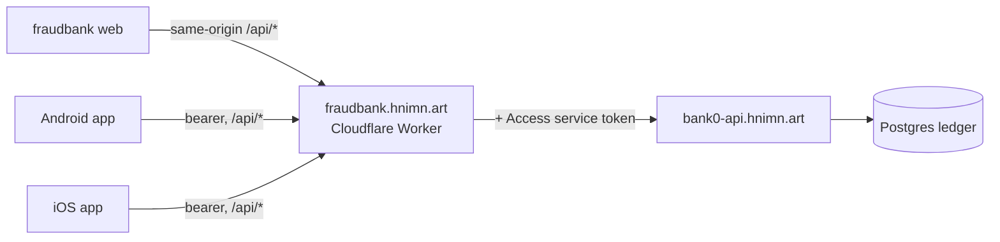

# bank0 - integrating an external client

**TL;DR.** External clients - the fraudbank web, Android and iOS apps - speak the
same contract as bank0's own PWA, and all of them reach it through
`fraudbank.hnimn.art/api/*`. There is no client-specific backend. Read
[`06-client-api.md`](06-client-api.md) for the full contract; this page covers what
client teams get wrong.

`bank0-api.hnimn.art` is **not** a client-facing hostname. Cloudflare Access gates
it in Service Auth mode and only the two Workers hold the service token, so a call
straight to it is refused at the edge. There is no unauthenticated fallback path on
purpose: one would make the gate theatre.

Written for a developer building against the API who has never seen this
repository. You need to know HTTP and JSON; banking terms are explained where
they appear.



Diagram: every client - web and native - goes through the fraudbank Worker, which
is the only holder of the Access service token. All paths end at the same ledger.

---

## 1. Tokens

Login returns a short-lived access token (15 minutes) and a refresh token. Send
the access token as `Authorization: Bearer <token>`. Rotate at
`POST /auth/refresh` before it expires.

Four responses to `POST /auth/login` are possible, and a client that handles only
the first one will break:

| Response | What it means | What to do |
|---|---|---|
| `token` + `refresh_token` | normal sign-in | proceed |
| `mfa_required: true` + `mfa_token` | the user has MFA enrolled; **no** access token was issued | collect a code, `POST /auth/mfa/verify` with the `mfa_token` |
| `password_change_required: true`, no `refresh_token` | an operator requires a password change | route to a change-password screen; the token you got reaches only `POST /me/password` and `POST /auth/logout-all`, everything else is 403 |
| `401` | wrong credentials, or the account is locked | show one generic message - the API deliberately does not distinguish them |

Two rules that bite:

- **A replayed refresh token revokes the entire family.** Rotation is
  single-use. If two threads race the same refresh token, one of them gets a
  401 and the user is signed out everywhere. Serialize refreshes.
- **`POST /me/password` revokes every session, including the caller's.** After a
  204, every refresh token you hold is dead, on every device. The access token
  you made the call with keeps working until it expires - at most 15 minutes -
  because a JWT cannot be recalled, but there is nothing to renew it with.
  Clear local state and send the user to sign in again.

`POST /auth/logout` revokes one session; `POST /auth/logout-all` revokes every
one.

**Where the tokens live.** Native apps hold them in Keystore or Keychain and send
them to `fraudbank.hnimn.art/api/*` like every other client - the Worker hop is not
optional, because the Access service token lives there and has no place in a
shipped app. Web holds them in the browser, because `worker/index.ts` is a
pass-through proxy. Moving them
into httpOnly cookies at that same-origin seam is described in
[`07-client-web-app.md`](07-client-web-app.md) §6. It is not built.

---

## 2. Lists are bare arrays

Every list endpoint returns a JSON array, and an empty one is `[]`, never `null`.
There is no `{items, next_cursor, has_more}` envelope anywhere in this API -
client API, admin surface and disputes all agree.

Pagination is a keyset cursor plus `limit`; you have reached the end when a page
comes back shorter than `limit`. The ledger uses a composite cursor of
`(posted_at, id)` rather than a timestamp alone, so entries sharing a timestamp
are never skipped between pages. Pass both `cursor` and `cursor_id` back.

---

## 3. Errors

Every non-2xx response is `{"error": <code>, "message": <text>}` with a JSON
content type - including errors minted by the Worker proxy. Branch on the
`error` token and the HTTP status. Never branch on `message`: it is display
text and changes without notice.

The token set is a registry. Existing tokens are never renamed or removed within
1.x, new ones may appear at any time, and an unknown token should be treated as a
generic failure for its status class. The envelope is additive the same way - new
top-level members may appear and must be ignored if unrecognised.

---

## 4. Guided transfers

`GET /transfers/suggestion?from_account&amount_minor` powers the guided-transfer
demo. It returns `{"options": [...]}` with up to three third-party candidates
drawn at random from the active scenario short-list, or `{"options": []}` when
none are configured - in which case the client picks a payee itself or falls back
to the caller's own account. It is read-only and exposes no more than
confirmation of payee: a masked owner name and an IBAN.

---

## 5. Disputes feed the fraud engine

Raising a dispute writes a `dispute_raised` audit row. It does **not** freeze
anything. Freezing an account on an accusation is a product decision, not a
missing feature.

It is not inert either. `assess_transfer_risk` adds a `destination_flagged`
score to any account on the receiving side of an open or under-review dispute
categorised as fraud or unrecognised
([`00015_fraud.sql`](../db/migrations/00015_fraud.sql)). Later payments to that
same destination can therefore escalate to a warning, a step-up, or a review
hold.

---

## 6. Local development: opt-in CORS

Production web is same-origin through the Worker, so CORS never applies. For
local work without the Vite proxy, `server.cors_origins` (default empty, meaning
disabled) unblocks direct browser calls to `:8090`:

```
Access-Control-Allow-Origin: <matched origin>   # exact match from the list, never *
Access-Control-Allow-Methods: GET, POST, PATCH, DELETE, OPTIONS
Access-Control-Allow-Headers: Authorization, Content-Type, Idempotency-Key
Access-Control-Max-Age: 600
Vary: Origin
```

Preflight `OPTIONS` returns 204. `Idempotency-Key` has to be in the allowed
headers or `POST /transfers` fails preflight. There is no `Allow-Credentials`,
because authentication is a bearer header and not a cookie.
