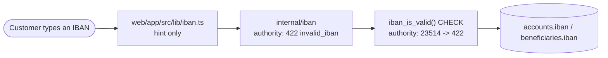

# bank0 - IBAN validation and minting

**TL;DR.** An IBAN carries its own checksum, so a typo or a transposed digit is
detectable without asking anyone. bank0 checks it in three places and trusts two
of them. The database is the one that cannot be bypassed.

An IBAN is an account number with a country prefix and two check digits -
`NL91 ABNA 0417 1643 00`. The check digits are computed over the rest of the
string with MOD-97 (ISO 7064): move the first four characters to the end, turn
every letter into two digits (`A` = 10 ... `Z` = 35), read the result as one long
integer, and a valid IBAN leaves remainder 1 when divided by 97. That single
property is what makes a mistyped IBAN detectable. The full standard is ISO
13616; [Wikipedia's
article](https://en.wikipedia.org/wiki/International_Bank_Account_Number) has
the worked example, and the authoritative per-country structures are in the
[SWIFT IBAN registry](https://www.swift.com/standards/data-standards/iban-international-bank-account-number).

---

## 1. Three layers, two authorities

Diagram: the browser check is a convenience hint, the Go package rejects a bad
checksum before the database is touched, and a CHECK constraint backed by the
`iban_is_valid()` function refuses the row no matter which client is writing.

| Layer | Where | Role |
|---|---|---|
| Browser | `web/app/src/lib/iban.ts`, `routes/Transfer.tsx` | instant inline hint, gates the look-up button. Never authoritative. |
| Go | `internal/iban`, `handlers_beneficiaries.go`, `handlers_accounts.go` | rejects a bad checksum with a precise `422 invalid_iban` before any DB work |
| Postgres | `iban_is_valid()` in `00002_iban.sql`, CHECKs on `accounts.iban` and `beneficiaries.iban` | the backstop nothing can go around - the console, a seed file, a migration or somebody in `psql` all hit it |

A format regex is necessary but not sufficient: it cannot catch a transposed
digit. So the checksum has to live in at least one authority, and for a ledger
the answer is both - Go for a fast, precise error, Postgres because it is the
layer no writer can skip. That is the same reasoning as invariant 2 in
[`01-overview.md`](01-overview.md): if the rule is only in the application, it is
not a rule.

The DB check is cheap enough to run on every insert. The validator is a pure
function of its argument with no reads, so it is `IMMUTABLE PARALLEL SAFE`, and
it is a bounded loop over at most 34 characters doing modular arithmetic small
enough that the accumulator never exceeds 97. Measured at about 0.1 microseconds
per call on Postgres 18 - noise next to the cost of the insert itself.

---

## 2. Where the code lives

`iban_is_valid()` and `iban_generate()`, the per-country length table as the
shared `iban_country_length()` helper, the unregistered-country rejection and the
BBAN-length guard are all in
[`00002_iban.sql`](../db/migrations/00002_iban.sql). The CHECK constraints sit
with their tables, in [`00007_accounts.sql`](../db/migrations/00007_accounts.sql)
and [`00011_beneficiaries.sql`](../db/migrations/00011_beneficiaries.sql) -
column CHECKs rather than a shared domain.

The per-country table exists three times over - in the migration, in
`internal/iban`, and in the browser helper - and the three agree byte for byte.
Read it from `00002_iban.sql` rather than from a copy in prose, which is why this
document no longer carries one.

---

## 3. Minting the bank's own IBANs

Validating an IBAN and issuing one are different jobs, and bank0 keeps them in
different migrations. `allocate_iban()` in
[`00017_iban_minting.sql`](../db/migrations/00017_iban_minting.sql) is the bank's
allocation policy: `iban_generate('NL', ...)` over the operator-tunable
`bank_settings.iban_bank_code` (default `INGB`) plus a random 10-digit account
number, in a re-roll loop backstopped by the unique index on `accounts.iban`. It
is called by `open_customer_account` when a customer opens an account.

These IBANs pass every checksum test and are **not routable**: no real bank will
accept a payment to one. See
[`12-rail-readiness.md`](12-rail-readiness.md) for what connecting to a real rail
would involve.

For seed data, `db/seedgen` draws real vendored test IBANs from
`db/seedgen/ibans` first and falls back to `iban.Generate` (crypto/rand-backed;
`iban.Compute` is the deterministic variant) once the pool runs out - so the
account count is not capped by the vendored list and every seeded row still
passes the CHECK. Database-layer coverage is in `internal/db/iban_test.go`.
